## Summary
[[Kaito]] develops [[MultiSiteHighAvailability]] as an architectural progression from backups and replicas through same-city disaster recovery, active-active sites, cross-city deployment, and multi-site expansion. The central design move is [[TrafficUnitization]]: route each business or user cohort to one local site for a complete read-write loop, replicate state asynchronously across sites, and reserve single-writer treatment for global data that cannot tolerate eventual consistency. The article is a practitioner-level conceptual guide rather than a measured implementation report; it emphasizes redundancy and rapid failover while acknowledging high infrastructure, middleware, application, and operational cost.

## Key Claims
- Availability depends on both failure frequency and recovery time: `Availability = MTBF / (MTBF + MTTR)`, so each additional “nine” sharply reduces the permitted outage window.

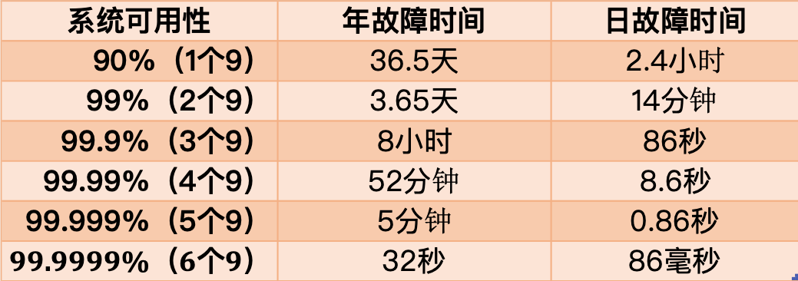

- Redundancy moves the protected failure boundary outward: database replicas cover instance loss, same-city disaster recovery covers a data-center loss, and cross-city sites address city-scale disasters.
- Cold standby preserves off-site data but requires restoration and deployment; hot standby predeploys the serving stack; same-city active-active sends production traffic to both sites so the standby path is continuously exercised.
- In the article's same-city active-active model, both sites serve reads, but writes still cross the private link to the primary site's storage. That makes close physical distance and acceptable link latency part of the design.

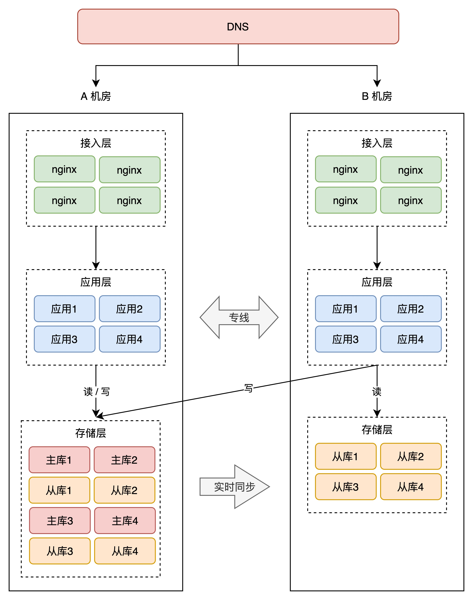

- A “two locations, three centers” design adds a remote backup center to two active same-city sites, protecting data from a city-scale event without making the remote center immediately service-ready.

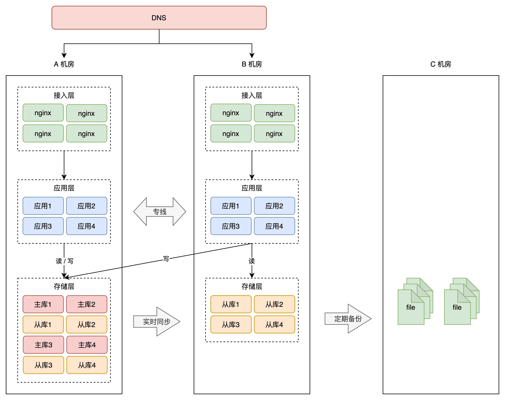

- Copying the same-city design across distant cities creates a false active-active architecture because remote application requests still depend on cross-city storage access; propagation distance, routing equipment, jitter, packet loss, and link failure make that dependency both slow and fragile.

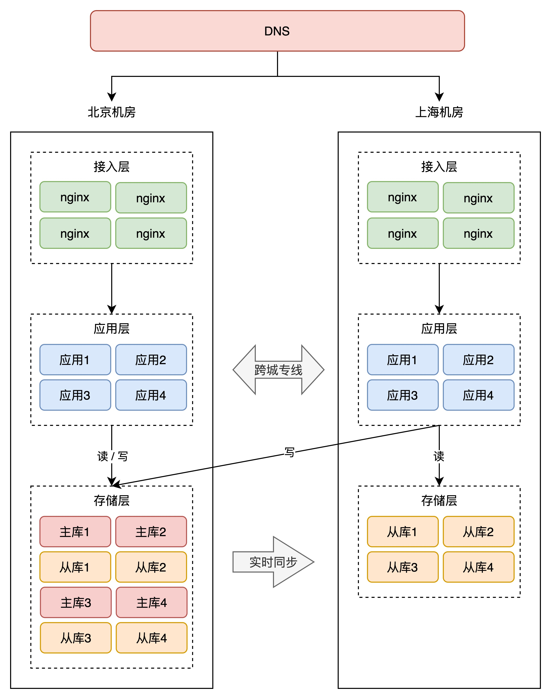

- A true cross-city active-active design keeps reads and writes local, makes both storage layers writable, and uses bidirectional replication to converge toward full copies at both sites.

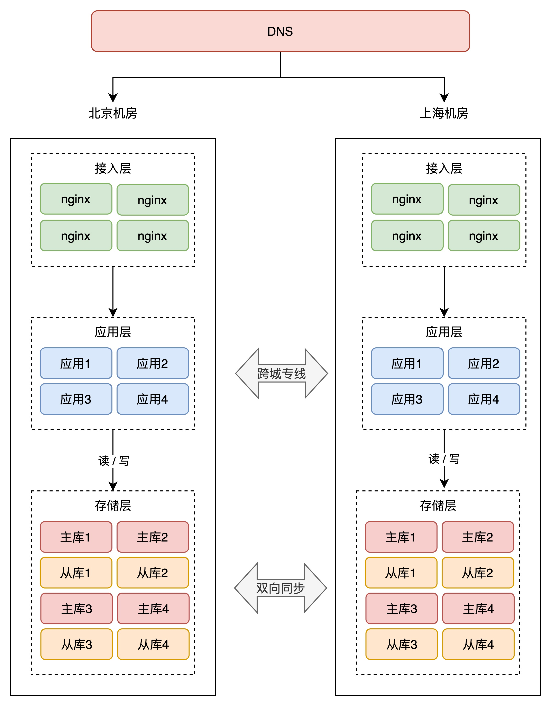

- Bidirectional eventual replication creates write-conflict risk. Rather than relying only on clock-based last-write-wins merging, the article recommends preventing conflicting writers through an upper routing layer and checking data ownership again near storage.

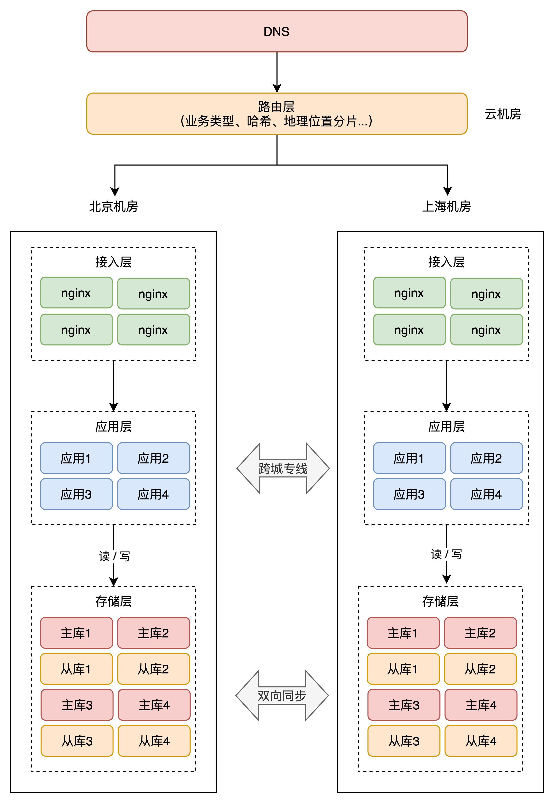

- [[TrafficUnitization]] can partition by related business capability, stable user hash, or geography; the invariant is that related work completes within one site and avoids synchronous cross-site calls.

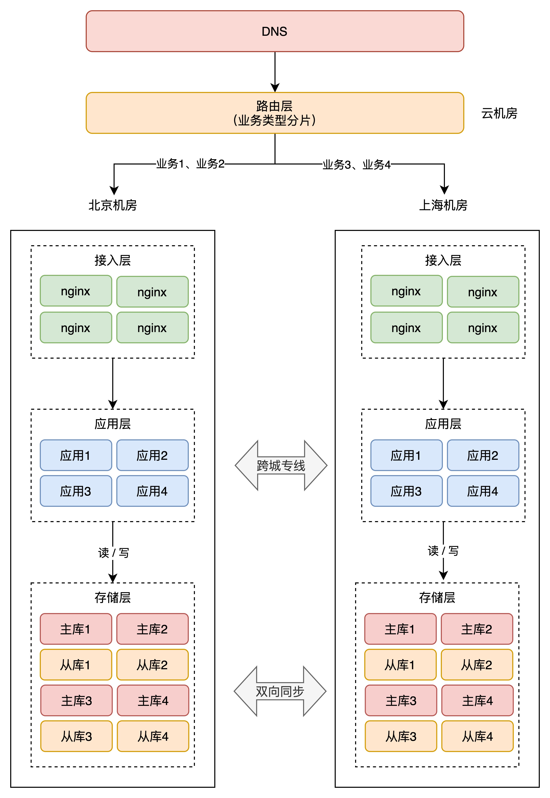

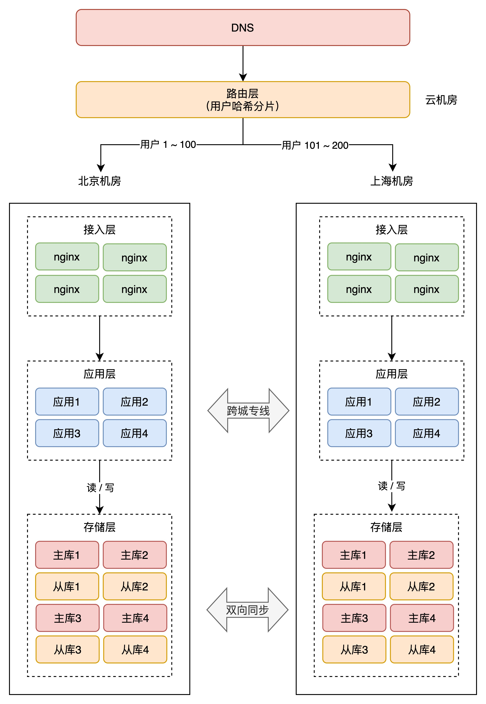

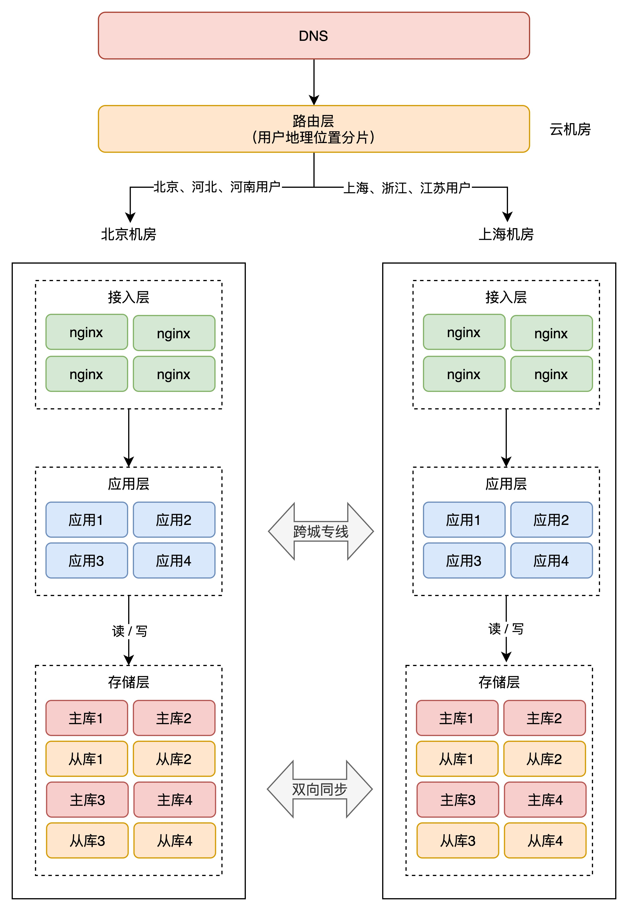

- Extending dual-active to many sites creates a dense replication mesh whose number of synchronization paths grows with site count.

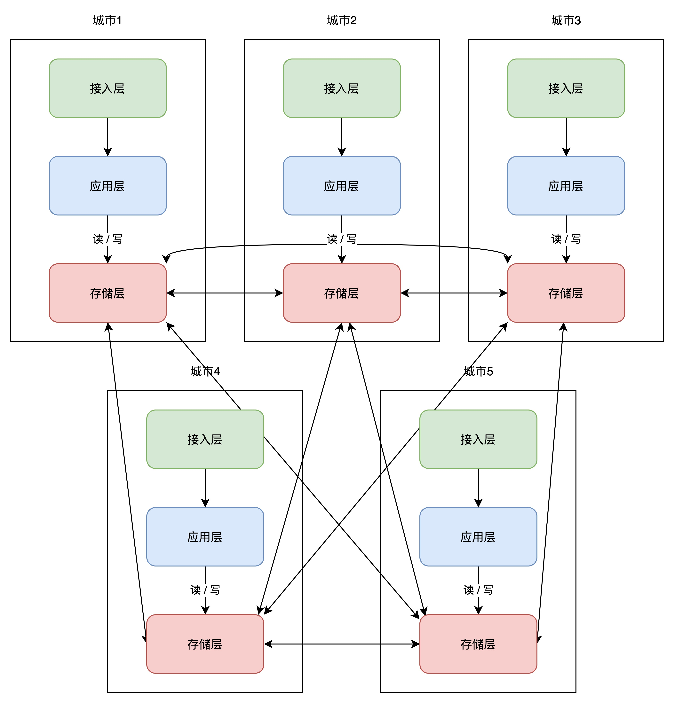

- A hub-and-spoke replication topology reduces per-site synchronization complexity by routing changes through a center, but raises the center's stability requirements and requires a way to promote another site if it fails.

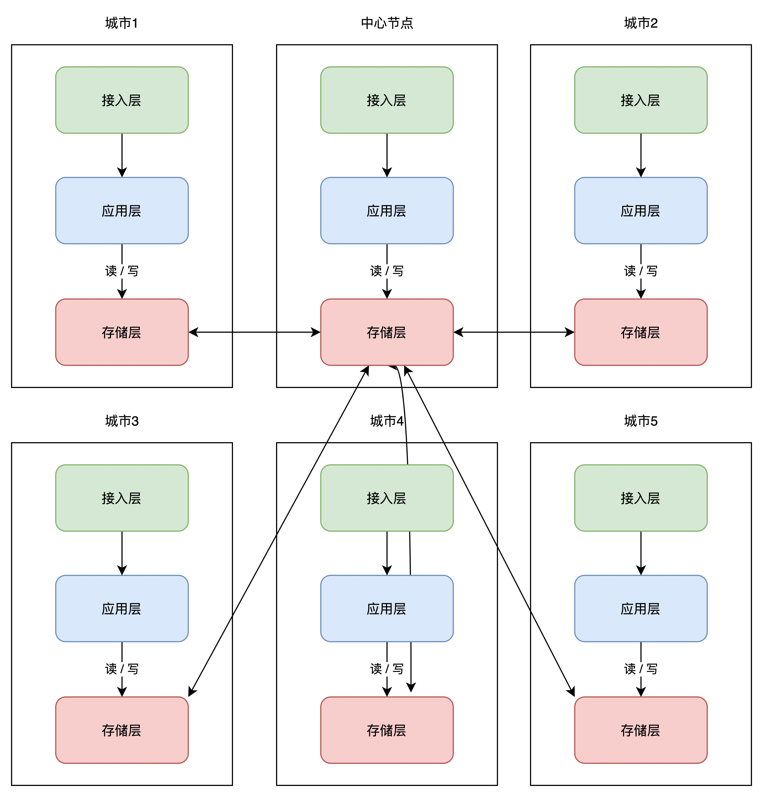

## Key Quotes
> “分片的核心思路在于，让同一个用户的相关请求，只在一个机房内完成所有业务‘闭环’，不再出现‘跨机房’访问。” - on the routing invariant behind unitized cross-city operation.

> “双活的重点，是要优先保证‘核心’业务先实现双活，并不是‘全部’业务实现双活。” - on limiting active-active scope when some global data still needs strong consistency.

## Connections
- [[Kaito]] - author and practitioner narrator of the architecture progression.
- [[MultiSiteHighAvailability]] - the source's main availability and disaster-recovery architecture.
- [[TrafficUnitization]] - routing and ownership method used to keep related writes inside one site.
- [[CloudHighAvailability]] - cloud-oriented counterpart covering availability zones, regional failover, and datastore-specific recovery.
- [[SystemReliability]] - broader discipline in which redundancy, recovery time, failover rehearsal, and operational readiness sit.
- [[EventDrivenConsistency]] - adjacent model for delayed convergence, retry, idempotency, and repair across distributed boundaries.
- [[MySQL]] - named database with native dual-primary replication in the article's simplified implementation discussion.
- [[Redis]] - named state system requiring an external cross-site synchronization mechanism in the proposed design.
- [[MongoDB]] - named state system requiring cross-site synchronization middleware in the proposed design.

## Contradictions
- The article's concrete dual-active pattern assumes full data copies and asynchronous bidirectional convergence, but it also exempts global configuration and inventory-like data that need strong consistency. “Active-active” is therefore not one universal consistency model, and the source does not prove that its partitioning rules fit every workload.
- The suggested 1,000-kilometer separation, 30-100 ms cross-city latency, and named middleware capabilities are source-date-specific rules of thumb rather than measured requirements or current product guarantees.
- Both active-active designs and the central-hub optimization still contain dependencies whose failure, lag, conflict, or promotion behavior must be tested. Architecture diagrams alone do not establish recovery time, data-loss bounds, or safe failover.
