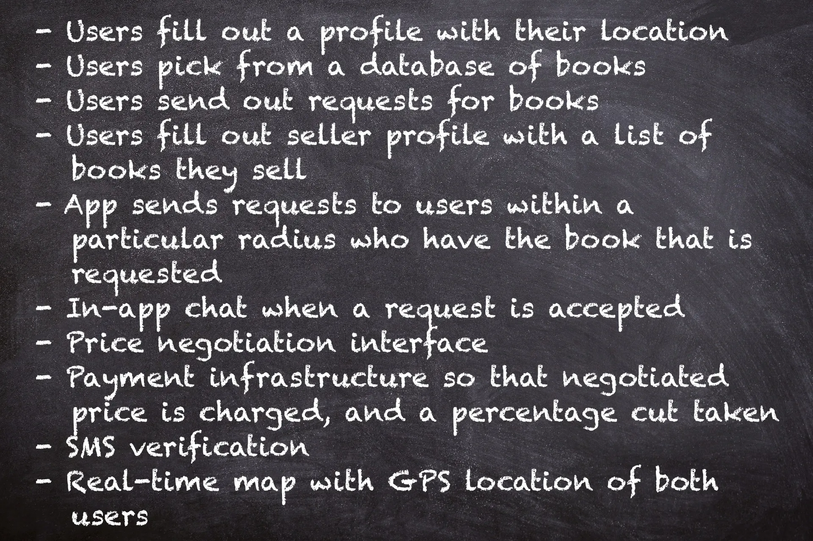
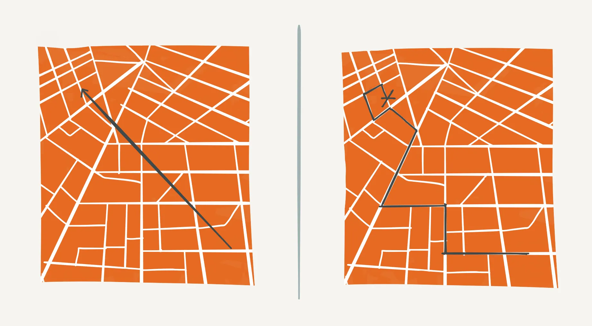
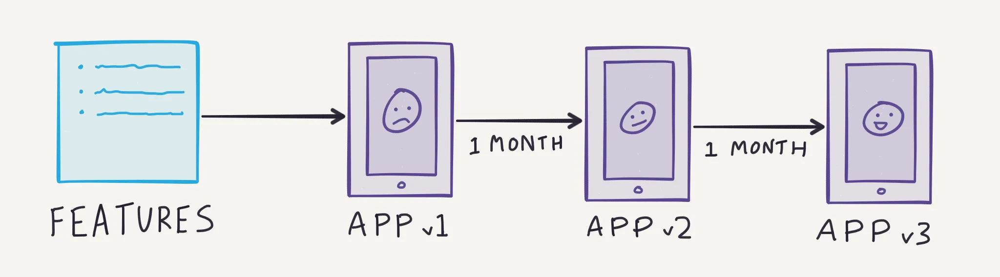
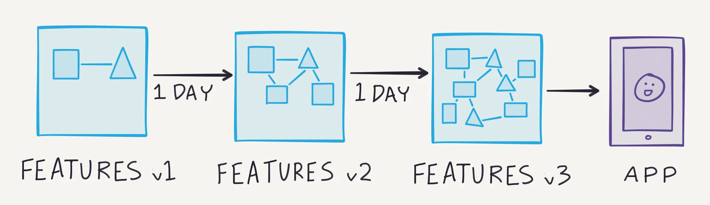
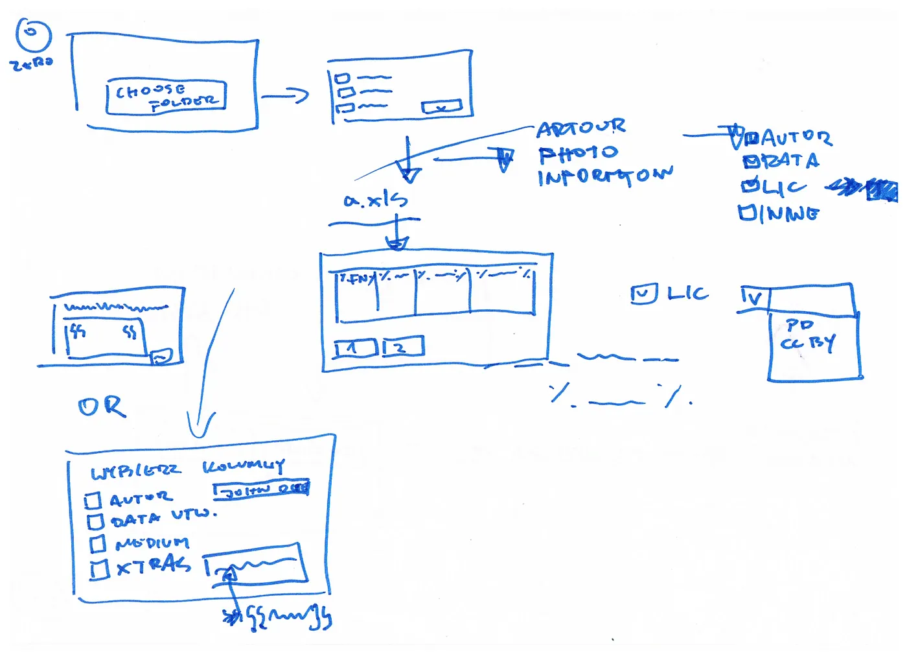

## Summary
[[KannanChandrasegaran]] argues that a short business-level feature list conceals the step-by-step decisions required to make software usable, so apparently expanding scope may be discovery of the original promise rather than [[FeatureCreep]]. He proposes [[PreimplementationFeatureDiscovery]]: state user objectives, map every screen or step in a fast outline, mockup, or flowchart, and interrogate each step's inputs, outputs, interactions, external services, and operator needs before coding. The method moves cheap iteration into the specification, but it cannot eliminate later technical, market, or use-context discoveries.

## Key Claims
- Software features have depth: closer inspection reveals decisions, edge cases, supporting capabilities, and workflow steps absent from concise business descriptions.
- Necessary capabilities uncovered while making the original objective workable are not automatically feature creep, technical architecture, or market validation.
- Delaying detailed walkthroughs until a working build turns specification discovery into repeated development cycles that may each take weeks or months.
- Teams can surface much of the hidden scope more cheaply by iterating on a user-flow representation before implementation.
- The proposed workflow starts with user objectives, represents every screen or step, prioritizes fast low-fidelity artifacts, and adds newly discovered steps back into the flow.
- A four-part question framework examines user inputs, information presented, interactions among users/product/external services, and business-owner functionality.
- Preimplementation discovery reduces avoidable rework but does not make the first specification complete or settle product-market, pricing, or technical choices.

The expanded inventory makes the article's central boundary concrete: the added capabilities support the original marketplace transaction rather than introduce unrelated product goals.

The route comparison visualizes how a plausible high-level objective acquires constraints when translated into executable steps.

Together, the process diagrams contrast discovering interaction detail through slow coded versions with discovering it through faster specification revisions.

The sketch illustrates the recommended fidelity: enough structure to expose distinct screens, branches, and inputs without spending heavily on visual polish.

## Key Quotes
> "Software features are more like fractals" - on details becoming visible as a team moves from business intent to step-by-step use.

> "Instead of iterating on the app, we want to iterate on the spec." - the proposed shift in when complexity is discovered.

## Connections
- [[KannanChandrasegaran]] - author presenting the feature-depth diagnosis and preimplementation questioning method.
- [[PreimplementationFeatureDiscovery]] - the article's method for exposing hidden workflow detail before code.
- [[FeatureCreep]] - the source distinguishes necessary elaboration of an original objective from unrelated capability accumulation.
- [[PrototypeFirstProductDiscovery]] - both shorten learning cycles with cheap artifacts, though this source emphasizes specification completeness rather than user-test evidence.
- [[ProductFlowFriction]] - walking every screen and step exposes practical effort and missing transitions in a user journey.
- [[OutsourcedProductDevelopment]] - detailed user-flow discovery reduces reliance on developers to infer product decisions from terse business requirements.

## Contradictions
- The article argues that the same hidden details can largely be discovered in a week with pencil and paper rather than months of builds, but supplies an illustrative marketplace and no measured project comparison.
- Static outlines and imagined walkthroughs can miss technical constraints, accessibility needs, adversarial behavior, operational load, and behavior that appears only with real users or production data.
- The recommendation to represent every screen can become expensive premature specification when the problem, market, or product model remains highly uncertain; [[PrototypeFirstProductDiscovery]] and live experiments may sometimes produce better evidence sooner.
