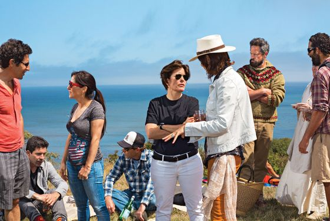
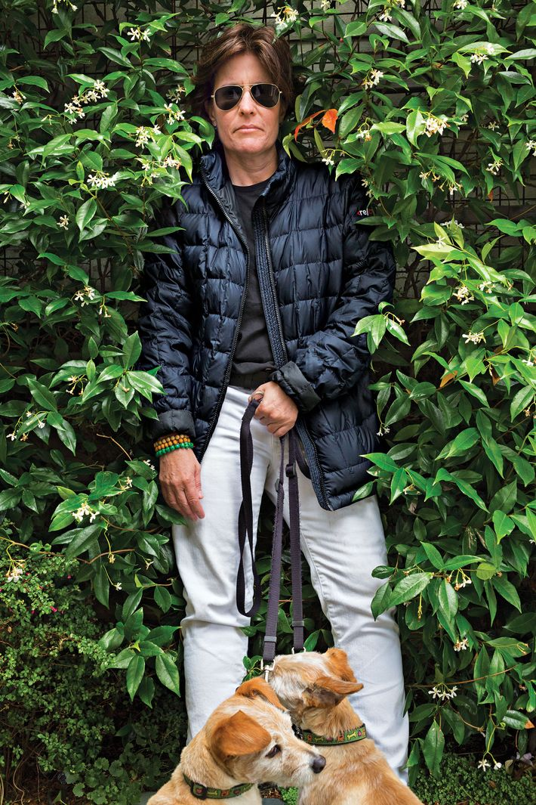

## Summary
This 2014 profile explains [[KaraSwisher]]'s unusual combination of access, fear, affection, and influence through long institutional memory, persistent sourcing, blunt but playful confrontation, selective discretion, and the conference-and-publication partnership she built with [[WaltMossberg]]. It also treats her success as a live [[AccessJournalism]] test: the relationships that produce scoops and accountability can create conflicts, perceived restraint, and power of their own, even when a reporter uses recusal, disclosure, non-venture funding, and aggressive coverage to protect independence.

## Key Claims
- Swisher's authority came from covering the technology industry since the early 1990s, knowing founders before their wealth and status, maintaining sources between stories, and repeatedly breaking consequential deal, personnel, and governance news.
- Her interview and sourcing style combined humor, insults, familiarity, persistence, and direct pressure; the profile argues that this could elicit candor while preserving relationships with people she criticized.
- [[AllThingsD]] and its conference joined reporting, live executive interviews, product debuts, and a profitable events business; this made Swisher and [[WaltMossberg]] both chroniclers of and institutional actors within the industry they covered.
- Swisher distinguished her model from [[MichaelArrington]]'s disclosed investing while reporting, criticizing his “process journalism” and CrunchFund as incompatible with accuracy and independence.
- Recusal from Google coverage, extensive disclosure, separate finances, and media rather than venture backers reduced some conflicts around [[Recode]], but did not eliminate the influence or appearance risks created by family ties, board membership, conference revenue, friendships, and elite access.
- Selective discretion was part of Swisher's power: she withheld weakly confirmed or merely personal information, yet published private matters when she judged the business relevance sufficient.
- The wider technology-media environment made adversarial reporting difficult because young reporters and powerful subjects often shared social networks, technology publications depended on industry money or participation, and favorable coverage could preserve invitations and access.

## Key Quotes
> "Most reporters are so transactional, rather than strategic." - Swisher on staying in contact with sources when she did not need a story.

> "I'm not going to give them a break, but I'm going to be fair, even if it's not nice." - Swisher on preserving long-term relationships without promising favorable treatment.

> "At some point, we're going to have to start pissing people off more." - Swisher on the accountability burden of the newly independent Re/code.

## Connections
- [[KaraSwisher]] - central subject whose reporting methods, career, influence, and conflicts are examined.
- [[WaltMossberg]] - Swisher's long-term editorial, conference, and business partner.
- [[AllThingsD]] - Dow Jones publication-and-conference operation that established their joint model.
- [[Recode]] - independent successor launched with media-company backing rather than venture capital.
- [[MichaelArrington]] - rival technology journalist whose investing and reporting practices supply the profile's sharpest ethical contrast.
- [[CodeConference]] - later identity of the executive-interview conference whose earlier model the profile describes.
- [[AccessJournalism]] - central tradeoff between information gained through proximity and scrutiny endangered by it.
- [[SiliconValley]] - overlapping network of founders, investors, executives, reporters, money, and status in which Swisher operated.
- [[TechnologyElitePower]] - subject power that Swisher challenged while also becoming an influential broker within its network.

## Contradictions
- The profile complicates a deterministic account of [[AccessJournalism]]: rivals identify serious conflicts and appearance risks, but the author reports that they could not name a major story Swisher suppressed, and her record includes repeated criticism of people who remained friends, sources, speakers, or investors.
- It also complicates Swisher's claim to stand outside the industry's back-scratching ecosystem. Her disclosures, recusals, and funding choices impose real boundaries, while conference economics, close relationships, Re/code board composition, and her former spouse's Google role still constrain or appear to constrain coverage.
- This is a 2014 magazine profile based heavily on interviews, reputation, anecdote, and contemporaneous judgments. It does not measure source accuracy, story selection, suppressed reporting, conference influence, or later practice, and several quoted critics had their own professional conflicts with Swisher.
- Both unique photographs were retained as contextual visual evidence of Swisher's on-set media role and recognizable informal presentation; the second embed was omitted because it was a square crop of the retained on-set photograph.
