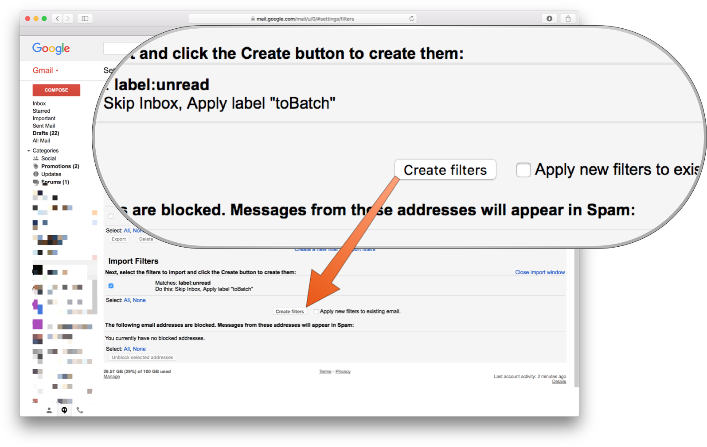
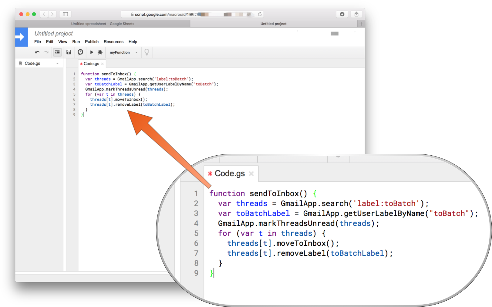
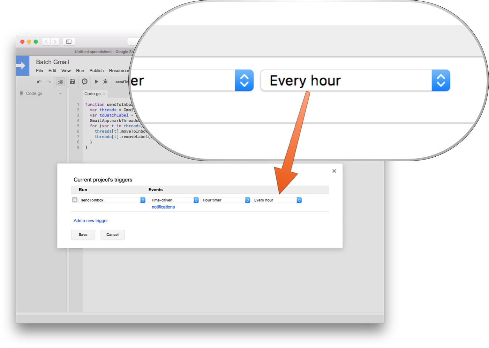
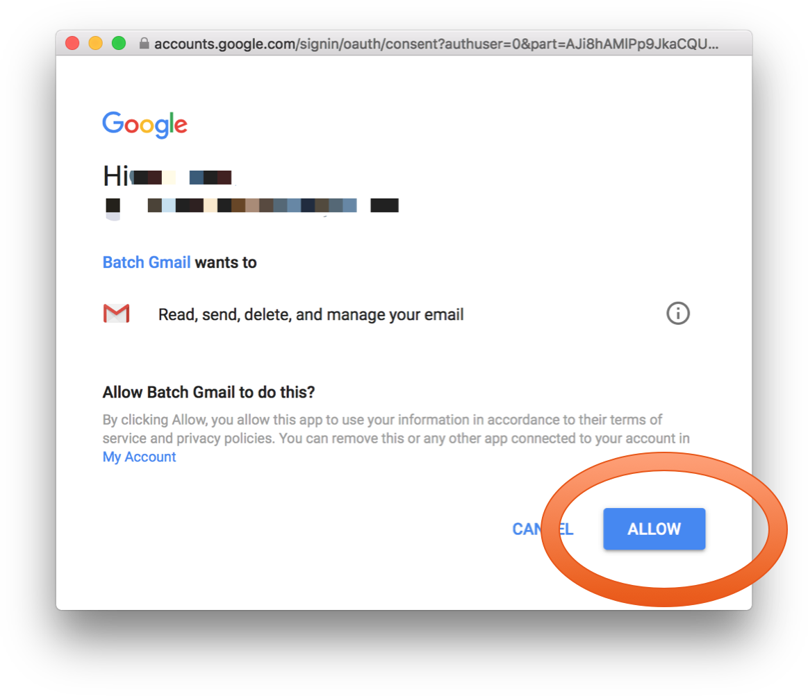

## Summary
[[KennethFriedman]] proposes [[EmailBatching]] as a way to separate message arrival from deliberate review: a [[Gmail]] filter hides and labels new mail, then a time-driven Apps Script returns the accumulated threads to the inbox as unread. The tutorial turns a behavioral intention into an environmental constraint, but it documents a 2018 interface, requests broad mailbox permission, and provides no measured evidence that the setup improves stress, focus, or productivity.

## Key Claims
- [[EmailBatching]] can reduce the reward from habitual inbox checking by withholding newly arrived messages until a scheduled release.
- The historical setup uses a Gmail filter matching unread mail to skip the inbox and apply a `toBatch` label.

- A Google Apps Script searches for `label:toBatch`, marks matching threads unread, moves them to the inbox, and removes the label.

- A time-driven trigger runs the restore function periodically; the author recommends every four hours while allowing shorter intervals.

- Senders or keywords that justify interruption can be excluded from the hiding filter, making responsiveness an explicit exception rather than the default.
- The authorization screen grants the script permission to read, send, delete, and manage email, so the convenience depends on trusting and controlling the script and account.

## Key Quotes
> "new messages won't trickle in exactly when they are sent" - on separating arrival from inbox visibility.

> "there won't be any new messages to see" - on changing the environment around habitual checking.

## Connections
- [[KennethFriedman]] - author of the batching tutorial.
- [[EmailBatching]] - the source's central method for scheduled message visibility.
- [[Gmail]] - platform whose filters, labels, search, and Apps Script integration implement the workflow.
- [[AttentionManagement]] - the setup tries to protect focus by reducing visible novelty in the inbox.
- [[CommunicationMultitasking]] - scheduled release is proposed as an intervention against repeated email switching.
- [[EmailTaskManagement]] - batching governs when mail becomes visible, while task management governs what happens after review.

## Contradictions
- The article claims batching will create fewer distractions and more focused work, but it reports no comparison, outcome data, or account of self-initiated access through labels, search, mobile notifications, or other clients.
- The screenshots and navigation paths describe 2018 Gmail, Google Sheets, Apps Script, and OAuth interfaces. They support the historical mechanism but should not be treated as current setup instructions without verification.
- The tutorial's reassurance about the “unverified app” warning understates the significance of broad mailbox permission; user-authored code reduces third-party trust exposure but does not eliminate coding, account, or authorization risk.
