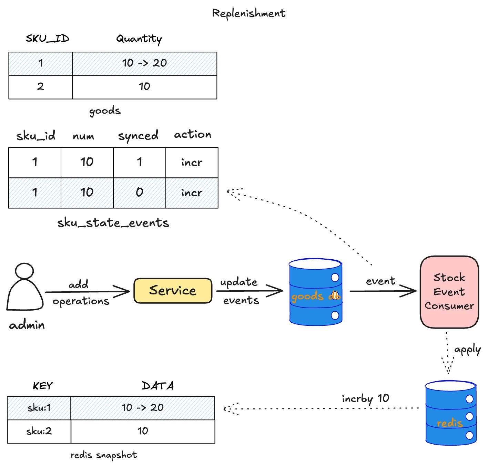
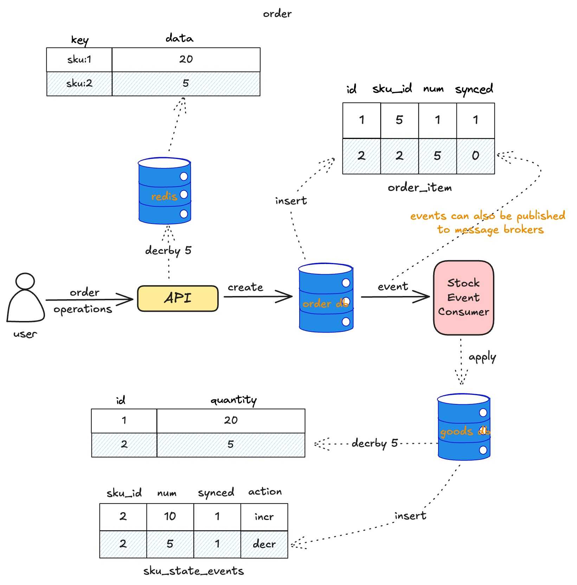
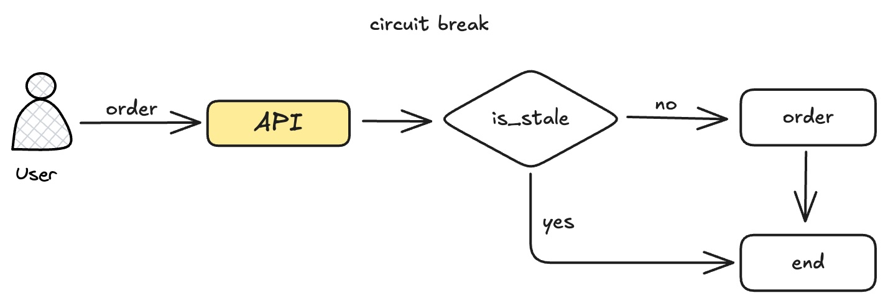
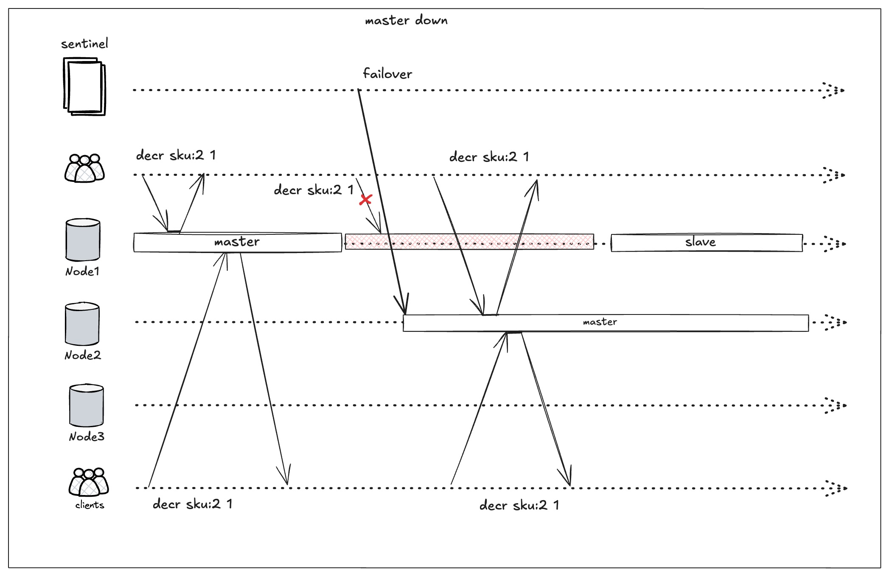
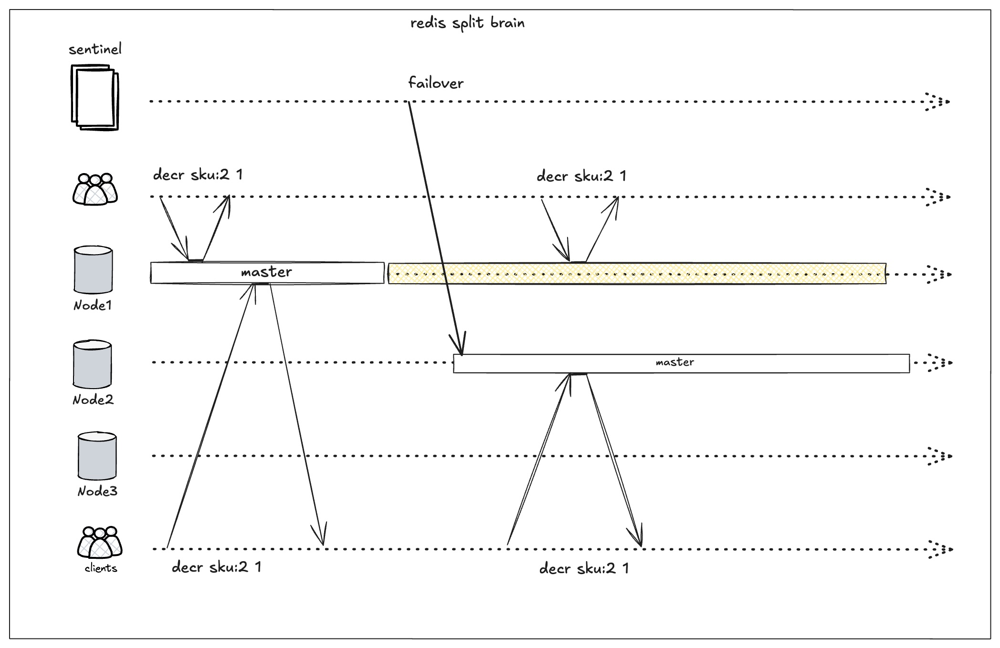
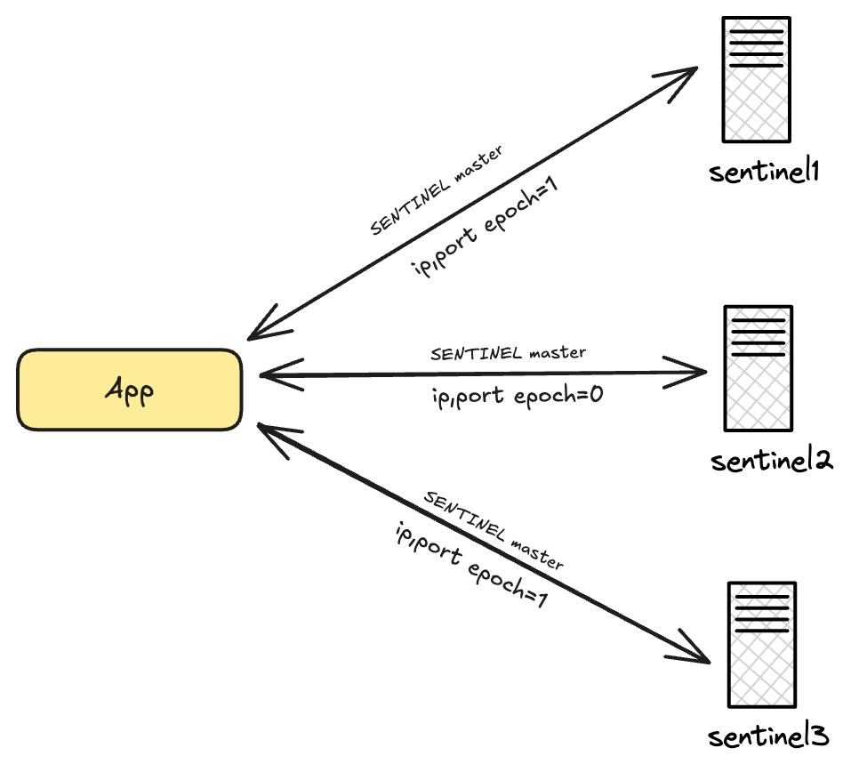
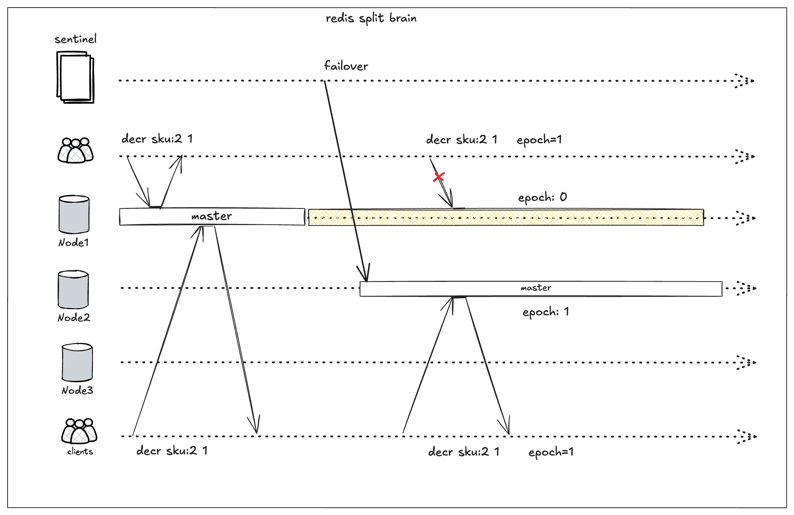
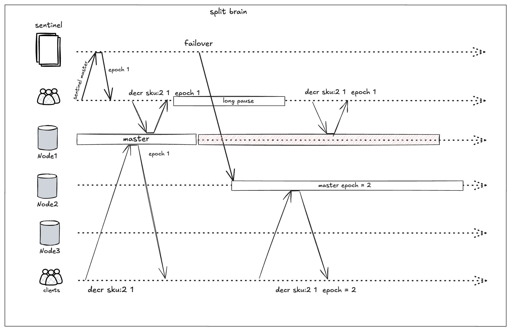
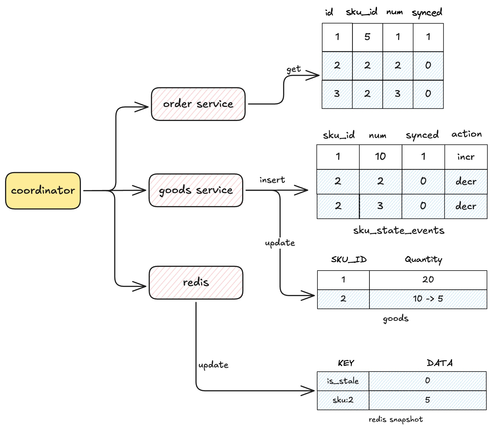

## Summary
[[Kikcat]] compares database row updates, Redis distributed locks, an event-driven in-memory inventory design, and AliSQL Inventory Hint for [[HighConcurrencyInventoryDeduction]]. The proposed high-throughput path treats Redis as the synchronous stock snapshot and the relational database as the durable source of truth, then uses idempotent stock events, circuit breaking, epoch checks, reconciliation, and forced recovery to bound overselling and underselling. The article's central conclusion is a tradeoff rather than a perfect solution: stronger consistency, availability, throughput, implementation complexity, and cloud portability cannot all be maximized together.

## Key Claims
- A guarded SQL update can deduct stock atomically, but a hot row serializes transactions, increases lock and deadlock-detection work, consumes database connections, and makes latency depend on the transaction holding the exclusive lock.
- Redis locks can shield the database, but a global lock serializes unrelated SKUs, a per-SKU lock still serializes a hot SKU, and multi-SKU orders add ordering, deadlock, and cross-service atomic-commit complexity.
- In the proposed in-memory design, Redis accepts the synchronous deduction while `order_item` and `sku_state_events` provide replayable changes that consumers apply to the goods database and Redis snapshot.

- A stale Redis snapshot must fail closed: the API rejects deductions until a coordinator drains unsynchronized order and stock events, rebuilds the snapshot, and marks it ready.

- Sentinel failover after a real master failure converges clients on one promoted master, but a network partition can leave the old and new masters accepting writes because Redis writes do not require quorum acknowledgement.

- Clients should consult a Sentinel majority, carry the resulting configuration epoch into the Lua deduction, and be rejected when the epoch differs from the target master; replica-health settings and client-side circuit breakers further limit the split-brain window.

- Epoch fencing is mitigation, not proof: a GC pause, swapping, cgroup throttling, failover inside the freshness timeout, or clock rollback can let an old client resume against the old master.

- Recovery requires processing all unsynchronized order items and stock events before refreshing Redis and clearing the stale marker; failures before a local ledger write require heavier periodic reconciliation and may force a temporary ordering pause.

- AliSQL Inventory Hint shortens a narrow update transaction by committing or rolling back immediately, but multi-SKU atomicity, limited public implementation detail, and vendor lock-in constrain the approach.

## Key Quotes
> "同一条记录的 X 锁只能被一个事务持有" - on why a hot database row becomes a serial bottleneck.

> "数据库它只作为 Source of Truth" - on separating synchronous Redis deduction from durable database state.

> "我们想要在 sentinel 这样一个 AP 的系统中构建一个 CP 的保证" - on why the Sentinel design can reduce but not eliminate overselling.

## Connections
- [[Kikcat]] - author of the architecture analysis.
- [[HighConcurrencyInventoryDeduction]] - central design problem and tradeoff framework.
- [[Redis]] - synchronous in-memory stock snapshot, Lua atomicity substrate, lock service, and failover risk surface.
- [[EventDrivenConsistency]] - stock events reconcile order-side deductions with durable goods state without one cross-service transaction.
- [[TwoPhaseCommit]] - stronger atomic coordination that the source rejects for this latency-sensitive path.
- [[SystemReliability]] - circuit breaking, fencing, recovery, reconciliation, and deliberate availability loss are reliability controls.

## Contradictions
- The source qualifies any claim that event sourcing alone “guarantees” inventory consistency: its own failure analysis requires idempotency, stale-state rejection, durable local reporting, coordinator recovery, and periodic reconciliation, while some failure windows still permit overselling or underselling.
- No direct contradiction with [[TwoPhaseCommit]] is established; the article makes a workload-specific latency tradeoff rather than disproving the protocol's atomicity value.
