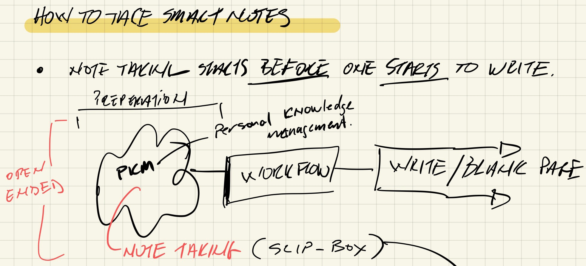
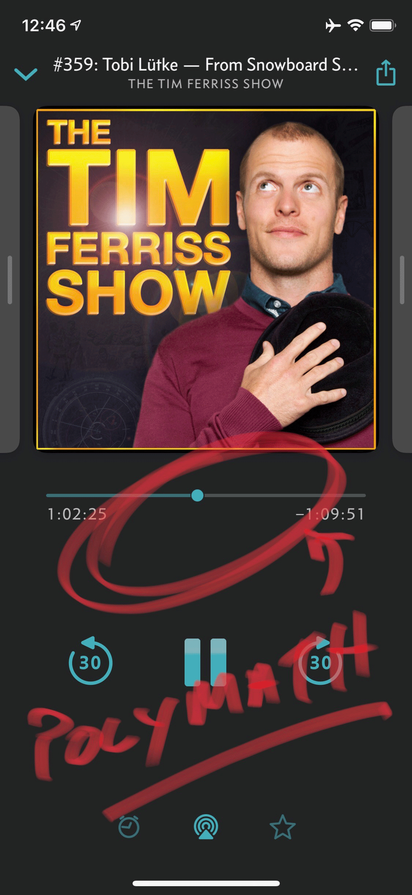
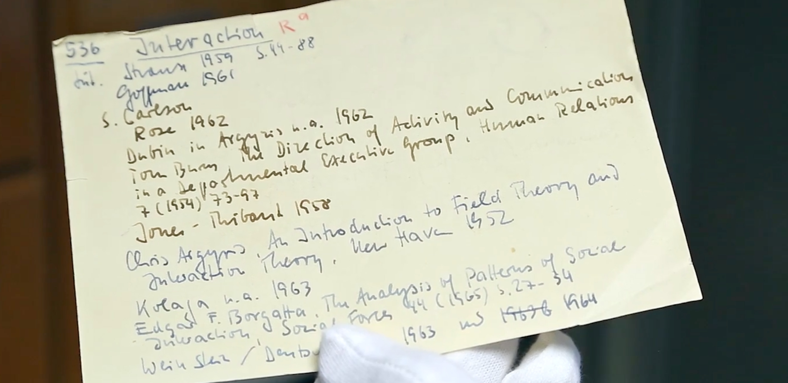
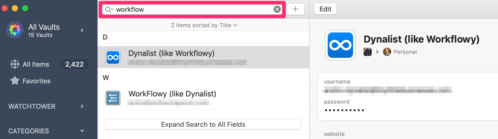
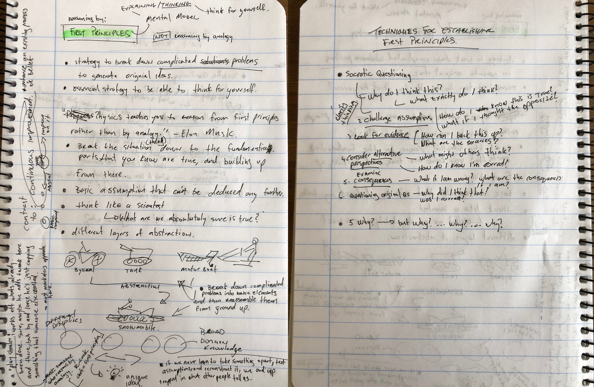
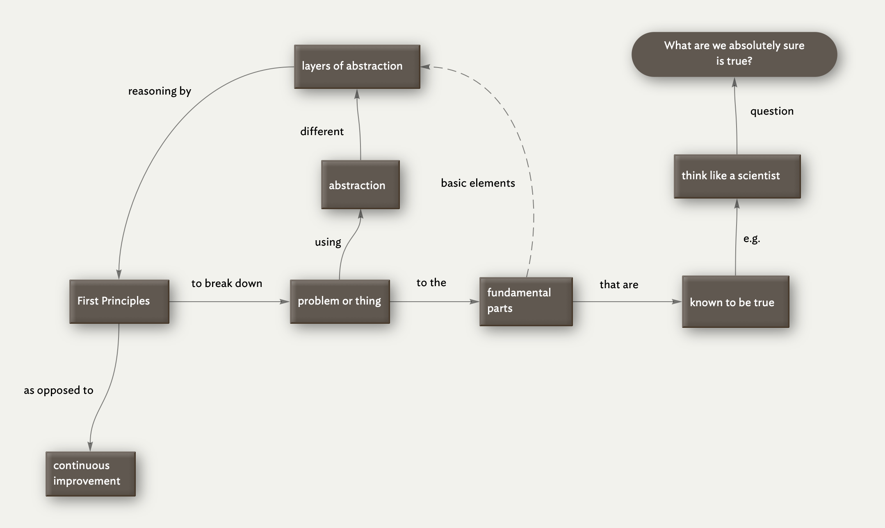
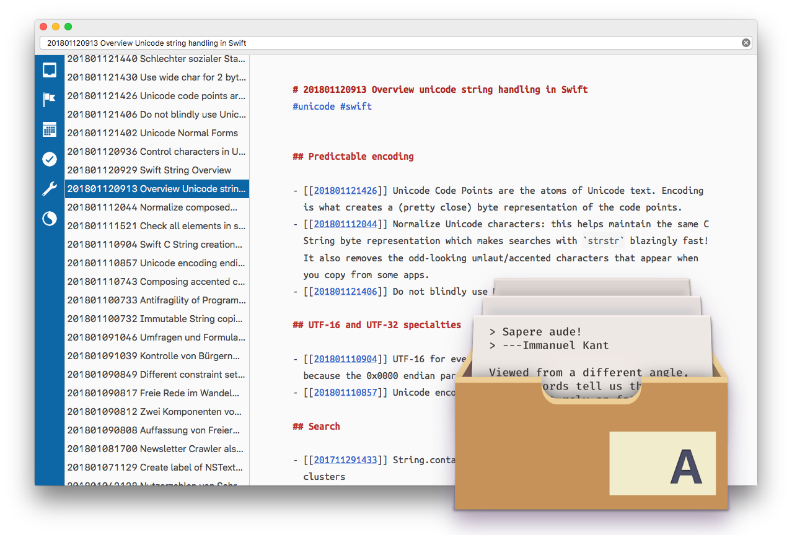
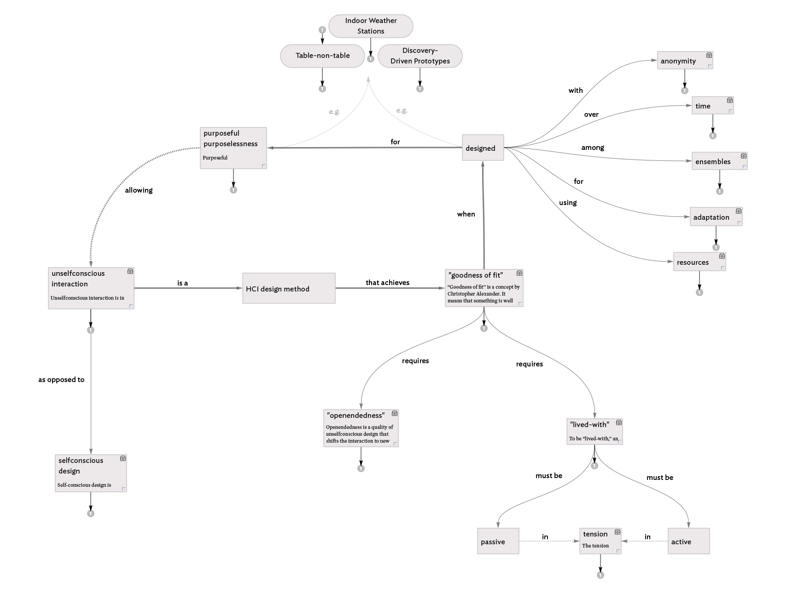

## Summary
[[AndreChaperon|André Chaperon]] presents [[PersonalKnowledgeManagement]] as the upstream layer that turns fragmented information into material for creative work before a writer reaches the blank page. His adapted [[ZettelkastenMethod]] moves low-friction fleeting capture into permanent notes written in the author's own words, then uses contextual search, stable identifiers, links, and optional visualization to support retrieval and recombination. The article is a self-reported 2019 workflow rather than comparative evidence, but its images make the movement from capture to linked, visualized notes concrete.

## Key Claims
- [[PersonalKnowledgeManagement]] should precede application-level workflow and drafting so relevant information can be found and reused instead of reconstructed at a blank page.
- [[ZettelkastenMethod]] separates fleeting capture from permanent notes: quick fragments reduce capture friction, while later rewriting in one's own words tests comprehension and creates durable material.
- Contextual retrieval can be more flexible than fixed hierarchical filing: stable IDs, search terms, metadata, and semantic links let a note reappear where it becomes useful.
- Writing is circular rather than purely linear because linked notes can accumulate before a project and later be assembled, revised, and extended into larger work.
- [[NoteToolFit]] favors a simple, low-friction system and durable open formats; Chaperon's personal stack combines paper, [[TheArchive]], [[Tinderbox]], and external long-form writing tools.
- [[FirstPrinciplesThinking]] is used as a worked example: a fleeting handwritten model is rewritten as a compact permanent note, then visualized as a relationship map.
- Visual maps can supplement prose when they preserve typed relationships among concepts, but they remain an optional personal layer rather than a required part of Zettelkasten.

## Key Quotes
> "In which CONTEXT will I want to stumble upon it again?" - on retrieval-oriented note placement.

> "The Archive is my external brain." - on using a searchable plain-text note store as durable memory.

> "Deep knowledge work requires a robust PKM." - on placing knowledge processing upstream of creative output.

## Connections
- [[AndreChaperon]] - author describing the evolution of his personal knowledge-processing workflow.
- [[NiklasLuhmann]] - historical model for flat, identified, contextually linked slip-box notes.
- [[ChristianTietze]] - creator of The Archive and co-publisher of the Zettelkasten resource Chaperon recommends.
- [[PersonalKnowledgeManagement]] - central system for capturing, processing, retrieving, and reusing information.
- [[ZettelkastenMethod]] - primary method adapted for permanent notes and contextual linking.
- [[NoteToolFit]] - explains the emphasis on low friction, open files, search, and optional visualization.
- [[SecondBrain]] - the article treats connected permanent notes as external memory for later creative work.
- [[FirstPrinciplesThinking]] - worked example used to demonstrate capture, rewriting, and visualization.
- [[TheArchive]] - plain-text note application used for permanent Zettel.
- [[Tinderbox]] - visual note environment used to map relationships among concepts.

## Contradictions
- The source's strong claim that robust PKM prevents blank-page problems is qualified by [[why-note-taking-apps-dont-make-us-smarter]] and [[liang-mouyin-wei-shen-me-ni-bu-gai-chen-mi-zhi-shi-guan-li]]: capture, storage, and tooling do not by themselves improve thought or produce useful output.
- The recommended stack is a personal 2019 macOS workflow, not evidence that its tools, one-to-two-day processing target, flat structure, or visualization layer outperform simpler, hierarchical, paper-only, or project-specific systems.
