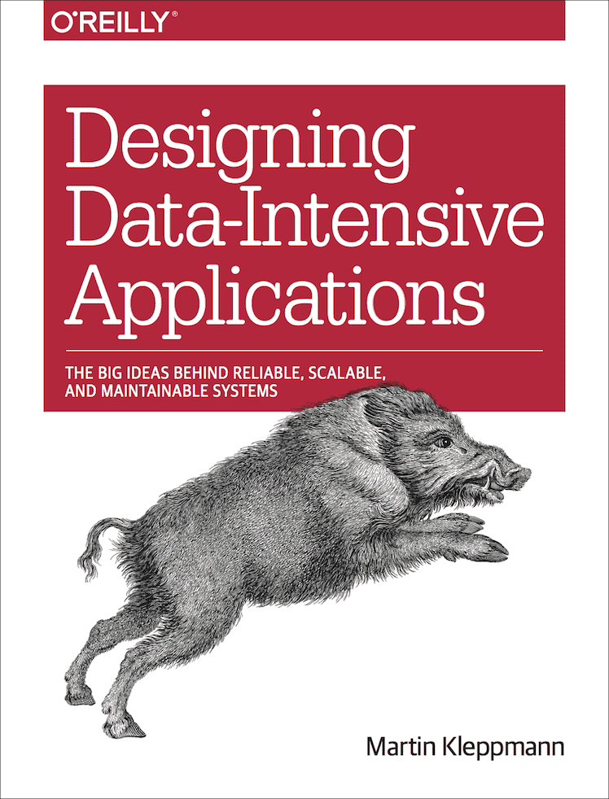
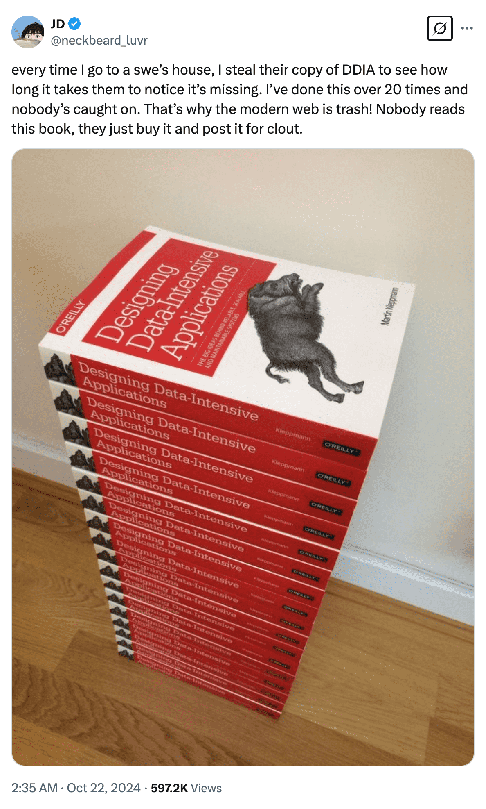

## Summary
Laisky condenses *Designing Data-Intensive Applications* into a broad survey of reliable, scalable, and maintainable data systems. The notes connect data models and storage engines with replication, partitioning, transactions, clocks, consensus, batch processing, and streaming, emphasizing that each guarantee carries performance and operational tradeoffs. They are useful as a structured reading synthesis rather than an independent benchmark, protocol specification, or current product guide.

The introductory joke frames the book as widely owned among software engineers but less often read in full.

## Key Claims
- [[DataIntensiveSystems]] should be evaluated across reliability, scalability, and maintainability rather than by throughput or one database feature alone.
- Data-model choice follows relationship and access patterns: documents favor locality, relational systems make joins explicit, and graph models fit traversal across complex relationships.
- Storage design is workload-specific: LSM trees favor sequential writes but pay compaction and read costs, while B-trees use page-oriented in-place updates with different amplification and concurrency behavior.
- [[DatabaseTransactionIsolation]] is about preserving application invariants under concurrency; snapshot isolation, locking, MVCC, predicate protection, and SSI prevent different anomalies at different costs.
- Replication and partitioning improve locality, availability, or throughput while creating lag, conflict, routing, hotspot, and failover problems.
- [[DistributedConsensus]] separates serializability from linearizability and uses ordered replication, fencing, terms, quorums, or protocols such as Paxos and Raft to coordinate under partial failure.
- Batch and stream systems both benefit from immutable inputs and retry-safe effects, while streams additionally require explicit ordering, backpressure, window, event-time, and delivery-semantics decisions.

## Key Quotes
> "A key transactional property is safe retrying" - on designing failed transactions so they can be repeated without duplicate effects.

> "Causal consistency can be considered the strongest model that offers good performance under unreliable networks." - the notes' qualified consistency judgment.

## Connections
- [[Laisky]] - author of the reading notes.
- [[DataIntensiveSystems]] - umbrella synthesis joining the article's reliability, storage, distribution, transaction, and processing themes.
- [[DatabaseEngineeringTradeoffs]] - database guarantees and structures must be interpreted through workload, failure, and operational consequences.
- [[DatabaseTransactionIsolation]] - the notes compare MVCC, snapshot isolation, explicit locks, predicate locks, two-phase locking, and SSI.
- [[DistributedConsensus]] - the notes distinguish consistency models and explain ordered replication, FLP, two-phase commit, and leader terms.
- [[DataDurability]] - WALs, replication, immutable logs, and recovery protect acknowledged state within a defined failure model.
- [[DurableMessaging]] - broker persistence, offsets, redelivery, and idempotent effects compose end-to-end processing guarantees.

## Contradictions
- No direct contradiction was found. The source reinforces existing pages while broadening them from individual database and consensus examples into one connected data-system design map.
- The notes summarize a book and include simplified or time-sensitive product examples; numerical claims and implementation guidance should be checked against primary and current sources before operational use.
