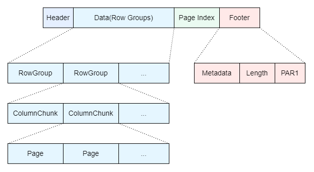
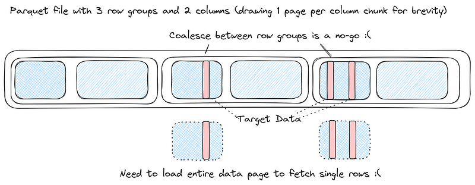
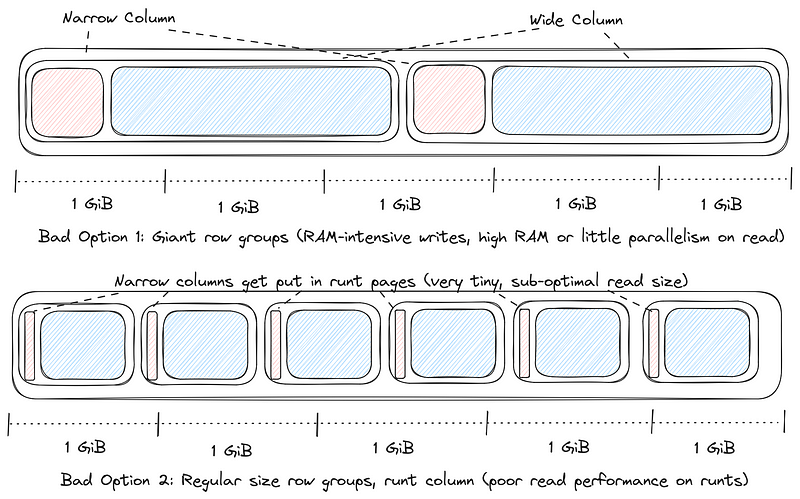
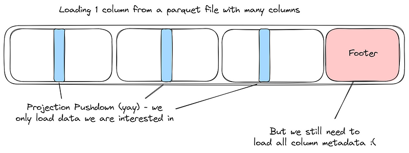
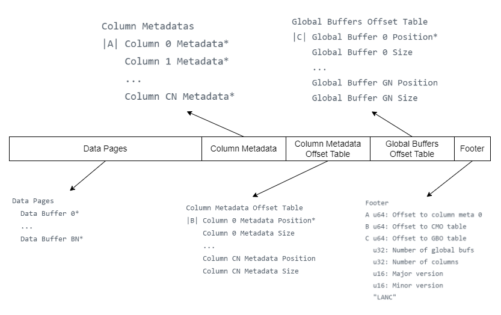
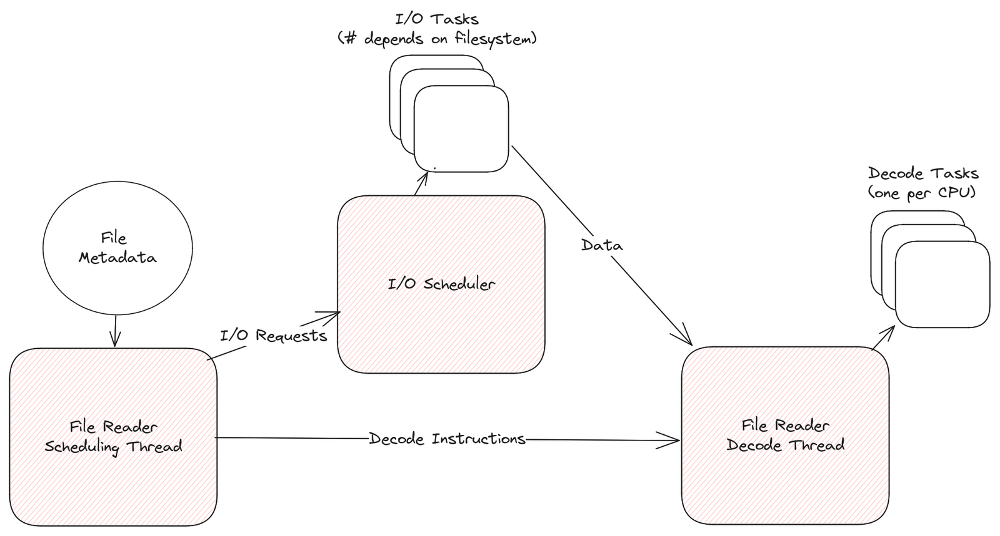
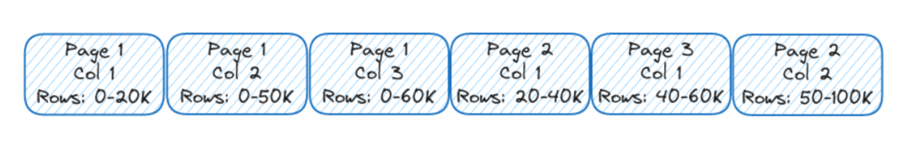
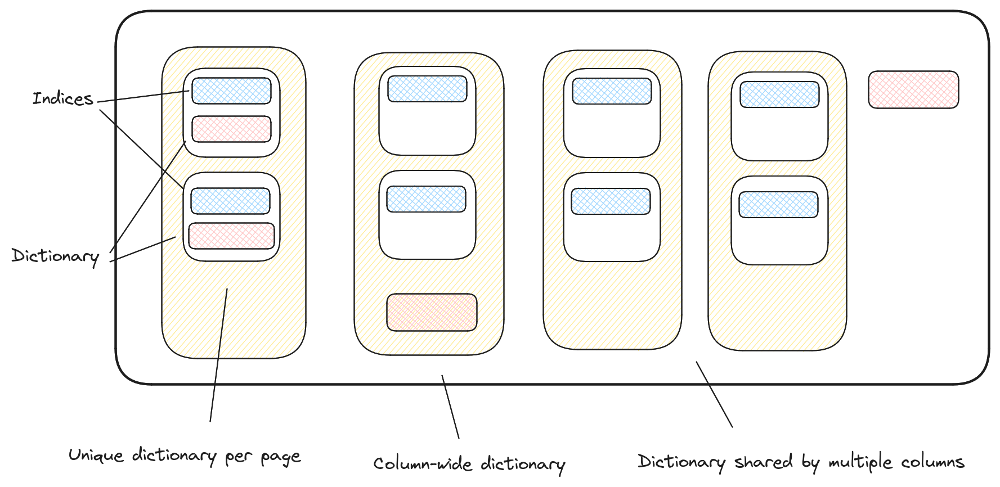
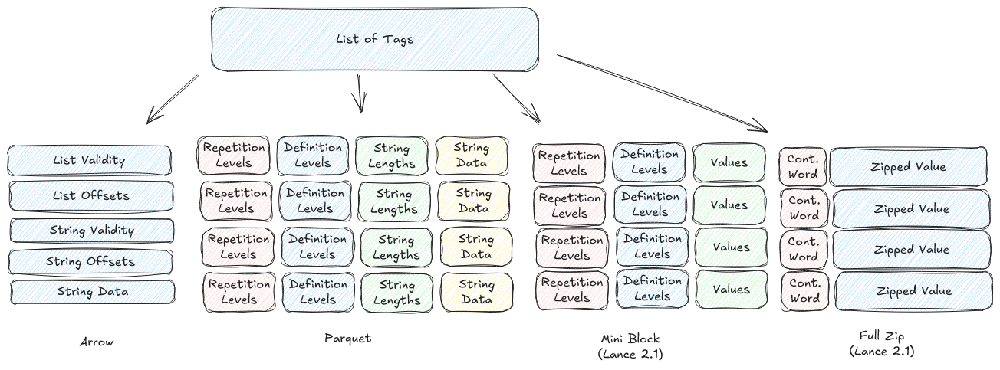

## Summary
This Chinese technical article, largely translated from Lance v2.1 materials with the author's commentary, presents [[LanceFormat]] as a file-and-table storage design for vector, tensor, text, image, audio, and video workloads. It contrasts Lance's row-group-free pages, small footer, independently addressable column metadata, extensible encodings, and external dataset metadata with [[ApacheParquet]] and Iceberg. The central [[ColumnarStorageTradeoffs]] are not that one format dominates every workload, but that scan compression, low-latency random access, metadata cost, I/O scheduling, and format evolvability pull the physical layout in different directions.

## Key Claims
- Parquet organizes row groups into column chunks and pages, with a footer holding schema, position, and statistics metadata; that hierarchy supports compression and scans but point lookup can still read whole pages across multiple row groups.

- In AI datasets, very wide binary or tensor columns make one shared row-group size awkward: large groups raise write memory and reduce read parallelism, while conventional groups can fragment narrow columns into inefficient tiny reads.

- A many-column Parquet file can impose metadata cost even when a query projects one column, because the reader still loads the common footer.

- Lance v2 replaces row groups with independently paged columns plus per-column metadata, offset tables, global buffers, and a small fixed footer that locates those structures.

- Without a shared row-group boundary, columns can use different page counts and storage-sized pages; the reader can overlap later I/O with CPU decoding rather than binding I/O parallelism to row-group and selected-column counts.

- Lance permits pages from different columns and row ranges to be interleaved, and lets dictionaries, statistics, and indexes live at page, column, global, or external dataset scope.

- Lance uses Arrow's type system while treating encoding descriptions as extensions. Its v2.1 structural encodings choose between mini-blocks for small values and full-zip encoding plus an index for large or nested values, aiming to bound random access to one or two I/O operations while retaining useful compression.

- Lance Table Format organizes `.lance` data files with version manifests, secondary indexes, and deletion files; types, encodings, indexes, and statistics can be externalized so they can evolve without rewriting all primary data.

## Key Quotes
> “Lance 本身没有类型系统” - on reusing Arrow types while leaving physical encoding extensible.

> “相同列的 Pages 不一定要连续存储” - on decoupling logical columns from one rigid physical order.

## Connections
- [[LanceFormat]] - the file and dataset formats explained by the article.
- [[ApacheParquet]] - scan-oriented comparison point whose row groups, pages, and footer expose different random-access and metadata tradeoffs.
- [[ColumnarStorageTradeoffs]] - synthesis of the layout choices among compression, scans, random access, metadata, and extensibility.
- [[LanceDB]] - database project built on the Lance format and independently represented in the wiki through its random-access benchmark.
- [[VectorDatabase]] - vector retrieval motivates native indexing and selective row access.
- [[MultimodalDataPipelines]] - tensors and large media columns motivate independent page sizing and first-class blob-oriented storage.
- [[StoragePerformanceBenchmarking]] - the claimed I/O and scan advantages require workload- and system-specific measurement.

## Contradictions
- No direct contradiction with the existing [[LanceDB]] benchmark: this source explains the on-disk mechanisms beneath its selective row-fetch path, while the benchmark supplies one measured runtime case.
- The source broadens [[ApacheParquet]] beyond Slack's interoperability role by emphasizing low-latency point lookup, wide-column sizing, and many-column metadata costs. These are workload qualifications, not evidence that Parquet is generally inferior for scans or interoperable analytics.
- Statements that Lance can exceed Parquet scan performance, tolerate millions of columns, or bound arbitrary nested random access to two I/O operations are design-author claims without reproduced benchmarks in this article. The comparisons also do not quantify file size, write cost, ecosystem maturity, compatibility, or operational complexity.

## Image Notes
All eleven effective remote image references were opened. Ten unique evidence-bearing diagrams were retained at their semantic positions; the second reference to the Lance v2 file-layout diagram was an exact duplicate and was omitted.
