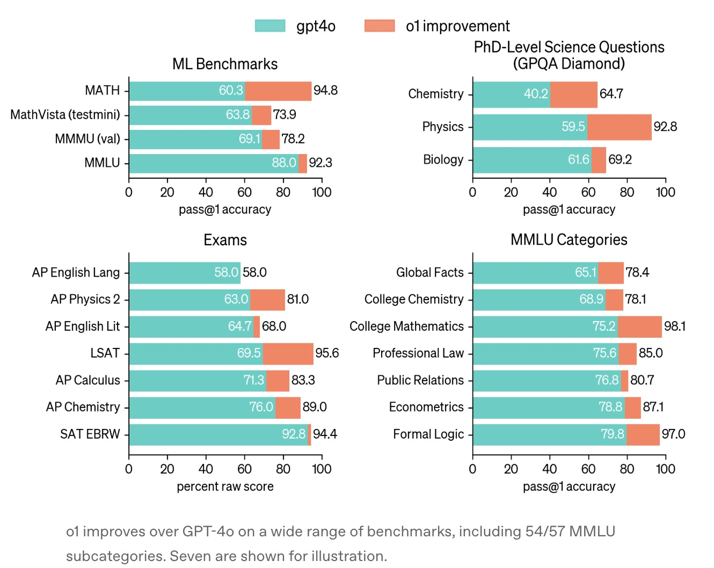
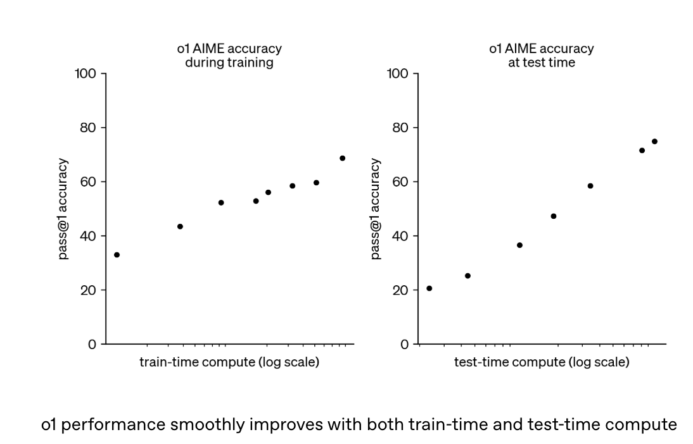
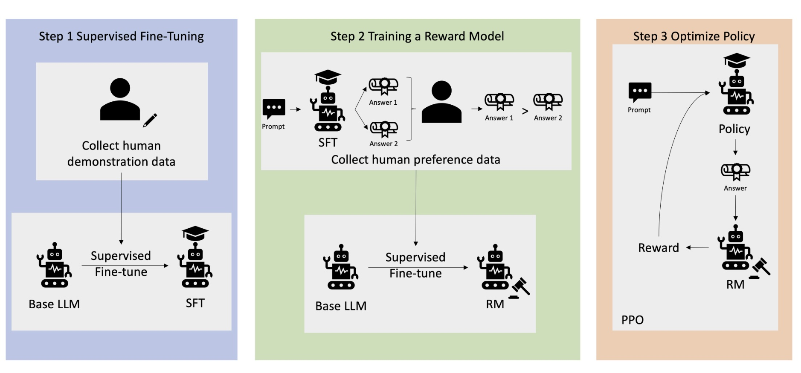
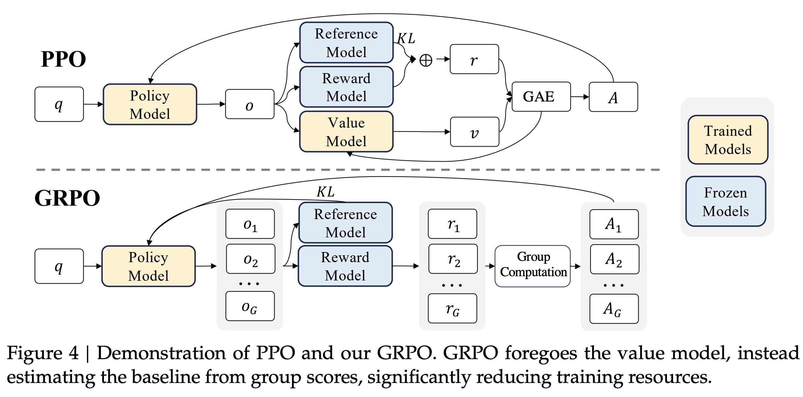
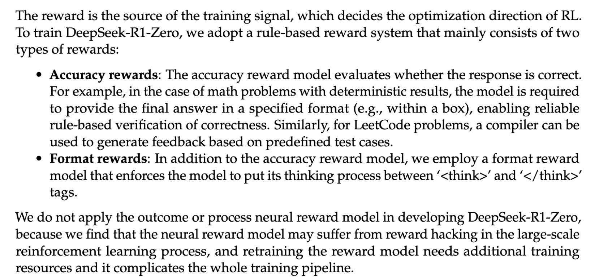
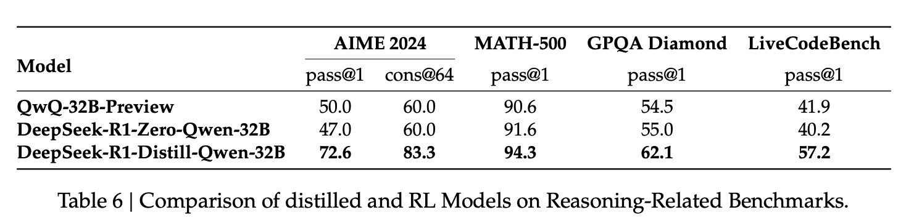
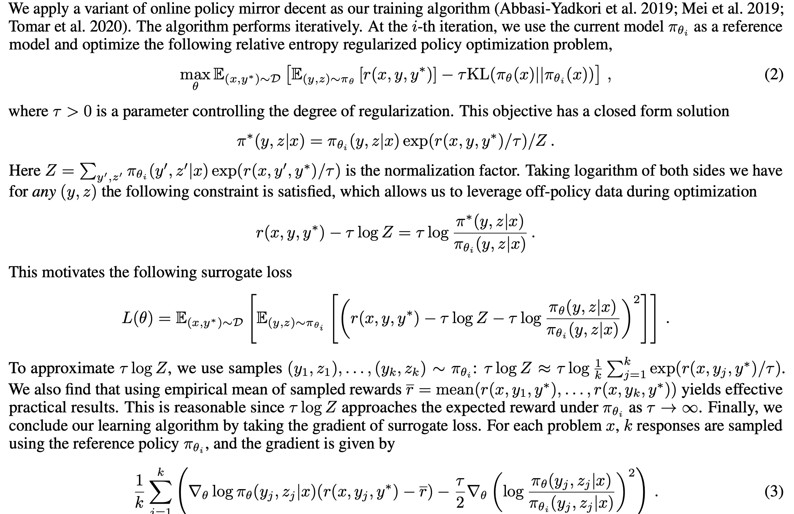
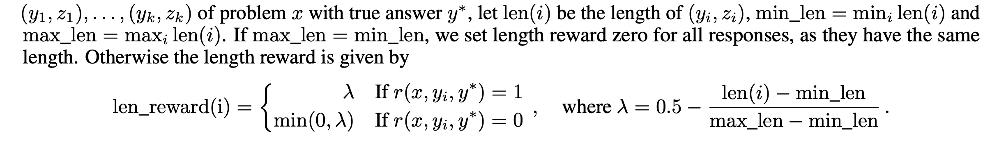

## Summary
[[Wulc]] compares the public technical accounts of [[OpenAIo1]], [[DeepSeekR1]], and [[KimiK15]] to explain how reasoning-model development moved additional computation into reinforcement learning and test-time reasoning. The article contrasts conventional RLHF and PPO with [[GroupRelativePolicyOptimization]], then follows DeepSeek's cold-start and multi-stage pipeline, rule-verifiable rewards, distillation, and unsuccessful PRM/MCTS trials alongside Kimi's long-context curriculum, critic-free policy optimization, and length-control methods. Its strongest synthesis is that training design, verifiable tasks, and efficient transfer can matter as much as raw parameter or pretraining scale, although it is a secondary overview and sometimes turns report findings into broader claims.

## Key Claims
- [[OpenAIo1]] is presented as a reasoning model whose benchmark performance and AIME accuracy increase with both training compute and test-time compute, while its hidden reasoning implementation is only lightly disclosed.

- Conventional RLHF is summarized as supervised fine-tuning, preference-based reward-model training, and policy optimization; PPO adds a trainable critic/value model and a frozen reference model whose KL penalty limits policy drift.

- [[GroupRelativePolicyOptimization]] removes PPO's critic and estimates relative advantage from rewards across multiple answers to the same prompt, reducing value-model training cost but retaining reward-design and sampling dependencies.

- [[DeepSeekR1]] separates an exploratory R1-Zero result—reasoning induced by RL without initial SFT—from a more usable R1 pipeline that adds cold-start long-chain data, reasoning RL, rejection-sampled SFT data, and all-scenario preference RL.
- DeepSeek-R1-Zero uses rule-based accuracy and output-format rewards because learned reward models add cost and can be exploited; DeepSeek-R1 adds a language-consistency reward to reduce mixed-language reasoning.

- The DeepSeek report treats process reward models and Monte Carlo tree search as unsuccessful general solutions: process boundaries and intermediate rewards are hard to define, while language search branches explosively and value models remain difficult to train.
- Distilling reasoning traces from a stronger DeepSeek model into smaller Qwen and Llama models is reported to outperform applying the same large-scale RL recipe directly to smaller models at lower compute cost.

- [[KimiK15]] combines a 128K-token reasoning context with a diverse, objectively gradable, difficulty-balanced RL prompt set and long-chain SFT before RL rather than beginning from pure RL.
- Kimi's critic-free online policy mirror descent variant uses sampled responses, relative rewards, and KL-style regularization; curriculum sampling begins with easier problems, while prioritized sampling later emphasizes lower-success tasks.

- Kimi's Long2Short methods—model merging, shortest-correct rejection sampling, DPO, and length-penalized RL—try to preserve reasoning accuracy while reducing unnecessarily long outputs.

## Key Quotes
> "it is the first open research to validate that reasoning capabilities of LLMs can be incentivized purely through RL, without the need for SFT" - the DeepSeek-R1 report's stated significance, quoted by the article.

> "distilling more powerful models into smaller ones yields excellent results" - the DeepSeek-R1 report's comparison of distillation with direct RL on small models.

## Connections
- [[Wulc]] - author of the comparative technical overview.
- [[OpenAIo1]] - benchmarked reasoning model and example of training- and test-time compute scaling.
- [[DeepSeekR1]] - open reasoning-model family used to explain pure-RL emergence and the later multi-stage production pipeline.
- [[KimiK15]] - long-context reasoning model used to explain prompt-set construction, policy optimization, sampling, and Long2Short methods.
- [[ReinforcementLearning]] - common optimization framework connecting the three reports.
- [[GroupRelativePolicyOptimization]] - critic-free algorithm central to the DeepSeek explanation.
- [[ChainOfThoughtReasoning]] - extended reasoning behavior whose quality, readability, and length the systems optimize.
- [[ReasoningModelDistillation]] - transfer of stronger-model reasoning trajectories into smaller models.

## Contradictions
- The article corrects a simple "pure RL replaces SFT" narrative: R1-Zero demonstrates a pure-RL route to emergent reasoning, but the practical DeepSeek-R1 model restores cold-start SFT, rejection-sampled SFT, and a second RL phase for readability and broad capability.
- It presents PRM and MCTS as unsuccessful attempts in this program rather than universally ineffective methods; the cited failure modes are especially tied to open-ended language search, intermediate-reward definition, value-model quality, and tractable branching.
- Benchmark figures and training claims are reproduced from vendor technical reports without independent replication, and the overview does not supply enough implementation detail to reproduce OpenAI o1.
