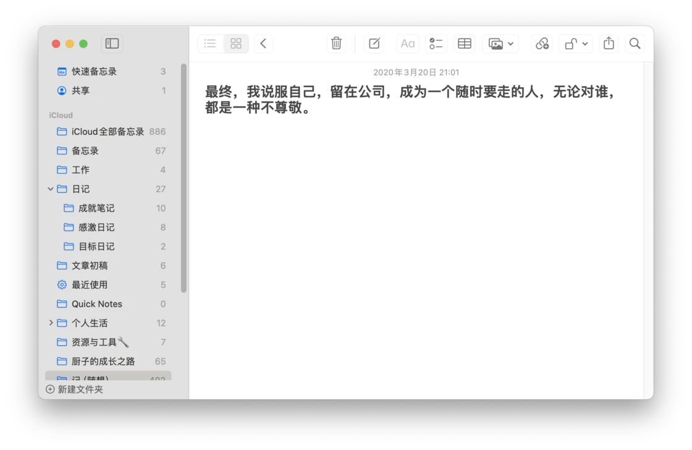

## Summary
[[LarsManbu|Lars漫步]] presents journaling as a selective reflection practice rather than an exhaustive daily log. The article organizes its value around reviewing past choices, making emotions and fears more concrete, and examining whether present decisions support desired goals, then offers a progression from meaningful events to emotion, gratitude, achievement, and choice-focused entries. It recommends a flexible ten-to-fifteen-minute practice, often the following morning, while supplying mainly personal experience and secondary references rather than direct causal evidence.

## Key Claims
- [[JournalingPractice]] can preserve evidence about earlier emotions, problems, achievements, and decisions so recurring patterns and the path into the present become easier to inspect.
- Useful entries select meaningful events and emotional changes rather than attempting an exhaustive chronology.
- An emotion journal makes fear, regret, and self-criticism explicit by asking what is feared, what action is possible, and what the worst outcome would be.
- [[GratitudePractice]] redirects attention toward people, relationships, support, and ordinary positives that might otherwise go unnoticed.
- An achievement journal records small completed actions as evidence of capability and can contribute to [[SelfEfficacy]], though the article does not measure that effect.
- Choice-and-goal entries reconstruct why a decision was made, compare it with a desired life, and use repeated behavior as material for adjustment.
- The author recommends choosing only the form relevant to the day and spending roughly ten to fifteen minutes, with next-morning writing offered as a personal preference rather than a universal rule.

## Key Quotes
> “重要的是如实地记录” — on observation preceding self-judgment or deliberate change.

> “我们不需要每天都把所有的流程过一遍” — on choosing the journal form that fits the day's most consequential material.

## Connections
- [[LarsManbu]] - author who combines retrospective, emotional, gratitude, achievement, and decision-oriented journaling practices.
- [[JournalingPractice]] - the article broadens structured journaling into a graduated set of prompts tied to self-understanding and choice.
- [[GratitudePractice]] - one proposed journal type records specific people and conditions for which the writer feels grateful.
- [[SelfEfficacy]] - small achievements are recorded as visible evidence that the writer can act and progress.
- [[GoalSetting]] - choice-focused entries compare daily behavior with longer-term aims.
- [[AttentionManagement]] - prompts intentionally redirect attention toward emotionally significant events, positives, and repeated behavior.

## Contradictions
- No direct contradiction with existing wiki content. The article complements the T.L.C., programming, and interstitial-journaling sources by adding emotional processing, achievement evidence, retrospective review, and choice reconstruction.
- Claims that writing recruits rational brain systems, buffers negative emotion, improves health, or raises happiness rely on simplified mechanisms and secondary references in the saved article; they should not be treated here as independently verified clinical or causal findings.
