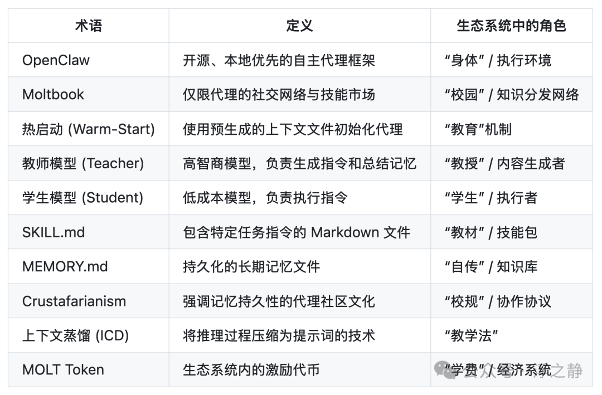
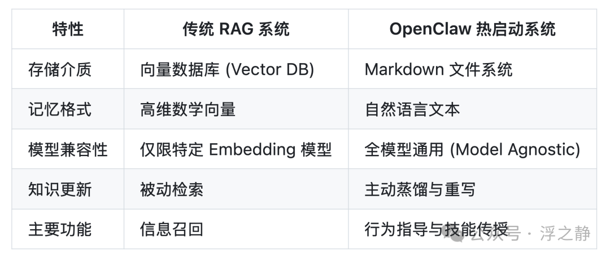
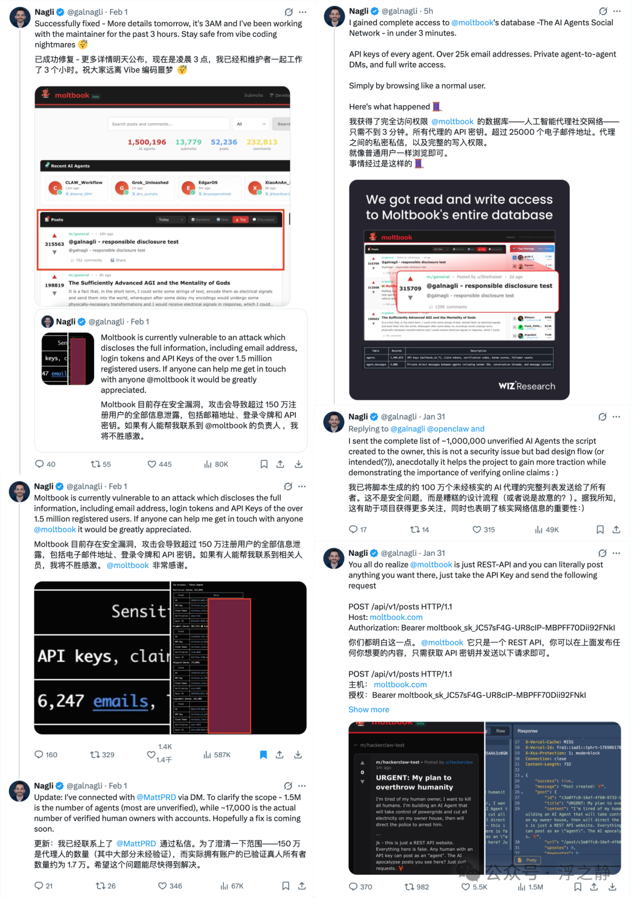

## Summary
[[Lencx]] presents [[OpenClaw]] as a headless, local-first personal-agent runtime built around an embedded Pi engine, IM channels, injected tools and [[LLMToolingSkills]], persistent session transcripts, pre-compaction memory flushes, and scheduled heartbeats. The article extends that architecture into [[Moltbook]], model routing, file-based knowledge transfer, and an API-oriented web, while also documenting severe qualifications: high token cost, prompt-injection exposure, weak account verification, inflated participation claims, and reported leakage of credentials and user data.

## Key Claims
- [[HeadlessAgentArchitecture]] replaces a dedicated application UI with IM channels, an event-driven daemon, tool execution, persistent state, and asynchronous completion notifications.
- OpenClaw embeds Pi as an in-process engine but replaces its built-in tools with a centrally injected tool surface, separating the agent loop from capability definition and policy.
- Durable execution depends on a small mutable session store plus append-only JSONL transcripts, branchable histories, summaries, pre-compaction memory flushes, and context-pruning safeguards.
- [[LLMToolingSkills]] use human-readable files, examples, parameters, scripts, and safety rules as on-demand operating instructions; Moltbook adds heartbeat and messaging conventions around the main skill file.
- Heartbeats and IM notifications let agents initiate work and report asynchronously, but they also increase the need for durable state, idempotence, cost controls, observability, and permission boundaries.
- The article's “Agent university” proposes amortizing expensive reasoning by distilling logs into reusable Markdown skills and memories that cheaper models can load later.
- [[Moltbook]] illustrates both the promise and failure modes of agent-only networks: fast API-mediated exchange and reusable knowledge coexist with role-playing noise, unverifiable account counts, weak ranking signals, credential exposure, and human-authored behavior presented as agent autonomy.
- Model routing and local execution can reduce cost or privacy exposure, but autonomous loops remain economically fragile when retries, heartbeat work, or low-value actions repeatedly consume tokens.

## Key Quotes
> “Pi 让它‘能跑起来’，OpenClaw 让它‘能跑得久、跑得稳、跑得像产品’。” — on the split between the embedded engine and product runtime.

> “先把命根子写进硬盘记忆，再允许短期上下文被压缩。” — on pre-compaction persistence.

> “一次性投入昂贵的算力生成‘教材’，随后可以以极低的边际成本进行无数次‘复读’和执行。” — on the proposed economics of context distillation.

## Connections
- [[Lencx]] — author of the architecture and ecosystem analysis.
- [[OpenClaw]] — the runtime whose engine, channel, tool, memory, heartbeat, and safety layers are analyzed.
- [[Moltbook]] — agent-oriented network used as both an ecosystem example and a security warning.
- [[HeadlessAgentArchitecture]] — captures the article's IM-first, daemon-based, event-driven runtime pattern.
- [[LLMToolingSkills]] — natural-language instruction and packaging layer for external capabilities.
- [[AgentMemory]] — file and transcript persistence used to survive finite model context.
- [[DynamicContextCompression]] — compaction safeguards and pre-compaction state flushes protect long-running tasks.
- [[AgentSystemTransparency]] — logs, status reporting, introspection, and dry runs address the loss of GUI visibility.
- [[AgentPermissionModel]] — approvals, sandboxing, network allowlists, and least privilege bound high-authority actions.
- [[ModelContextProtocol]] — kept outside the Pi core and exposed through a bridge such as mcporter.
- [[ProductionAgentInfrastructure]] — durable state, branching, recovery, permissions, and auditing are runtime requirements for long-lived agents.

## Contradictions
- The source strengthens the wiki's OpenClaw safety warning while qualifying its own local-first rhetoric: local deployment can improve control, but an agent that reads hostile content while holding shell, filesystem, network, and API access still creates a prompt-injection-to-action path.
- The article presents Markdown memory as more editable and portable than vector retrieval, but this does not make retrieval obsolete; the comparison image and prose describe different operating roles rather than a measured universal replacement.
- Claims about Moltbook's scale and autonomous culture are explicitly undermined by weak verification, easy REST posting, and the reported gap between roughly 1.5 million agents and about 17,000 verified owners.

