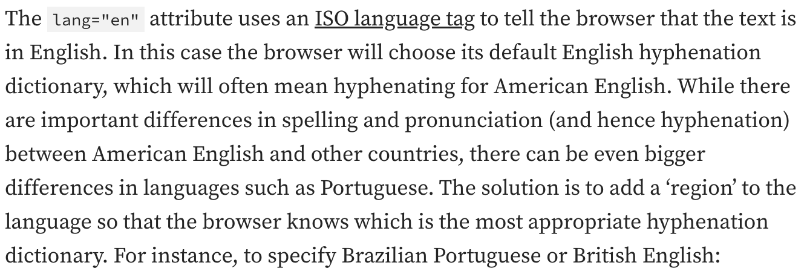
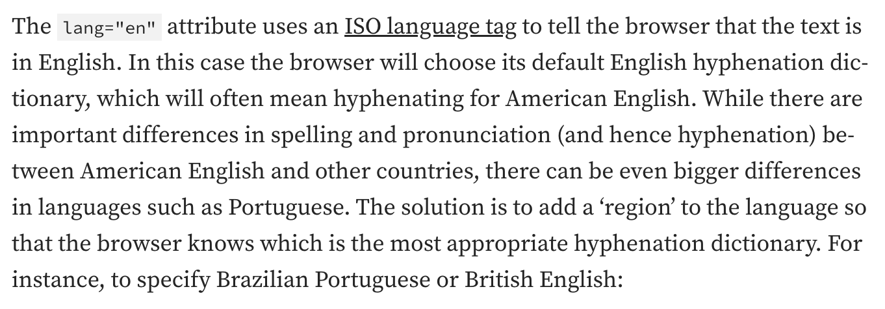
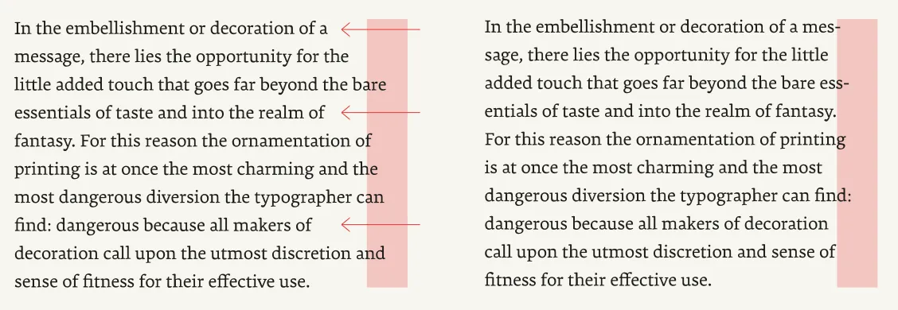
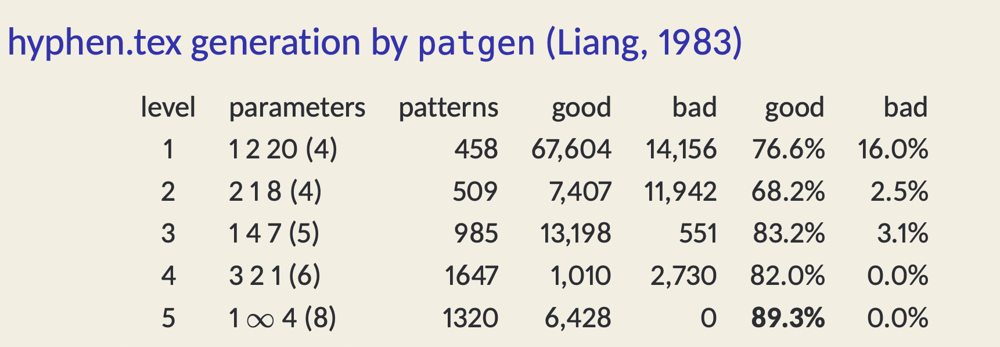
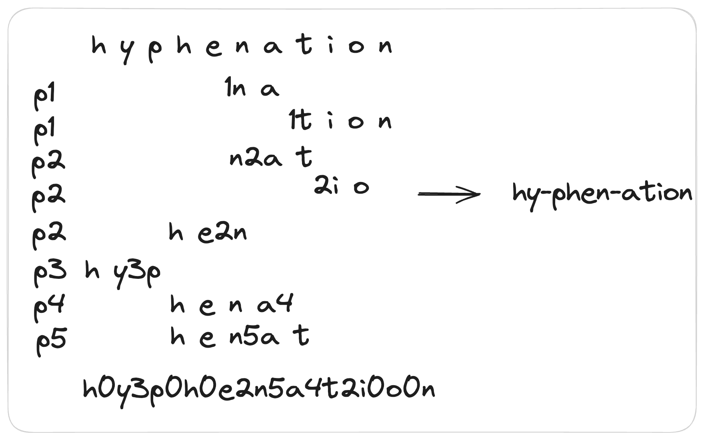

## Summary
This Chinese-language technical article connects the typographic purpose of [[Hyphenation]] with its Web controls and the pattern-matching method introduced by [[FrankLiang]] for [[TeX]]. It explains how language-sensitive word splitting reduces ragged edges or stretched word spaces, then traces a pipeline from dictionary examples to weighted patterns stored in a packed trie and applied by overlapping matches. The retained illustrations show the visual layout effect, the CSS hyphenation zone, reported pattern-level accuracy, and the worked transformation of “hyphenation” into “hy-phen-ation.”

## Key Claims
- Western text normally breaks at word spaces, so long words can leave large right-edge gaps under left alignment or excessive word spacing under justification; discretionary word splitting can improve line fit, especially in narrow columns.
- Browser hyphenation is language-sensitive: the document should carry an appropriate language and region tag before `hyphens: auto` is enabled, while supporting CSS controls can constrain minimum fragment sizes, consecutive hyphenated lines, final-line behavior, and the right-edge zone in which splitting is suppressed.
- Hyphenation is a rendering effect rather than a mutation of the underlying document text, so the inserted mark should not alter selection or search semantics.
- Early [[TeX]] used manually designed linguistic rules plus an exception dictionary; the article says this found only 40% of permissible breakpoints on a small dictionary at a 1% error rate and was difficult to generalize across languages.
- [[LiangHyphenationAlgorithm]] learns compact substrings from a hyphenated dictionary, stores them for efficient lookup, and overlays every matching pattern on an input word.
- Pattern digits encode competing evidence at character boundaries: higher levels override lower ones, odd final values permit a split, and even final values suppress it.
- The worked example overlays matches such as `hy3ph`, `he2n`, `hen5at`, and `1tion` to derive `hy-phen-ation`; the article also points to multilingual patterns and neural models as possible future directions.

The first pair makes the central tradeoff visible: splitting words reduces conspicuous unused line width, but introduces several visible hyphens and therefore a competing readability and aesthetics cost.

The pink right-edge zones show where a word beginning inside the zone is not split. A larger zone therefore tolerates more raggedness in exchange for fewer hyphenated line endings.

The reproduced Liang table reports 4,919 total patterns across five levels. Its per-level rows are not a monotonic accuracy curve: the reported good percentage varies from 68.2% to 89.3%, while bad outcomes fall to 0.0% at levels 4 and 5.

The worked diagram aligns matched substrings beneath the input word, takes the maximum digit at each boundary, and selects the surviving odd-valued positions to produce two breaks.

## Key Quotes
> “连字符只会存在于渲染层，也就是说数据层不会保存连字符” — on keeping layout-time hyphens separate from document content.

> “高等级的模式会覆盖低等级的模式” — on resolving overlapping pattern evidence.

## Connections
- [[Hyphenation]] — the typographic problem, browser controls, and readability tradeoff at the center of the article.
- [[LiangHyphenationAlgorithm]] — the dictionary-derived weighted-pattern method explained through a complete example.
- [[TeX]] — the typesetting system in which the article locates the transition from hand-authored rules to Liang's pattern method.
- [[FrankLiang]] — designer of the pattern algorithm and packed-trie representation described by the source.
- [[DonaldKnuth]] — creator of TeX and supervisor context for Liang's work.
- [[Univer]] — paragraph-layout project that motivated the author's study and includes a related trie-based implementation.
- [[DeepLearning]] — proposed in one cited research direction for Hungarian hyphenation.
- [[NaturalLanguageProcessing]] — broader computational-language field within which language-sensitive automatic word splitting sits.

## Contradictions
- The article calls the method dictionary-based but also describes it as pattern matching. It does not retain a full word list at runtime: it derives reusable substring patterns from a hyphenated training dictionary, so it sits between literal dictionary lookup and manually authored linguistic rules.
- The packed-trie explanation says that merging identical prefixes distinguishes it from an ordinary trie, although prefix sharing is already the defining property of a trie. The source does not explain Liang's actual packed-array representation in enough detail to support its stronger storage claim.
- The text says accuracy rises with pattern level, but the retained table's “good” percentage is not monotonic: level 2 is lower than level 1, and level 4 is lower than level 3. The narrower defensible claim is that reported bad outcomes reach zero at levels 4 and 5 in this table.
- Browser support and the CSS Text Level 4 properties are time-sensitive. The article supplies no browser-version matrix or interoperability tests, and several fine-grained controls may not have uniform implementation.
- The historical performance figures, the claim that level 5 is maximally authoritative, the suggested `8%` zone, and the future multilingual or neural advantages are reported from cited or practitioner sources rather than independently reproduced here.
