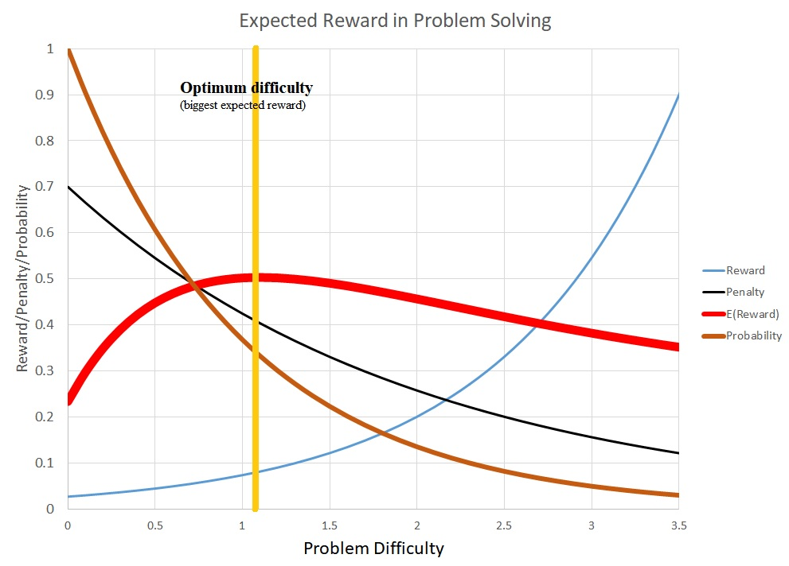

## Summary
[[PiotrWozniak]] presents [[Eustress]] as brief, self-chosen stress that becomes beneficial when productive progress or relief supplies a reward. The article models exploration through a [[ProblemValuationNetwork]] that balances expected reward, effort, fear, and danger, arguing that moderate, controllable challenges can strengthen learning and [[StressResilience]]. It contrasts that loop with [[ChronicStress]] imposed by school, work, or society, which the source says can disrupt sleep, damage threat appraisal, and increase anxiety rather than prepare people for difficulty.

## Key Claims
- [[Eustress]] is acute stress followed by reward, productive resolution, or removal of the stressor; it can make exploration enjoyable and memories durable.
- The [[ProblemValuationNetwork]] estimates reward against effort, failure probability, injury, and other costs, making an intermediate “Goldilocks” level of difficulty more valuable than trivial or overwhelming tasks.
- Productive exploration is iterative: an agent approaches, reassesses, retreats, learns, consolidates, and either tries again with better skill or concludes that the risk is too high.
- Autonomy is the boundary between useful challenge and harmful overload because self-direction lets a learner regulate exposure, retreat, and recompute value.
- Repeated success with controllable challenge is presented as a route to [[StressResilience]], realistic threat appraisal, and learned optimism.
- [[ChronicStress]] from steep, inescapable, or externally controlled demands can disturb sleep and threat valuation, producing anxiety rather than resilience.
- Excessive childhood stress may impair development of the valuation system needed to distinguish manageable danger from disproportionate fear.

## Key Quotes
> "自主承担的压力可能与奖励达到最佳平衡，而过量的压力可能导致焦虑症" - on autonomy and dose as the boundary between useful and harmful stress.

> "基于应对良性压力的高度抗压韧性来自于自由的探索" - on exploration as the proposed mechanism for resilience.

> "无法在学校、工作、或社会上控制自己的决定，是现代生活中有害的慢性压力的主要来源之一" - on loss of control as a chronic-stress mechanism.

## Connections
- [[PiotrWozniak]] - the source translates a SuperMemo Guru article attributed to Wozniak's learning and exploration framework.
- [[Eustress]] - the article defines beneficial stress through acute challenge plus later reward or resolution.
- [[ProblemValuationNetwork]] - the article's central mechanism for balancing reward, effort, probability, fear, and danger.
- [[StressResilience]] - the article argues that freely explored, manageable challenges build resilient threat appraisal.
- [[ChronicStress]] - the harmful contrast to brief, controllable challenge.
- [[FreeLearning]] - self-directed exploration lets a learner regulate difficulty, retreat, and retry.
- [[CoerciveLearning]] - imposed high-stakes educational pressure illustrates how potentially useful challenge can become chronic stress.

The chart makes the article's mechanism explicit: reward rises with problem difficulty while probability of success falls, penalty also declines in the plotted model, and their combination produces a broad expected-reward maximum near an intermediate difficulty rather than at either extreme.

## Contradictions
- No direct contradiction with existing wiki content. The source strengthens existing autonomy-centered learning claims, but its neuroscience, developmental, and mental-health mechanisms are theoretical assertions in one Wozniak-attributed essay rather than independently evaluated causal evidence.
