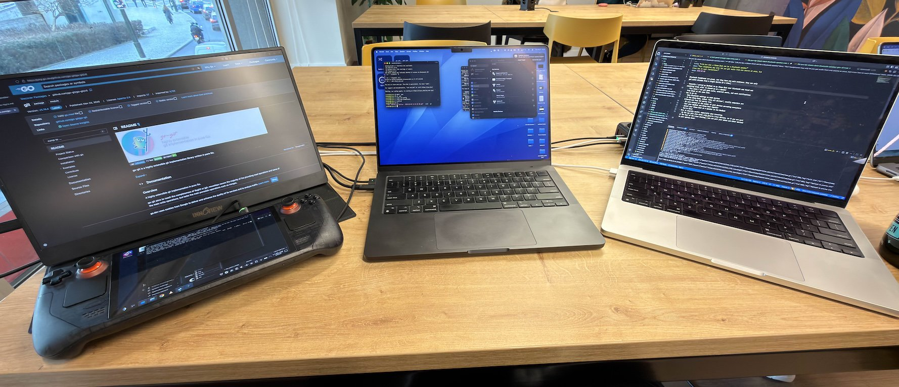

## Summary
The article describes using a [[SteamDeck]] as a Bluetooth audio sink so one pair of headphones can carry sound originating from several personal and work devices. Its practical recipe is to pair each computer with the Deck, select the Deck as that computer's speaker, maximize volume at the sending device, and use the Deck as the common volume-control point.

## Key Claims
- A Steam Deck can receive Bluetooth audio from a paired computer while continuing to provide its own audio, making it a practical aggregation point for devices that otherwise compete for one headphone connection.
- Pairing may require enabling a "show all devices" option because Bluetooth settings commonly de-emphasize computer-to-computer pairing.
- After pairing, the user selects the Steam Deck as the sending computer's speaker.
- Maximizing volume on each sender and controlling final volume on the Deck gives the shared output a single control point.
- The author says the technique also works with other Linux devices, but supplies no distribution, Bluetooth-stack, profile, hardware, or multi-device compatibility tests.
- The retained photograph shows the physical setting behind the workaround: a Steam Deck with an external display beside two laptops at a shared workspace.

## Key Quotes
> "Select your Steam Deck as a speaker on your laptop." — the central routing step.

## Connections
- [[SteamDeck]] — serves as both an audio source and the Bluetooth receiver for audio sent by other computers.
- [[BluetoothAudioRouting]] — the workaround consolidates several device audio streams at a Linux endpoint before headphone playback.

## Contradictions
- The claim of "no real limit" to the number of inputs is not benchmarked and may be bounded by Bluetooth profiles, hardware, software configuration, or practical usability.
- The opening description of headphones accepting only one source is a motivating case, not a universal hardware rule; the source does not compare multipoint-capable headphones.
- The generalization from Steam Deck to any Linux device is asserted without setup details or compatibility evidence.
