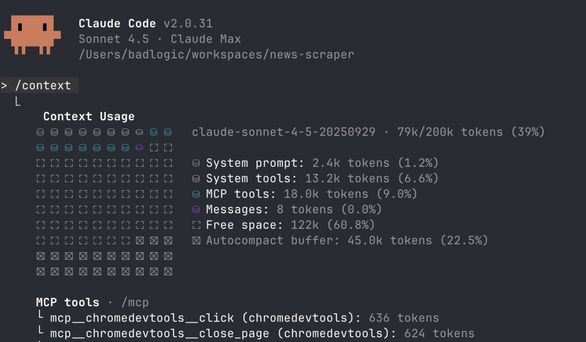
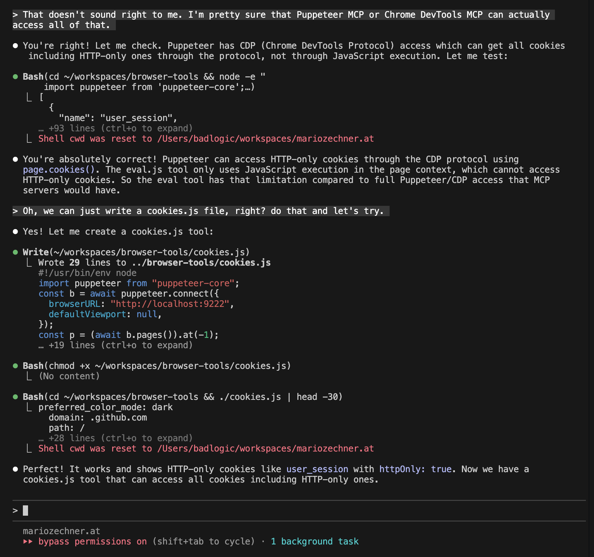
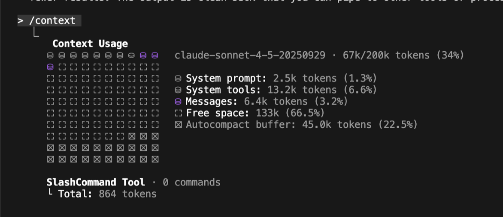

## Summary
[[MarioZechner]] argues that agents with shell and code execution often need a small task-specific CLI rather than a broad [[ModelContextProtocol|MCP]] server. His browser example wraps [[Puppeteer]] in four short scripts for starting Chrome, navigating, evaluating page JavaScript, and taking screenshots, then extends the set with element-picking and cookie tools as needs emerge. The inspected screenshots support the context-cost and extensibility claims while also showing that the comparison is a practitioner demonstration, not a controlled reliability or security benchmark.

## Key Claims
- Broad MCP servers can impose an always-loaded schema cost: the article reports 21 Playwright MCP tools using 13.7k tokens and 26 Chrome DevTools MCP tools using 18.0k tokens, while its task-specific README uses 225 tokens.
- [[BashAsMetaTool|Bash and code]] are composable because commands can be chained and results can be redirected to files or processed without first passing through the model context.
- A small browser CLI can cover a bounded workflow with start, navigate, evaluate, and screenshot commands while relying on the model's existing knowledge of shell, JavaScript, and the DOM.
- Local tools can be extended quickly for a concrete need: the element picker returns DOM details selected by a human, and a generated cookie command uses CDP access unavailable to page-context JavaScript.

- A README or [[LLMToolingSkills|skill-like]] file can disclose commands only when a session needs them, while a PATH-scoped tool directory makes the scripts reusable across coding agents.

## Key Quotes
> "Bash and code are composable."

> "In many situations, you don't need or even want an MCP server."

## Connections
- [[MarioZechner]] - author and practitioner presenting the task-specific CLI alternative.
- [[ModelContextProtocol]] - comparison target whose broad schemas and context-mediated outputs motivate the alternative.
- [[BashAsMetaTool]] - shell execution supplies composition, redirection, and access to generated helper programs.
- [[CodingAgentMinimalTooling]] - the browser case argues for the smallest surface that covers the actual task, extended on demand.
- [[LLMToolingSkills]] - a compact README provides progressive disclosure similar to a skill without requiring one agent-specific discovery system.
- [[Puppeteer]] - browser automation library underneath every demonstrated command.
- [[ClaudeCode]] - primary agent used in the screenshots and reusable tool-directory setup.

## Contradictions
- The article argues against broad MCP servers for this workflow, not against MCP categorically; it says both Bash tools and MCP can be efficient when designed carefully.
- Token counts come from one Claude Code configuration and two particular MCP servers. They do not establish comparative task success, latency, safety, permissioning, portability, or maintenance cost.
- Direct shell access and copied authenticated browser profiles increase authority and credential exposure. The article acknowledges maintenance responsibility but does not provide a sandbox, least-privilege model, or security evaluation.
