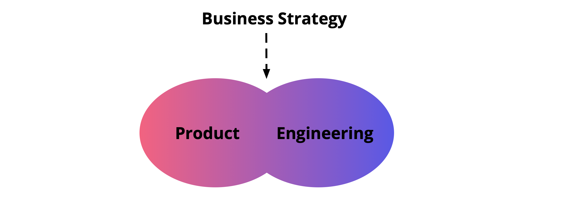

## Summary
[[MartinFowler]] frames [[TechnicalDebt]] as a stage-sensitive tradeoff: prudent shortcuts can accelerate early product learning, but debt becomes a scaling bottleneck when it lengthens value delivery, harms customers or developers, and compounds faster than teams can contain it. The article recommends an intentional technical strategy built around a quality bar, limited blast radius, equal product-and-engineering participation under business strategy, transparent evidence, end-to-end ownership, empowered teams, lightweight governance, and iterative investment rather than blanket rewrites.

## Key Claims
- [[TechnicalDebt]] includes code, tests, coupling, unused features, outdated dependencies, tooling, reliability and performance limits, manual processes, deployment capability, and missing knowledge—not only poor code quality.
- Prudent debt is useful while a startup is testing [[ProductMarketFit]], but successful experiments and core systems need repayment or replacement as the business enters scale-up.
- Over-engineering for hypothetical scale can be as damaging as uncontrolled debt because it slows experimentation before demand is proven.
- Warning signals include increasing value lead time, user-facing latency or quality problems, falling engineering satisfaction, difficult developer onboarding, and degraded infrastructure cost, performance, or availability.
- Some work described as debt is actually missing product or platform functionality with direct KPI impact and therefore needs normal planning, requirements, and dedicated resources.
- A technical strategy should be reconsidered around funding, product-direction changes, regular governance reviews, and fresh outside or rotating perspectives.
- Effective treatment combines clear quality standards, constrained blast radius, product-engineering collaboration, transparent business and platform data, end-to-end ownership, team autonomy, metrics used as guides, and lightweight checks.

## Key Quotes
> "prudent technical debt is healthy and desired" — on using shortcuts intentionally during early product discovery.

> "resolving technical debt should be part of the natural flow of product development" — on making repayment an ordinary product-team responsibility.

## Connections
- [[MartinFowler]] — attributed author presenting Thoughtworks' scale-up experience.
- [[Thoughtworks]] — consulting context from which the article draws its composite company examples.
- [[TechnicalDebt]] — central stage-sensitive tradeoff and scaling bottleneck.
- [[StartupScaling]] — growth changes which shortcuts, architecture, and operating practices remain suitable.
- [[ProductMarketFit]] — early uncertainty can justify prudent shortcuts and limits the value of premature scale engineering.
- [[InternalSoftwareQuality]] — brittle code, weak tests, poor documentation, and unsuitable models increase change cost.
- [[ContinuousDelivery]] — automated small deployments provide experimental flow and a quality signal.
- [[TechnicalDebtTracking]] — metrics and team feedback can make debt visible for contextual decisions.
- [[ProductManagement]] — product and engineering leaders jointly negotiate feature and sustainability tradeoffs.

## Contradictions
- Qualifies simplistic debt-elimination advice: zero debt is not the goal, and premature architecture, automation, or optimization can waste scarce learning capacity.
- Qualifies rewrite-first responses: the source recommends diagnosing the debt type and business impact before choosing process changes, incremental repair, platform work, or selective rebuilding.
- The article is practitioner guidance based on composite Thoughtworks client experience; it supplies no comparative outcome data, validated thresholds, or independent evidence for the four-phase model and recommended interventions.
