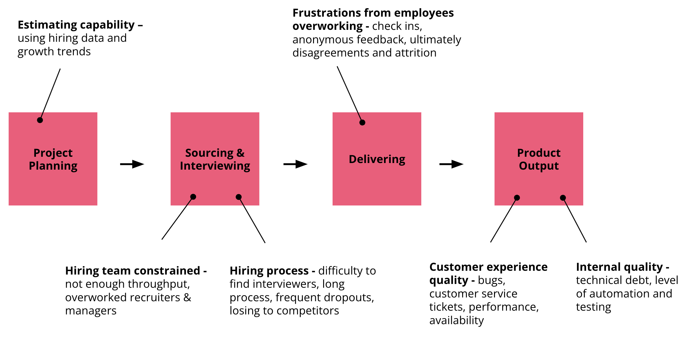
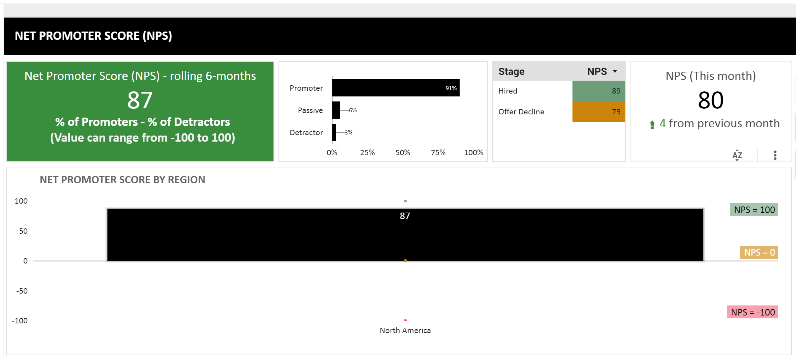
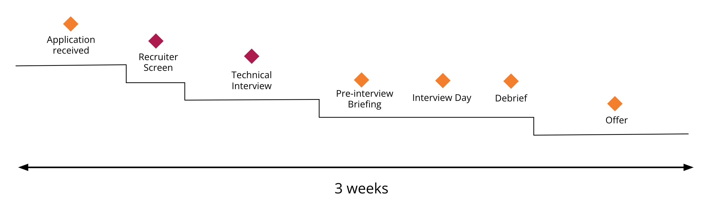

## Summary
[[TimCochran]] and [[RoniSmith]] describe how a scaleup can become constrained by both capacity and capability when hiring starts after growth has already overloaded the founding team. Drawing on [[Thoughtworks]] practice, they treat recruiting as a forecastable operating system: detect strain and dependency early, build recruiting capacity, improve the funnel with data and feedback, broaden the talent pool, make room for new hires, and prepare onboarding and work systems before headcount arrives.

## Key Claims
- Talent constraints appear through employee overwork and attrition, deadline conflict, quality decline, manual work, key-person dependencies, weak recruiting throughput, disappointed new hires, and reactive growth planning.
- Hiring must begin before the crisis because sourcing takes time and new employees may need another two to five months to become productive.
- A scaleup can differentiate itself through meaningful product impact, credible technical innovation, an effective engineering environment, employee advocacy, public technical writing, and open-source participation.
- Early teams need a few specialists, but most growth-stage technologists should be adaptable T-shaped learners; expanding beyond senior-only hiring requires mentoring and team-productivity incentives.
- Recruiting capacity, business forecasts, interviewer time, sourcing, applicant tracking, workforce planning, feedback, and funnel conversion should be treated as one measurable system.
- Remote capability broadens the regional and global talent pool only when tools, home-office support, meeting norms, and rituals put remote participants on equal footing.
- Diversity requires deliberate sourcing, job language, evidence-based interviews, explicit goals, inclusive retention, and reduced dependence on homogeneous referral networks.

- The displayed dashboard illustrates segmentation of candidate experience by outcome and region, but it is an example rather than evidence that NPS predicts hiring quality.

- The illustrated three-week process makes stages and elapsed time visible, supporting the recommendation to map and remove funnel friction.

## Key Quotes
> "Use trends to hire, rather than simply hire in reaction to obvious problems." - on forecasting capacity before growth becomes constrained.

> "Hiring shouldn't be outsourced." - on reserving employee time for interviews and shared hiring decisions.

## Connections
- [[TimCochran]] - co-author presenting Thoughtworks scaleup and technology-practice lessons.
- [[RoniSmith]] - co-author presenting recruiting operations and talent-system lessons.
- [[Thoughtworks]] - consultancy whose North American hiring system and training program supply the main organizational case.
- [[StartupHiringAtScale]] - central transition from founder-network hiring to forecasted, measurable recruiting capacity.
- [[HiringSystemDesign]] - recruiting is mapped across sourcing, interviews, candidate feedback, onboarding, outcomes, and continuous improvement.
- [[InclusiveHiring]] - deliberate sourcing and evidence requirements counter referral homogeneity and vague culture-fit judgments.
- [[EngineeringHiringEconomics]] - recruiter capacity, interviewer time, time-to-start, and ramp time make hiring an operating-capacity investment.
- [[RemoteWork]] - remote capability can widen the labor pool but requires deliberate tools and equal-participation practices.
- [[TechnicalDebt]] - quality decline and insufficient automation can be downstream signals that talent capacity is already strained.

## Contradictions
- The source recommends a time to offer below 45 days, time to start below 60 days, two to three hires per recruiter per month, one recruiting-operations person per three recruiters, and referrals below 30-40% after early growth. These are practitioner heuristics, not validated universal thresholds, and role, geography, labor market, accessibility, and company stage can change them materially.
- The article is company-authored guidance supported by composite client experience and a Thoughtworks case study; it does not provide controlled comparisons linking its process changes to retention, performance, diversity, or business growth.
- Its NPS dashboard demonstrates measurement design but does not establish that candidate NPS is a valid proxy for fairness, predictive selection, or post-hire success.
