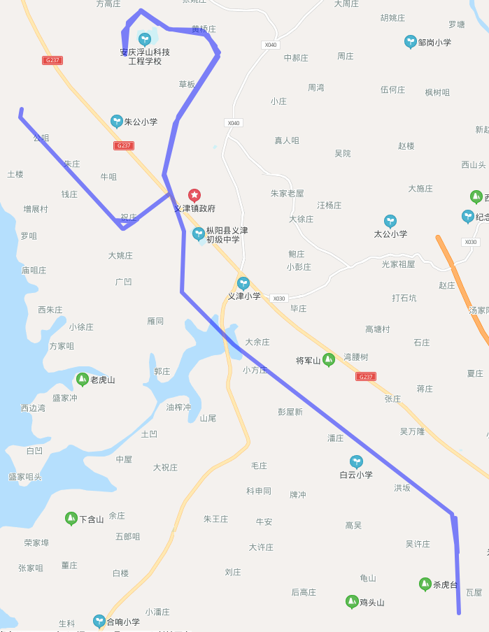

## 核心摘要

文章用车辆轨迹展示[Ramer–Douglas–Peucker算法]()：以首尾点连线为基准，寻找离线段最远的点；若最大距离超过阈值`epsilon`，保留该点并递归处理两侧，否则用一条线段近似整段曲线。

原例包含812个轨迹点。随着`epsilon`从`0.000001`增加到`0.001`，保留点数从676降到35。它直观展示[简化容差]()如何交换几何细节与数据量，但没有给出位置误差、渲染耗时或接口体积的独立测量。

> **图片状态：** 6张原始图片全部解析。精选3张公开嵌入：算法动画、812点原始轨迹和35点近似轨迹；另有3张因信息重复而省略，它们是中间epsilon结果，并非private处理。

## 算法步骤

1. 连接曲线首尾点A、B。
2. 找出中间点到线段AB距离最大的点C。
3. 若最大距离小于`epsilon`，删除A、B之间的点。
4. 否则保留C，对A–C与C–B递归执行相同步骤。
5. 依原顺序连接所有保留点，得到近似折线。

*动画以首尾弦和最远点为依据递归分割；最终保留能描述主要转折的点。*

## 示例结果

| epsilon | 保留轨迹点 |
| --- | ---: |
| 0.000001 | 676 |
| 0.00001 | 569 |
| 0.0001 | 250 |
| 0.001 | 35 |

*抽稀前的812个采样点绘制出的车辆路线。*

*`epsilon=0.001`时保留35个点；总体路线相近，但局部转角已经简化。*

## 坐标系与距离单位

原文直接对经纬度坐标使用`epsilon`。这适合演示，却不能把`0.001`视为通用参数：经纬度是角度，东西方向距离随纬度变化；跨日界线、大范围轨迹和高纬地区还会放大平面计算误差。生产系统应先明确距离函数和坐标参考系，通常在适合区域的投影坐标或测地距离下用米表达容差。

## 适用边界

- RDP保证各被舍弃点到相应近似线段的距离不超过阈值定义下的误差，但不直接保证速度、时间、道路拓扑或停留语义。
- 重复点、GPS漂移和异常跳点最好先清洗，否则可能被当成重要转折保留。
- 结果依赖点的顺序；它简化折线，不是无序点聚类。
- 递归朴素实现最坏可能达到`O(n²)`，长轨迹应考虑栈深、预过滤和空间索引。
- “仅4%的点”来自这一个样例，不能外推为普遍压缩率。

## 来源

- 码田匠心，[《轨迹抽稀之道格拉斯-普克算法》](https://zulu.wang/posts/2020/09/08/ramer-douglas-peucker-algorithm.html)，2020-09-08。
