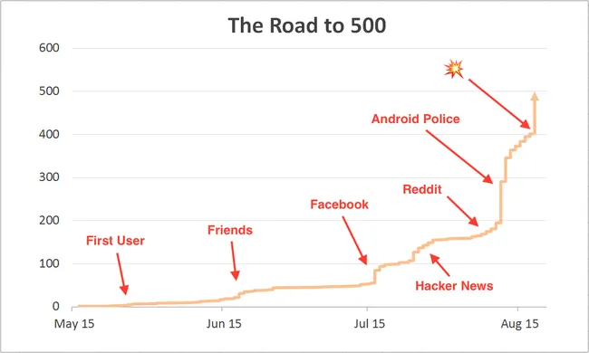

## Summary
[[MitchellLee]] recounts how he and a cofounder moved [[Penny]] from a hackathon project to its first 500 signups without paid advertising or mainstream technology press. Their sequence began with observed, in-person onboarding among close contacts and research participants, expanded through personal networks, then used a credible marketing page, [[HackerNews]], norm-aware [[Reddit]] participation, app aggregators, incidental press, and expert outreach. The case makes [[EarlyUserAcquisition]] concrete, but the reported figures measure signups rather than activation, retention, revenue, or channel profitability.

## Key Claims
- The first user was onboarded in person one week after focused development began; the founders fixed roughly 12 bugs while watching her connect a bank account.
- Users two through ten came mainly from pre-product interviewees who had shown the strongest interest, and the founders favored in-person onboarding so they could observe friction directly.
- One Facebook post and one large group-chat message reportedly expanded the user base from roughly ten to fifty.
- A polished marketing page was treated as credibility and conversion infrastructure before the founders tried to drive more traffic.
- A Show HN post reportedly brought about 700 unique visitors, 100 download clicks, and 40 signups, while later Reddit participation produced roughly 30 users.
- Small app aggregators usually produced little impact, but unplanned inclusion in an Android Police roundup reportedly generated almost 200 signups in two days.
- Outreach to personal-finance bloggers was framed primarily as expert feedback seeking, with growth or exposure as a possible secondary result.

## Key Quotes
> "Method 2: Product research participants." - on recruiting the most enthusiastic pre-product interviewees into the first-user cohort.

> "Prerequisite: A good marketing page." - on establishing credibility and a conversion destination before seeking wider traffic.

## Connections
- [[MitchellLee]] - Penny cofounder and author of the retrospective.
- [[Penny]] - personal-finance app whose first 500 signups form the case.
- [[EarlyUserAcquisition]] - staged progression from observed onboarding through networks, communities, listings, press, and expert outreach.
- [[StartupDistributionStrategy]] - combines several small, audience-matched channels before scalable acquisition is established.
- [[AppLandingPages]] - the marketing page served as credibility and conversion infrastructure.
- [[HackerNews]] - Show HN supplied a measurable but modest visitor-to-signup funnel.
- [[Reddit]] - participation and useful niche posts preceded product exposure and roughly 30 reported users.
- [[CustomerLedProductDevelopment]] - in-person onboarding and expert feedback requests kept early acquisition coupled to learning.

## Contradictions
- No direct contradiction was found. The case reinforces the wiki's distinction between burst attention and qualified demand: 700 Show HN visitors reportedly became about 40 signups, while the source supplies no activation, bank-link completion, retention, referral, or payment results by channel.
- The channel figures are a founder's 2015 retrospective without analytics definitions, cohort windows, independent verification, or controlled attribution. Facebook, group chat, Hacker News, Reddit, Android Police, app aggregators, bloggers, product changes, and the landing page overlap in time.
- Penny was a pre-revenue, US-only consumer finance app with founder network access, so the sequence does not establish a universal path for enterprise, paid, regulated, international, or differently networked products.
