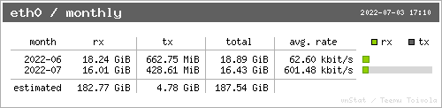
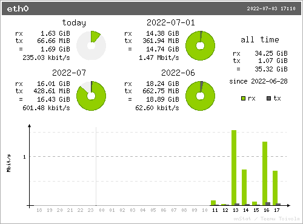

## Summary
This Baeldung tutorial presents two host-level approaches to [[LinuxBandwidthMonitoring]]: the persistent `vnstat` daemon and direct sampling of Linux's `/proc/net/dev` counters. It covers console reports, `vnstati` images, threshold-triggered scripts, and daily CSV snapshots, while exposing an important tradeoff between a maintained history and counters that reset at boot. The inspected images confirm the split between cumulative RX/TX summaries and a recent transfer-rate chart.

## Key Claims
- `vnstat` collects per-interface received and transmitted traffic into persistent history that can be queried by hour, day, month, or year.
- Interface selection matters: `vnstat -i` and `/proc/net/dev` filtering should target the interface whose traffic answers the operator's question.
- `vnstati` can render monthly totals or a summary combining daily, monthly, all-time, and recent rate information.
- `vnstat --alert` can turn a period, direction, quantity, and unit threshold into an exit status suitable for scheduled automation.
- `/proc/net/dev` supplies per-interface byte, packet, error, and drop counters without additional software, but its cumulative values reset when the interface or system resets.
- Periodic snapshots can support interval estimates by differencing counters only when reset and continuity boundaries are handled explicitly.

## Key Quotes
> "The advantage of using this file is that we don’t need to install any extra software."

> "The bandwidth usage is accumulative, so each line represents the bandwidth usage from the last system boot until the line timestamp."

## Connections
- [[LinuxBandwidthMonitoring]] - central operational practice illustrated through persistent and raw-counter approaches.
- [[DDoSTrafficMonitoring]] - shares traffic measurement and thresholding, but targets attack detection rather than quota accounting.
- [[TimeSeriesDatabase]] - provides a broader model for timestamped measurements, retention, aggregation, and reset-aware interpretation.
- [[NetworkAutomation]] - scheduled scripts can transform traffic thresholds or samples into repeatable operational actions.

## Contradictions
- The CSV example says logging prevents loss across reboots, but subtracting cumulative `/proc/net/dev` rows across a counter reset can produce an invalid interval unless resets are detected and segmented.
- Interface counters measure traffic seen by a host interface, not necessarily a provider's billable internet transfer; loopback exclusions, virtual interfaces, retransmission, encapsulation, provider direction rules, and measurement boundaries can differ.
- The walkthrough is a tutorial demonstration using one historical host and does not compare accuracy, overhead, retention, failure recovery, or current command behavior across versions and distributions.
