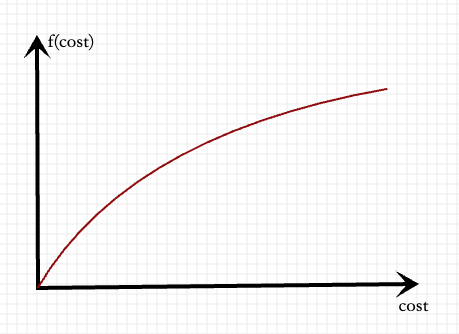
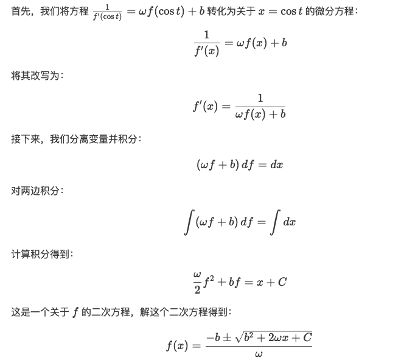
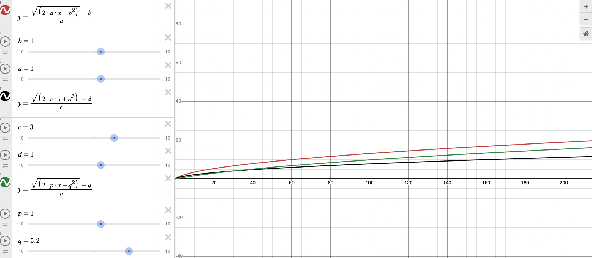
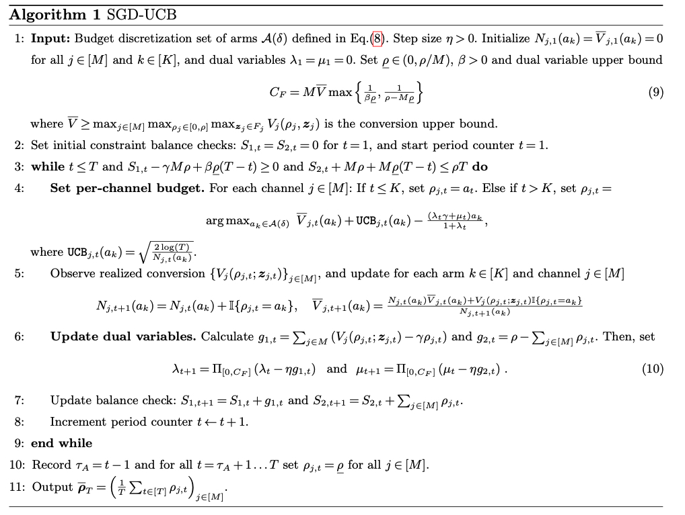

## Summary
[[Wulc]] examines [[MultiChannelAdOptimization]] within one advertising platform, where shared campaign goals do not imply that every channel should use the same bid or an unrestricted common budget. The article argues that channel-specific prediction bias, traffic timing, posterior-data sparsity, and delayed conversion feedback often justify per-channel bid control, while concave cost-to-conversion models can turn an advertiser's cost target—or a searched marginal-cost target—into explicit channel budgets. It separately summarizes cross-platform research claiming that per-channel budgets alone can attain the advertiser's global conversion optimum and illustrates an SGD-UCB algorithm for learning those allocations.

## Key Claims
- Unified bidding is optimal only under strong conditions such as equally accurate channel predictions; differing over- and underestimation can make one common bid unable to correct channels in opposite directions.
- Cost-based products can either bid independently against an explicit target CPA or use a shared base bid with channel-specific perturbations, but full independence requires enough posterior data in every channel.
- Lowest-cost products are harder to separate because there is no advertiser-specified cost target or natural per-channel budget; one practical pattern lets a main channel spend while other channels align their costs to it.
- Budget allocation becomes a second control mechanism: a two-stage design can plan long-horizon spend from a cost-to-conversion model, then execute short-horizon bids against the planned spend.
- The cost-to-conversion prior assumes conversions increase concavely with spend, so marginal conversion cost rises as cheaper opportunities are exhausted.

- Assuming marginal cost is linear in conversion count gives a solvable differential equation and a positive-root conversion function parameterized by channel-specific cost coefficients.

- Fitting those coefficients per channel lets a target CPA determine explicit budgets; without a supplied CPA, binary search can find the lowest marginal CPA that exhausts the total budget, naturally favoring lower-cost channels.

- In the cited cross-platform result, optimizing per-channel ROI targets alone can be arbitrarily suboptimal, whereas optimizing per-channel budgets is claimed to recover the global conversion optimum.
- The illustrated SGD-UCB algorithm discretizes each channel's budget into arms, combines upper-confidence exploration with dual penalties for ROI and total-budget constraints, observes realized conversions, and updates both arm statistics and constraint prices.

## Key Quotes
> "per-channel independent bidding is often more reasonable" - the article's practical conclusion about unified versus channel-specific control.

> "solely optimizing for per-channel budgets allows an advertiser to achieve the global optimal" - quoted conclusion from the cross-platform autobidding paper.

## Connections
- [[Wulc]] - author synthesizing within-platform bidding practice and two research approaches to budget allocation.
- [[MultiChannelAdOptimization]] - central problem of coordinating bids and budgets across heterogeneous inventory channels.
- [[ProgrammaticAdvertising]] - broader automated-advertising context in which per-auction bids and campaign constraints are executed.
- [[MarketingOperations]] - multi-channel allocation automates decisions that would otherwise require repeated manual budget and bid adjustment.
- [[ContextualBandits]] - related exploration-exploitation family; the cross-platform algorithm discretizes budgets into arms and applies UCB under constraints.
- [[ScoreShading]] - adjacent constrained-control problem where posterior estimates, pacing, exploration, and delayed long-horizon outcomes also limit local optimization.

## Contradictions
- The source qualifies any simple claim that a shared campaign objective implies one optimal bid: heterogeneous prediction error and traffic distributions can require channel-specific correction.
- The cost-to-conversion approach depends on a concave prior, stable historical fit, adequate conversions, and sufficiently timely feedback. The article itself notes that these conditions can fail, that piecewise fits may be better, and that sparse channels may need exploration bidding.
- The cross-platform optimum and SGD-UCB performance are reported from a cited paper rather than reproduced here; the supplied source provides no dataset, experimental effect size, deployment result, or comparison against advertiser practice.
