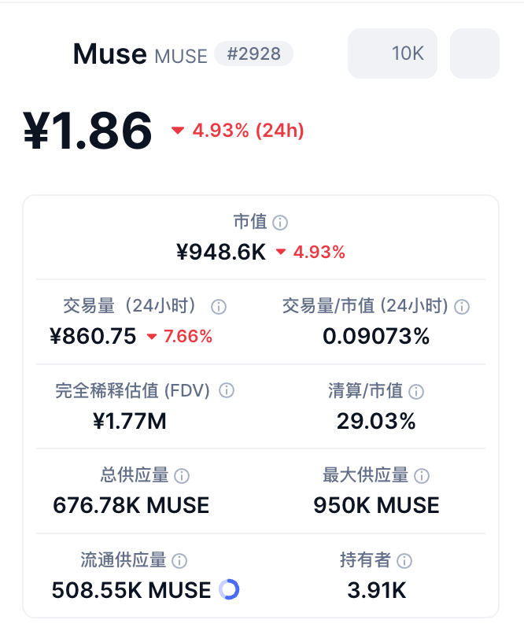

## Summary
[[MaiYang]] analyzes the launch attention around Meta's [[Muse]] consumer agent as the interaction of artificial scarcity, referral incentives, and demand for software that can act rather than only chat. The article also maps region, waitlist, age-verification, redemption, and connector friction, then argues that download volume and promotional token balances do not settle retention, trust, safety, or the cost of providing each user with a virtual computer. Its operational and market claims are a secondary synthesis of social posts, press reports, and analyst commentary rather than independently verified product research.

## Key Claims
- Muse's early attention is attributed to three reinforcing forces: restricted United States and Canada access, referral rewards, and interest in a personal agent that can perform tasks.
- The reported access path can fail at app availability, network-region checks, waitlisting, card-based age verification, referral-code redemption, linked accounts, or later agent operation.
- A referral code reportedly grants a large, non-expiring token allowance to both sides, turning setup tutorials into reward-bearing acquisition surfaces and extending [[ViralLoops]] beyond a simple invite prompt.
- The phrase "1 billion tokens" can attract unrelated cryptocurrency audiences because a separate MUSE token exists, increasing noisy attention without demonstrating qualified product demand.
- Muse's browser or desktop operation illustrates [[ComputerUse]] as consumer product capability, including the recursive pattern of using one agent or remote browser to register for another.
- Reported unauthorized message access, a macOS zero-day, and Amazon's block create a trust and permission boundary around an unusually privileged agent.
- Downloads and free usage do not establish retention or viable economics; the source raises the prospective cost of dedicated virtual-computer capacity as a major scaling question.

## Key Quotes
> “邀请码真的是一个屡试不爽的增长神器，人类天然对稀缺性的东西感兴趣。” — on scarcity and referral access as launch-distribution mechanisms.

> “下载量不等于护城河。” — on separating launch attention from durable advantage.

## Connections
- [[MaiYang]] - author who combines access troubleshooting with a skeptical growth, trust, and economics analysis.
- [[Muse]] - consumer AI agent and central product discussed by the article.
- [[ViralLoops]] - referral rewards turn successful users and tutorial writers into acquisition participants.
- [[ComputerUse]] - Muse is presented as an agent that operates a computer on a user's behalf.
- [[AgentPermissionModel]] - message access and privileged device action make scope, consent, and containment material product questions.
- [[AgentDeploymentTradeoffs]] - dedicated virtual-computer capacity links consumer-agent utility to cost and scaling constraints.
- [[UserTrustCapital]] - security allegations, connector failures, grey-market access, and blocked destinations can consume trust created by launch excitement.

## Contradictions
- The source reports 902,000 downloads in six days, regional restrictions, referral-token terms, a one-dollar age-verification authorization, and a 30–50 billion dollar hardware estimate without supplying primary product documentation, datasets, or calculation assumptions.
- Registration workarounds are collated from social posts and may be stale, unsafe, policy-violating, or confounded by account, device, region, and rollout differences; they should not be treated as endorsed instructions.
- Scarcity and incentives plausibly amplify attention, but the article supplies no attribution model separating those effects from advertising, product utility, novelty, press coverage, or existing Meta distribution.
- Security, private-message access, and Amazon-blocking claims are linked to external reports but are not established by evidence contained in the supplied Markdown; the article does not characterize affected versions, remediation, prevalence, or user impact.
- Both effective images were opened. The title banner is decorative and was omitted. The crypto-market screenshot was retained because it documents the unrelated MUSE token and materially supports the audience-confusion claim.
