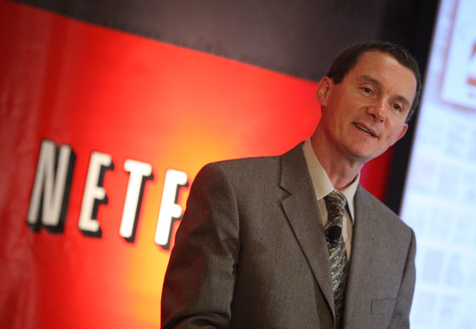

## Summary
[[NeilHunt]] recounts [[Netflix]]'s transition from unsuccessful a-la-carte DVD rentals to a queue-enabled subscription, then from DVD delivery to a broadly distributed streaming service. His first-person account connects product mechanics, inventory economics, device partnerships, a failure-triggered [[EnterpriseCloudMigration]], recommendation data, content delivery, and [[StrategicSelfCannibalization]] rather than treating streaming as one launch. The interview also distinguishes using behavioral data to estimate audience and funding feasibility from using data to write stories.

## Key Claims
- The queue enabled Netflix's monthly DVD subscription by automating the next shipment, removing late fees, and maintaining continuity despite postal delay.
- Recommendations served both members and unit economics: directing demand beyond new releases increased reuse of purchased discs and reduced the costly “percent new” problem.
- Netflix's focus on a sustainable business and near-term profitability helped it survive the post-dot-com financing collapse, although Hunt also attributes survival partly to luck.
- Early internet-video work moved from overnight download to real-time streaming as bandwidth and compression improved; the first service combined off-the-shelf Windows playback and DRM with HTTP delivery that worked through ordinary networks and firewalls.
- Spinning the internal player effort out as [[Roku]] let Netflix remain a neutral software partner to Xbox, PlayStation, LG, Samsung, and other device manufacturers.
- Adoption was gradual because broadband, connected-device penetration, technical usability, content licensing, and credibility with both hardware and content partners all had to develop together.
- A 2008 database failure exposed the availability gap between a delay-tolerant DVD website and an always-on streaming service, prompting a feature-by-feature migration to [[AWS]], NoSQL databases, and microservices rather than a direct fork of the legacy stack.
- Streaming behavior supplied more complete enjoyment signals than shipped discs or voluntary star ratings, but Hunt says Netflix used audience prediction to inform funding decisions rather than to tune stories by data.
- Netflix kept its content-delivery network outside the general cloud migration, placing efficient Open Connect servers near subscribers in exchanges and ISP infrastructure.
- Separating DVD and streaming plans and teams was a strategically necessary act of [[StrategicSelfCannibalization]], but Hunt says the Qwikster-era pricing and customer transition were too abrupt.

## Key Quotes
> "The Queue allowed us to go to subscription, not the other way around." - Hunt on the product mechanism behind the recurring-revenue model.

> "We don't write stories by data." - Hunt distinguishing audience and investment analysis from creative authorship.

## Connections
- [[NeilHunt]] - interview subject and first-person narrator of Netflix's product and technical transition.
- [[Netflix]] - company whose DVD, streaming, personalization, infrastructure, and content-production history is described.
- [[ReedHastings]] - Pure Software founder and Netflix leader whose recruiting and strategic decisions appear throughout Hunt's account.
- [[Roku]] - independent hardware company that continued Netflix's internal player work.
- [[PlatformNeutrality]] - reason Netflix separated the player effort from its service business.
- [[EnterpriseCloudMigration]] - the database-failure-triggered, feature-by-feature move from a legacy data center to AWS.
- [[AWS]] - cloud platform used for Netflix's newly re-architected control-plane services.
- [[MicroservicePlatformEngineering]] - architectural direction adopted instead of reproducing the Oracle-centered monolith in the cloud.
- [[CloudHighAvailability]] - streaming made redundancy, failover, and much higher uptime product requirements.
- [[StrategicSelfCannibalization]] - DVD and streaming separation illustrates the need and customer cost of replacing a successful model.
- [[StreamingContentEconomics]] - licensing costs, catalog quality, and original-content investment shape streaming viability.

## Contradictions
- Hunt recalls beginning the AWS move in 2008 and describes a rushed Apple mobile launch as an early proof point, but he is uncertain in the interview about whether the first target was iPhone or iPad and about device chronology. Those details should be treated as retrospective recollection rather than a precise launch timeline.
- The account reinforces the existing Griffin history's platform-neutrality rationale, but it describes Roku's timing more tentatively and does not replace the more detailed reconstruction in [[inside-netflixs-project-griffin-the-forgotten-history-of-roku-under]].
- Hunt frames Qwikster as a necessary transition executed too aggressively. This qualifies narratives that treat it only as a failure, while not showing that the chosen timing, pricing, branding, or separation structure was the only viable path.
- Most technical and business outcomes are attributed first-person claims without contemporaneous documents, audited metrics, controlled comparisons, or perspectives from customers, studios, device partners, and other Netflix teams.
