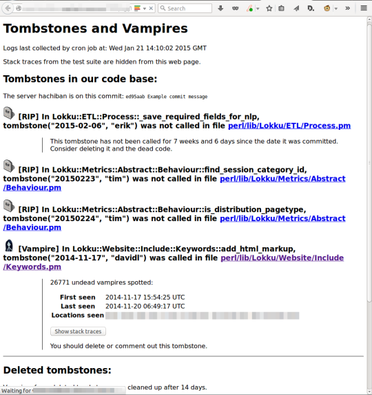

## Summary
[[DavidLowe]] describes [[Nestoria]]'s Perl implementation of [[DeadCodeTombstones]]: suspected dead paths receive lightweight runtime probes before deletion, allowing operators to distinguish code that remains uncalled from live “vampires.” The design favors production safety over complete telemetry by logging locally, bounding each probe's disk use, taking locks without blocking, and returning silently on errors; scheduled jobs centralize and expire the resulting files, and a web report supports deletion or refactoring decisions.

## Key Claims
- A code path that looks unused should be observed in production before it is removed, because static judgment can miss rare or indirect execution.
- Each tombstone records its author and date alongside invocation time, file, line, subroutine, and full stack trace so maintainers can identify ownership and understand how a supposedly dead path is reached.
- The probe is deliberately fail-open: directory, file, size, lock, encoding, or write failures return or warn without disrupting the application.
- One append-only file per tombstone and a per-file size threshold bound disk growth; after the threshold, additional events are dropped because invocation existence and path diversity matter more than exact volume.
- Non-blocking file locks avoid concurrent-write races without making application requests wait for telemetry.
- Cron jobs collect local logs centrally and delete old files, while a web report separates uncalled tombstones, observed vampires, and deleted tombstones.
- Nestoria reports that the method enabled removal of genuinely dead code while preventing deletion of code that only appeared dead, but supplies no counts, observation-window analysis, or controlled comparison.

## Key Quotes
> "blindly removing it can cause real problems in production" — on why suspected dead code needs behavioral evidence before deletion.

> "Excessive events simply get dropped" — on preferring bounded operational impact over exact invocation counts.

## Connections
- [[DavidLowe]] — article author and presenter of Nestoria's Perl implementation.
- [[Nestoria]] — production setting in which the tombstone workflow was implemented and used.
- [[DeadCodeTombstones]] — the source's runtime-evidence method for safer code deletion.
- [[ServiceObservability]] — logs and stack traces reveal whether and how marked paths execute.
- [[CentralizedLogging]] — scheduled collection moves per-host probe files to a central reporting location.
- [[TechnicalDebt]] — evidence-backed deletion reduces obsolete code without treating apparent non-use as proof.
- [[SoftwareVerification]] — production observation complements static analysis and test coverage for rare execution paths.

## Contradictions
- No direct contradiction found. The source qualifies deletion based only on inspection, static references, or test non-coverage by showing that apparently dead code may still execute in production.
- Silence is not conclusive proof of deadness unless the observation window covers relevant traffic, schedules, seasons, feature flags, failure paths, and hosts; dropped events and collection failures can also create false negatives.
- The outcome claim is a single company-authored retrospective without counts of probes, deletions, saved incidents, overhead, or false classifications.
