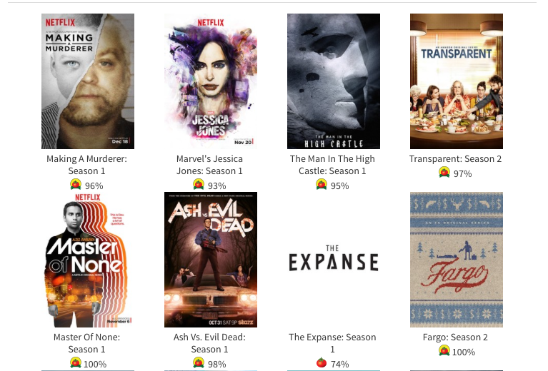
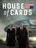
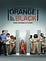
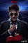
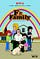

## Summary
This short 2016 commentary argues that [[Netflix]] had moved beyond distributing licensed television into producing acclaimed original series at enough subscriber and viewing scale to threaten incumbent television companies. Its embedded Rotten Tomatoes snapshot shows three Netflix titles and two [[Amazon]] titles in the displayed top five, making the broader point that streaming-native companies were competing for both audience attention and critical prestige. The article predicts eventual streaming displacement of traditional television, but supplies a point-in-time ratings display and unsourced company-scale estimates rather than a financial or causal industry analysis.

## Key Claims
- The article reports an estimated 69 million Netflix subscribers worldwide and 100 million viewing hours per day as of early 2016.
- It argues that original programming weakened the claim that Netflix would remain dependent on Hollywood studios and television networks for premium content.
- The retained Rotten Tomatoes snapshot displays *Making a Murderer*, *Jessica Jones*, and *Master of None* as Netflix titles among the first five series, alongside Amazon's *The Man in the High Castle* and *Transparent*.

- The author cites a run of Netflix shows with audience ratings of at least 85%, comedy specials, and *Beasts of No Nation* as evidence that streaming services could develop premium content across formats.
- The article treats audience data as an advantage for deciding which programs might find demand, then asks whether streaming could displace traditional television and whether [[Apple]] or [[Google]] would enter more forcefully.
- Six poster-only examples identify additional Netflix originals: *House of Cards*, *Orange Is the New Black*, *Marco Polo*, *Daredevil*, *Narcos*, and *Unbreakable Kimmy Schmidt*.

## Key Quotes
> "Did Big TV ever really know or even care what audiences wanted?" - the author's challenge to incumbent programming judgment.

> "How long before the Streaming Industry completely replaces TV?" - the article's central disruption prediction.

## Connections
- [[Netflix]] - principal case for subscriber scale, audience data, and original programming.
- [[Amazon]] - owns the other two streaming titles in the displayed Rotten Tomatoes top five.
- [[StreamingContentEconomics]] - original-content ownership and audience scale are presented as sources of platform leverage.
- [[Apple]] - named as a potential later entrant that could compete through execution quality.
- [[Google]] - named as a potential later entrant that could compete through lower prices.

## Contradictions
- The source's implication that audience data directly explains Netflix's content success is stronger than [[neil-hunt-on-netflix-and-the-story-of-netflix-streaming-internet-history-podcast]], where [[NeilHunt]] says Netflix used data to estimate audiences and project feasibility but did not write or tune stories through data.
- The article's replacement prediction is speculative. It does not distinguish broadcast, cable, direct-to-consumer subscriptions, licensed distribution, advertising, or hybrid bundles, and it provides no cost, churn, profitability, or incumbent-response evidence.
- The subscriber and viewing-hour numbers are unattributed estimates, and the Rotten Tomatoes display is a historical audience-rating snapshot rather than a stable ranking, representative quality measure, or proof of commercial performance.
