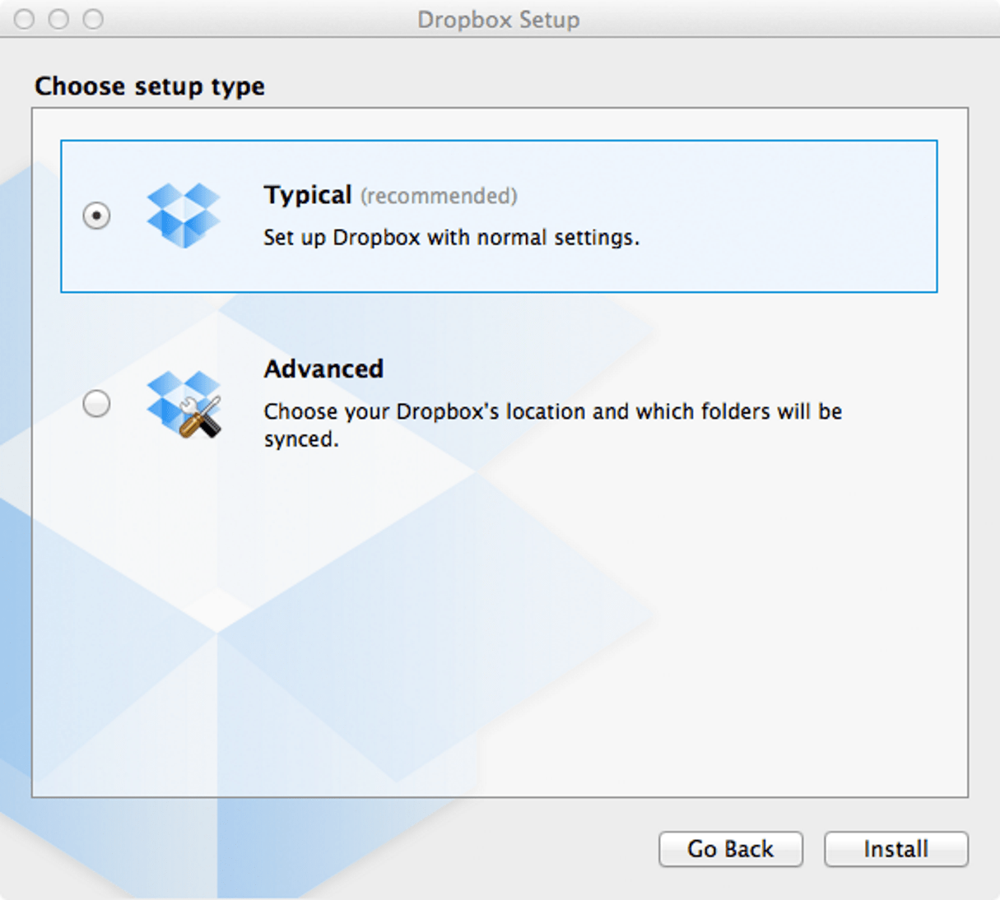
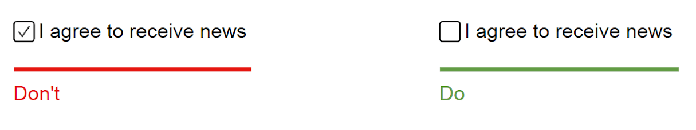
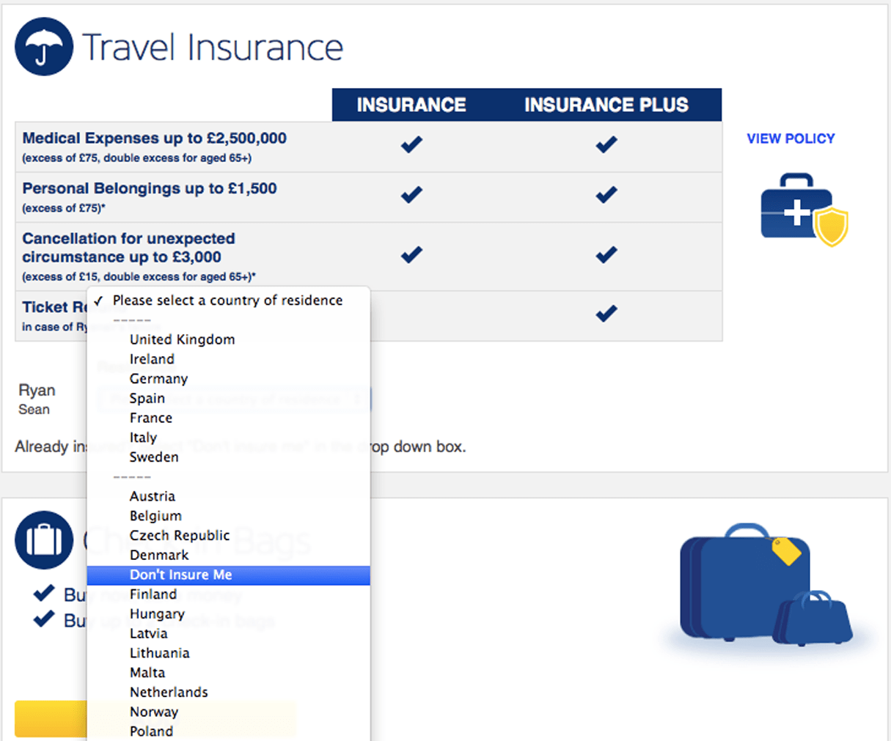
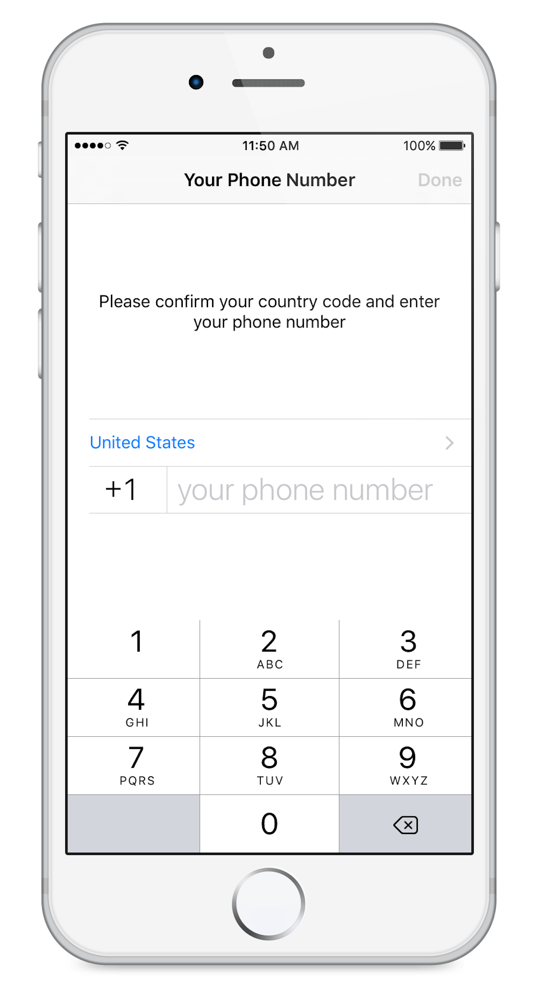
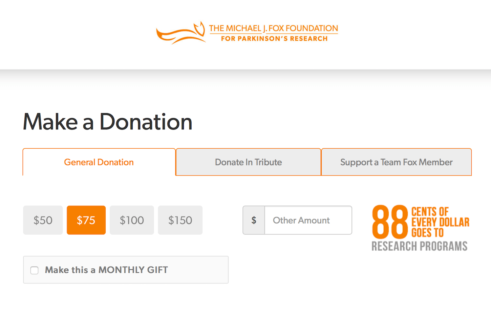
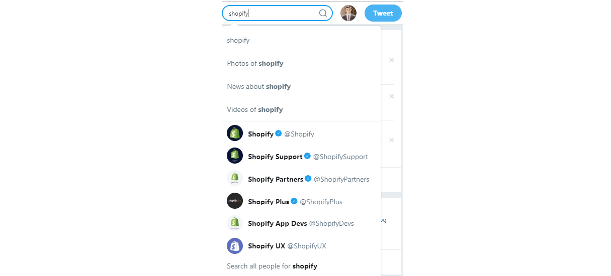
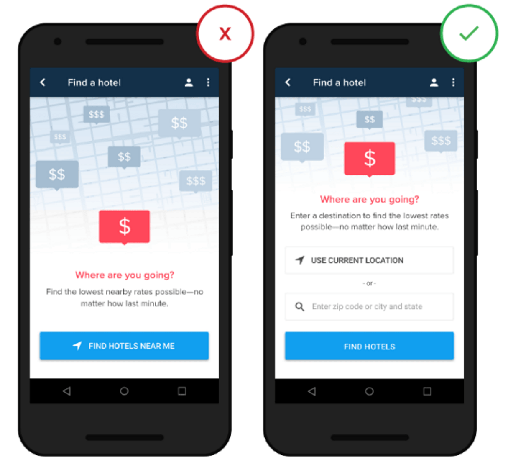
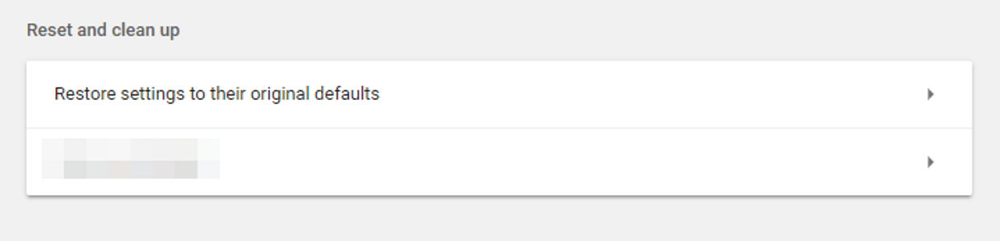

## Summary
[[NickBabich]] argues that [[SmartDefaults]] can reduce [[CognitiveLoadInUXResearch|cognitive load]] by using contextual or historical data to preselect the option a user is likely to want. Because defaults are unusually sticky, the article pairs convenience with safeguards: use research rather than assumption, favor user welfare and safety, avoid consequential or sensitive prefills, and provide easy override and restoration. Nine retained UI examples show both helpful patterns and manipulative failures.

## Key Claims
- Static defaults suit a broad majority, whereas smart defaults use a person's context, prior behavior, or supplied data to predict the most likely selection.
- Defaults reduce repeated typing, search, and choice, but their relevance depends on user research, testing, and observed usage rather than designer intuition alone.
- Preloaded answers can bypass attention because people scan forms; fields requiring informed, sensitive, or politically charged judgment should therefore remain explicit.
- A default should advance user welfare rather than the provider's conversion goal, especially for consent, add-ons, and other choices users may overlook.

- Useful form patterns include reusing payment details, inferring a nearby airport or phone country code, suggesting representative donation amounts, and offering search autocomplete.

- Safe and helpful initial settings matter because many users treat defaults as recommendations and do not change them.
- Every inferred default should be easy to inspect and override, and customizable settings should offer a clear route back to the original state.

## Key Quotes
> "Defaults promote cognitive ease" — the article's core reason for removing unnecessary choice and repeated entry.

> "It's better to use defaults that maximize your users' welfare." — the ethical boundary on provider-selected initial states.

## Connections
- [[NickBabich]] - author of the practitioner guidance and selected examples.
- [[SmartDefaults]] - central design pattern combining prediction, reduced effort, override, and restoration.
- [[CognitiveLoadInUXResearch]] - defaults remove some questions and memory work while potentially causing unnoticed errors.
- [[DarkPatterns]] - prechecked consent and hidden insurance refusal show defaults and friction serving provider interests.
- [[ProductFlowFriction]] - reused data, location suggestions, and autocomplete can shorten a flow without removing user control.
- [[FirstMileProductExperience]] - out-of-box settings shape whether a newcomer can reach value without configuration work.

## Contradictions
- The article's recommendation to default to what roughly 95% of users would choose is a heuristic, not a threshold established by evidence reproduced in the source.
- The claim that fewer than 5% of users change settings is attributed to another practitioner's observations; population, product category, measurement method, and date are not supplied here.
- Personalization from transaction history, saved payment details, or location may reduce effort while creating privacy, security, stale-data, shared-device, accessibility, and mistaken-inference risks that the article does not evaluate.
- Suggested donation amounts and autocomplete can guide users while also anchoring, narrowing, or commercially steering choice; editability does not by itself make the initial suggestion neutral.
- All nine effective local image references were opened and retained once under descriptive filenames at their semantic positions. Each is a text-bearing product or design example; none was treated as outcome evidence.
