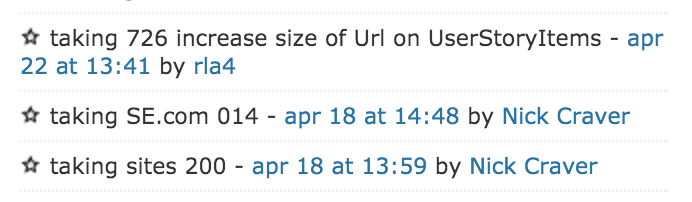
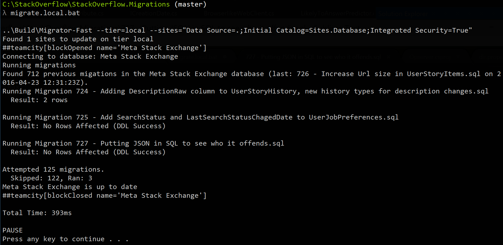
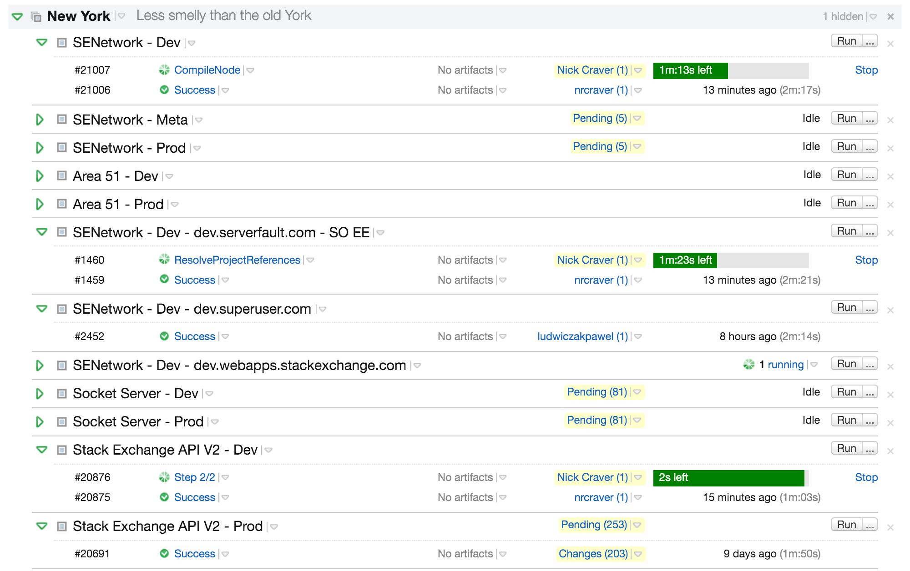
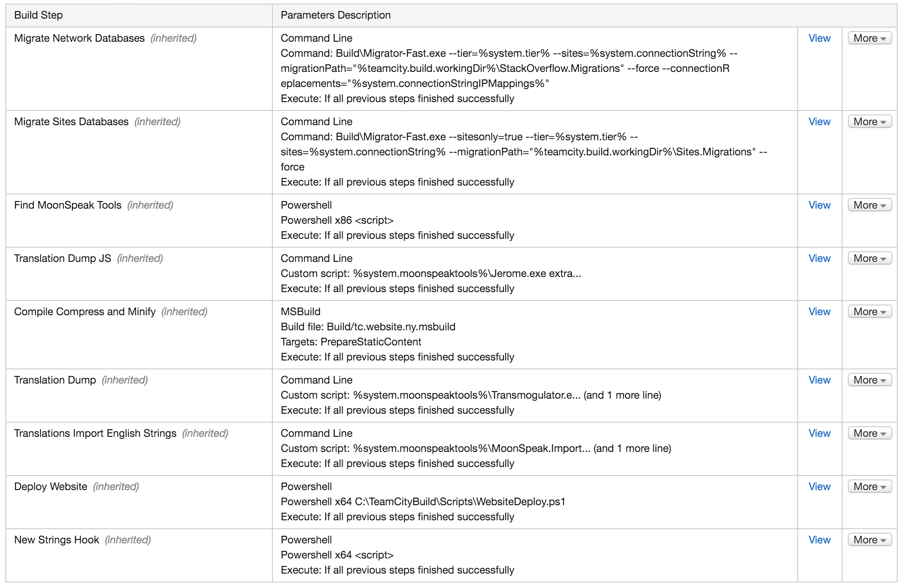
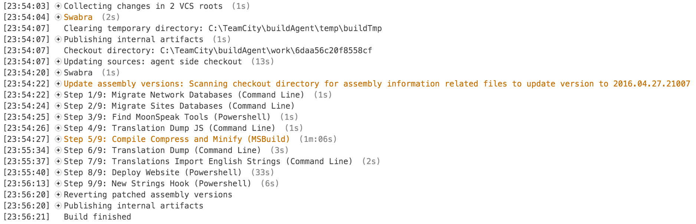
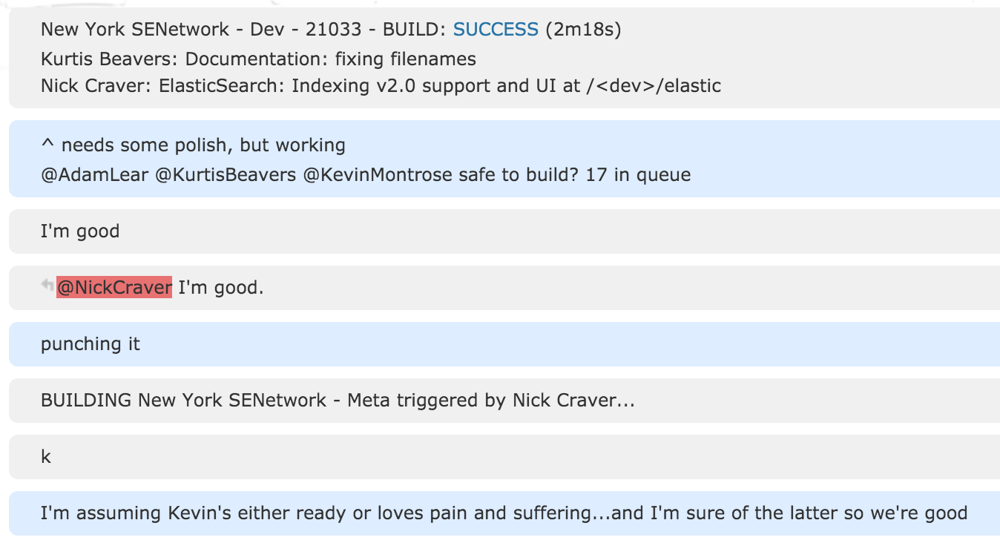
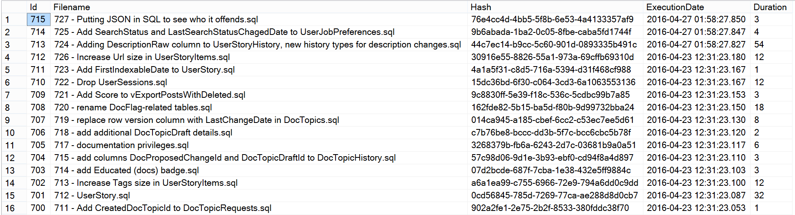
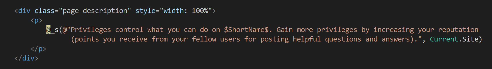
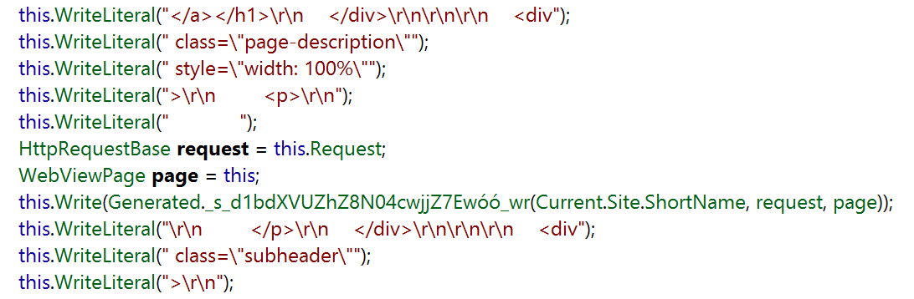
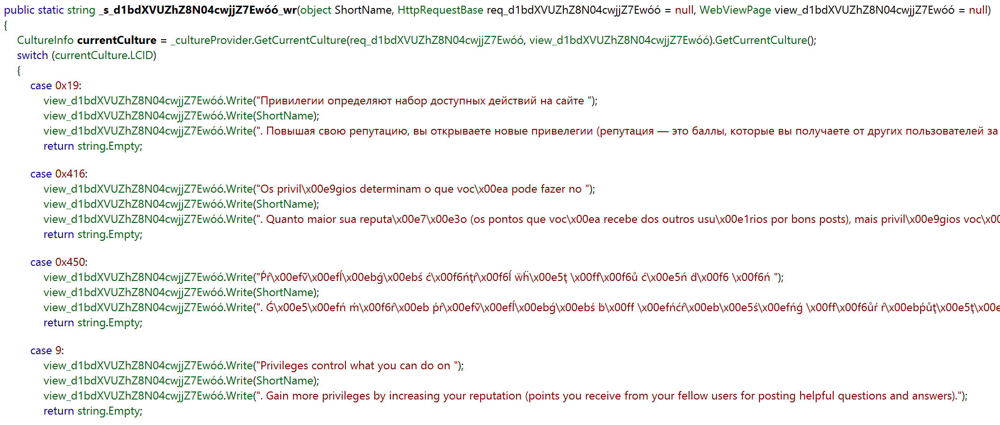

## Summary
[[NickCraver]] documents [[StackOverflow]]'s 2016 path from a developer push through TeamCity builds, database migration, tier promotion, and a load-balancer-aware rolling production deployment. The account links high deployment frequency to small mainline changes, short feedback, forward-compatible database evolution, and explicit mixed-version safeguards rather than to a universal branching or rollback prescription. Its timings, topology, tooling, and operating practices are first-party historical snapshots from one team.

## Key Claims
- Stack Overflow reported roughly 25 development deployments and 5-10 production deployments per day, with a push reaching all sites in under nine minutes through development, Meta, and production tiers.
- Developers usually pushed small changes directly to `master`; branches were reserved mainly for new developers, risky work, or multi-person features, and were commonly squash-merged for simpler code reversion.
- Numbered SQL migrations were reserved in team chat, tested locally through the real runner, applied across databases in parallel, written idempotently, recorded with content hashes, and normally repaired by a later forward migration rather than rollback.

- TeamCity polled the on-premises GitLab repository every 15 seconds, used agent-side checkout and local Git mirrors, and ran multiple build configurations for the monorepo.

- The development pipeline migrated databases, located localization tools, extracted JavaScript strings, compiled and minified the application, extracted C# strings, imported English strings, deployed the website, and notified translation tooling.

- Production rollout drained one IIS server at a time in [[HAProxy]], stopped the site, copied files, restarted it, and waited for three successful health polls before restoring traffic; static assets were rolled out first so a new asset hash could not be cached against old content.
- Deployment promotion included human chat coordination between tiers, preserving a lightweight control around an otherwise automated path.

- Database and API changes were sequenced for mixed-version compatibility: add before use, stop use before removal, deploy new endpoints before consumers, and reserve later cleanup for a separate deployment.

- Moonspeak moved localization work into compilation: source markers became generated culture-specific calls and switch branches, trading build complexity for fewer runtime string allocations.

## Key Quotes
> "Why roll back when you can roll forward?" - on repairing small database changes through another migration.

## Connections
- [[NickCraver]] - author and Stack Overflow infrastructure engineer describing the process.
- [[StackOverflow]] - web platform and engineering organization operating the deployment path.
- [[DeploymentPipeline]] - staged path from source push through development, Meta, and production.
- [[TrunkBasedDevelopment]] - small frequent integration on `master`, with limited exceptions for branches.
- [[ForwardOnlyDatabaseMigration]] - compatibility-first, idempotent, ledgered migration approach.
- [[RollingDeployment]] - one-server-at-a-time rollout coordinated with HAProxy drain and readiness state.
- [[HAProxy]] - traffic-control layer used to drain, mark down, and restore web servers.
- [[ContinuousDelivery]] - broader capability supported by small batches, automation, and fast feedback.

## Contradictions
- Direct-to-`master` work and rare branches are reported as a local fit, not a recommendation for every team; the source does not quantify defects, review coverage, or comparative outcomes.
- Database-before-code is conditional rather than absolute: destructive changes require code to stop depending on old state first, while additions are made nullable or unused until a later deployment.
- The article reports speed and availability snapshots but provides no independent dataset for change failure rate, customer impact, deployment collisions, or long-run reliability.
- Tool versions, server counts, deployment scripts, localization machinery, and network topology describe 2016 and should not be treated as current Stack Overflow documentation.

## Image Notes
All 12 effective image references were missing from the local export. The exact publisher-hosted originals were retrieved and opened for inspection. Ten evidence-bearing screenshots were retained at their semantic positions; the local migration-folder listing was omitted because its evidence is repeated by the reservation, runner, and migration-ledger views, and the Pinbot screenshot was omitted as a decorative joke.
