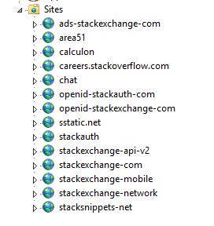
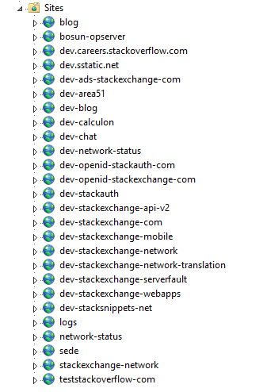
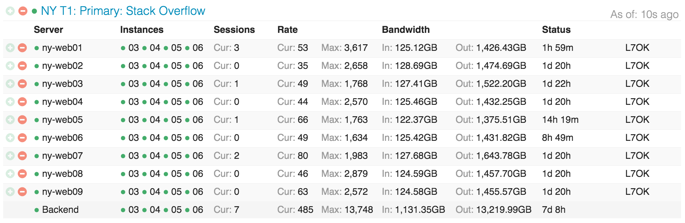
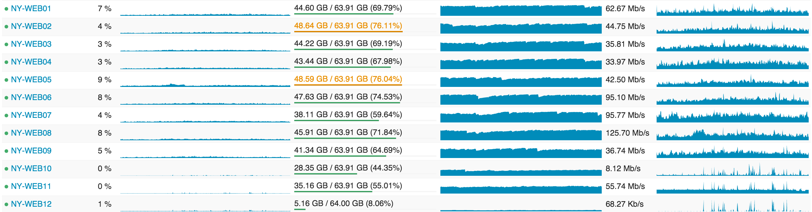
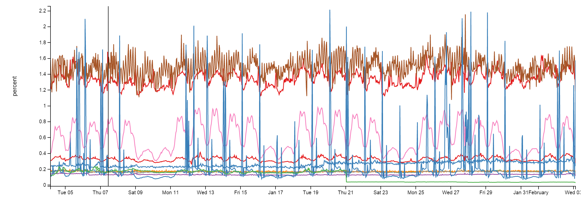
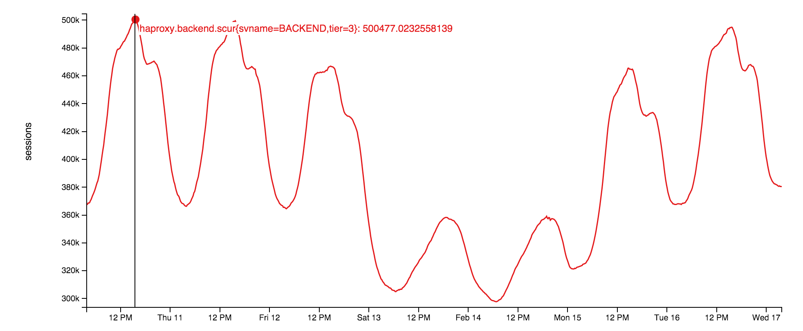
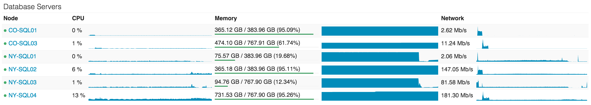

## Summary
[[NickCraver]] describes [[StackOverflow]]'s 2016 production architecture as a deliberately simple, heavily redundant system spanning edge routing, [[HAProxy]], a multi-tenant IIS web tier, specialized services, [[Redis]], websockets, Elasticsearch, and SQL Server. The account connects performance and availability to layered caching, spare capacity, request-level measurement, asynchronous replicas, and a second data center rather than to a large server count. Its topology, versions, throughput, and utilization figures are first-party historical snapshots, not current Stack Overflow documentation or independent benchmarks.

## Key Claims
- On February 9, 2016, Stack Overflow reported about 209 million load-balancer requests, 66 million page loads, 505 million HTTP-originated SQL queries, 5.8 billion Redis hits, and 17 million Elasticsearch searches in one day; lower ASP.NET processing time despite higher traffic was attributed to 2015 hardware and application tuning.
- Redundancy was layered across power, dual 10 Gbps server links, paired racks, four ISPs and edge routers, separate external VLANs, and a Colorado disaster-recovery site. A primary 10 Gbps inter-data-center MPLS path had two higher-cost OSPF failover routes through the ISPs.
- Four [[HAProxy]] load balancers terminated TLS, routed mainly by host header, rate-limited traffic, and captured application timing headers into per-request logs. Memory was used to cache TLS sessions and reduce repeated negotiation cost.
- Nine primary IIS servers ran the multi-tenant Q&A application, while two servers isolated development and Meta workloads; the author says the full Q&A network could technically run on one application pool and one server, but capacity was kept for rolling builds, headroom, and redundancy.

- A three-server service tier concentrated tag-engine, backend API, and Elasticsearch-indexing work that did not need ninefold replication; process affinity separated cache-heavy work across CPU sockets.
- The application used local L1 caches and shared Redis L2 caches. A double miss fetched from the source and populated both layers, while Redis pub/sub propagated invalidation to other servers; per-site key or database namespaces separated tenants.

- Raw-socket servers on the web tier pushed real-time updates over roughly 500,000 peak concurrent websockets. This reduced polling work but exposed load-balancer ephemeral-port and file-handle limits.

- SQL Server remained the source of truth; Redis and Elasticsearch were derived. Two AlwaysOn clusters used New York masters and replicas plus asynchronous Colorado replicas, while Elasticsearch used per-site indexes and SQL `ROWVERSION` checkpoints for incremental indexing.

- The architecture favored narrow mechanisms and simple SQL access: Dapper for new code, one remaining stored procedure, and open-source libraries for Redis, profiling, errors, serialization, websockets, and monitoring.

## Key Quotes
> "Simple is fast." - on deliberately ordinary SQL access despite large traffic volume.

> "I’m saying it works. I’m not saying it’s a good idea." - on the network's ability to run from one web server.

## Connections
- [[NickCraver]] - author and Stack Overflow infrastructure engineer describing the system.
- [[StackOverflow]] - multi-tenant Q&A platform whose 2016 architecture is documented.
- [[HAProxy]] - TLS termination, routing, rate-limiting, measurement, and web-tier distribution layer.
- [[Redis]] - shared L2 cache, invalidation pub/sub channel, and machine-learning data store.
- [[DynamicContentCaching]] - L1/L2 cache hierarchy with source refill and cross-server invalidation.
- [[MultiSiteHighAvailability]] - paired local infrastructure plus asynchronous state replication and alternate inter-site routes.
- [[ServiceObservability]] - Opserver, Bosun, MiniProfiler, per-request HAProxy logging, and tier dashboards expose system behavior.

## Contradictions
- No direct contradiction was found. The source qualifies the idea that large traffic necessarily requires many active servers: one server could reportedly carry the Q&A network, while the larger fleet primarily supplied deployment capacity, headroom, and fault tolerance.
- “Everything is redundant” is rhetorical rather than literal. The primary MPLS link was a single path with routed failovers, replicas were asynchronous, and stateful masters carried most normal load, leaving recovery time, lag, and failover behavior relevant.
- The account is a first-party point-in-time overview without independently reproducible data, incident rates, failover tests, latency distributions, or cost comparisons. Software versions, providers, hardware, server counts, and operating figures are historical to 2016.

## Image Notes
Seven referenced screenshot files were absent from the local export; the exact publisher-hosted originals were retrieved and opened. All seven were retained because they show workload placement, traffic distribution, resource utilization, or time-series behavior not fully repeated in prose. The two available rack photographs were opened and omitted as duplicative documentary images without additional architectural evidence.
