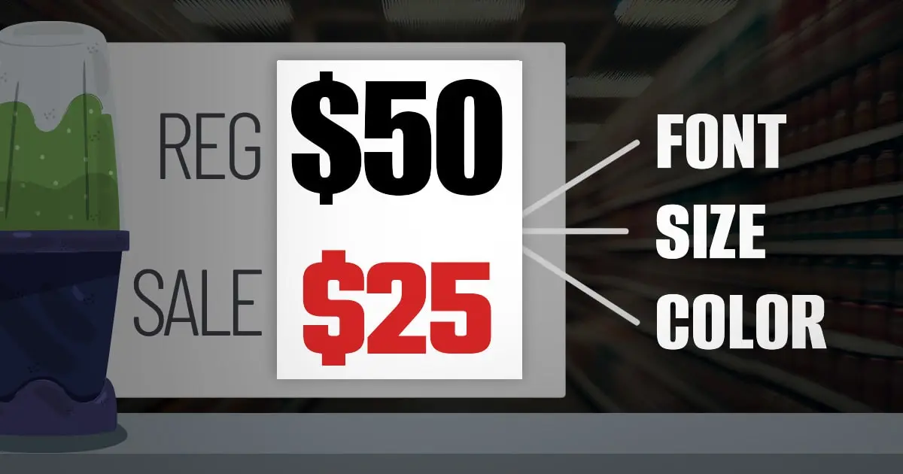
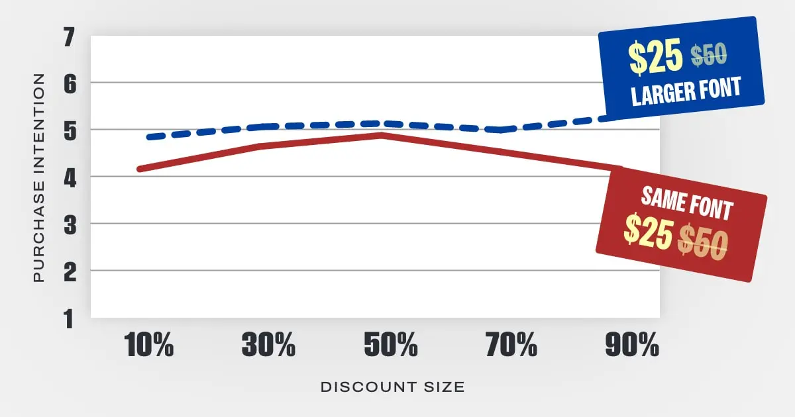
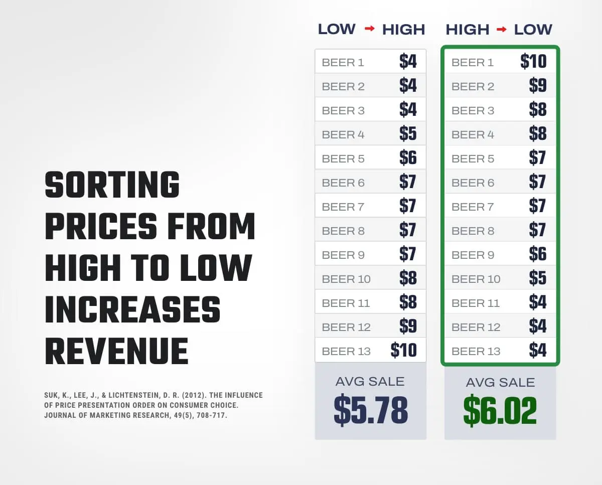
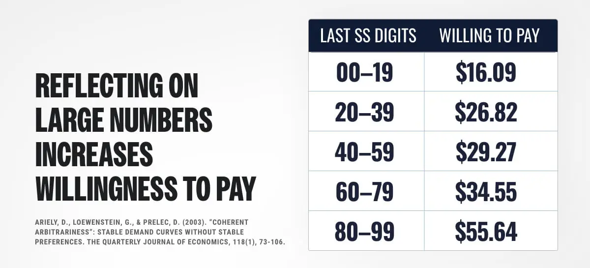

## Summary
[[NickKolenda]] treats price presentation as a perceptual and comparative design problem: wording, typography, spatial arrangement, digit structure, reference points, bundles, and promotion framing can change how expensive, fluent, urgent, or attractive the same economic offer feels. The visible guide entries combine published consumer-research findings with practical recommendations, pilot observations, and explicitly speculative extensions. The saved capture is incomplete: although the interface labels the guide as 102 tactics, it exposes only 22 numbered entries (1–15, 17–21, and 26–27), with lock placeholders and no text for the omitted material.

## Key Claims
- Price perception is constructed relative to nearby semantic, visual, spatial, and numerical cues rather than read from the amount alone; smallness words, leftward placement, smaller symbols, and nearby anchors can shift perceived magnitude.
- Visual contrast between regular and sale prices can imply a larger economic difference, but font size, color, spacing, and saturation interact with discount size, product meaning, timing, and audience.

- Number fluency can shape preference: divisible bundle prices, two nearby factors of a price, alliteration, shorter spoken forms, and product-digit congruence are proposed to make an amount feel easier or more fitting.
- Just-below prices can benefit from left-digit anchoring, especially when seen rather than heard, but the effect varies with numeracy, price magnitude, brand familiarity, and quality context.
- Reference points organize choice: descending price order can raise the comparison baseline, large incidental numbers can anchor willingness to pay, and a similar inferior option can increase preference for a target through attraction or compromise effects.

- Promotion framing should match the decision: percentage discounts usually display a larger number below roughly $100, amount-off discounts above it, coupons can defer attention to the final price, and precise discounts may signal instability or urgency while round discounts signal size and stability.
- Many recommendations are conditional design hypotheses, not universal laws; the guide repeatedly identifies context reversals, failed replications, weak pilot results, and tactics needing more research.

## Key Quotes
> "Customers evaluate prices by comparing them to other numbers." — the guide's reference-price premise.

> "Commit to One Side." — advice to make a discount clearly round or clearly precise rather than weakly occupying the middle.

## Connections
- [[NickKolenda]] - author translating consumer-research findings into pricing and promotion tactics.
- [[PricingPsychology]] - synthesis of the guide's perceptual, numerical, comparative, and promotional mechanisms.
- [[SaaSPricing]] - tier names, anchors, billing frames, and incremental prices can influence subscription-plan comparison.
- [[VisualAttention]] - color, size, contrast, repetition, and position affect which price information is noticed.
- [[BehaviorDesign]] - presentation cues are used to alter evaluation and choice without changing the underlying amount.

## Contradictions
- The guide's recurring causal explanations often outrun the cited finding: laboratory effects, field results, personal A/B-test reports, and author pilots are translated into tactics with different levels of support.
- Some recommendations conflict by design rather than error—for example, small fonts can imply a good deal while large fonts can imply immediacy or product quality—so applying isolated tactics without the stated context can reverse the intended effect.
- The saved document cannot support claims about all 102 advertised tactics because most entries are absent and five positions within the visible sequence are locked or skipped.
