## Summary
[[Quil]] argues that an application should deliver a useful result before asking users to assemble dependencies, choose among unexplained options, or read a manual. Using historical Babel and nvm command-line examples, the essay connects [[ApplicationConfigurationDesign]] to strong but overridable defaults, guided first-run paths, automatic recovery when one safe repair is available, and errors that explain both the problem and the next action. The retained screenshots document the examples and clearly distinguish the author's proposed nvm and JSON-parser interactions from observed tool output.

## Key Claims
- Libraries may expose composition and configuration, but an application should package an opinionated path to a completed task; shifting assembly work onto every user makes an application behave like a library.
- Convention and [[SmartDefaults|smart defaults]] should cover common, low-risk cases, with configuration deferred until a user actually needs a different profile rather than required before first use.
- First-run guidance should present the next useful action instead of an undifferentiated command catalogue.

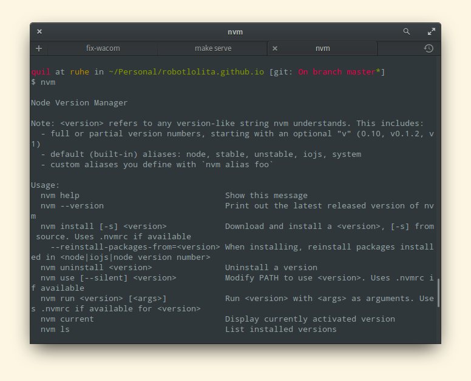

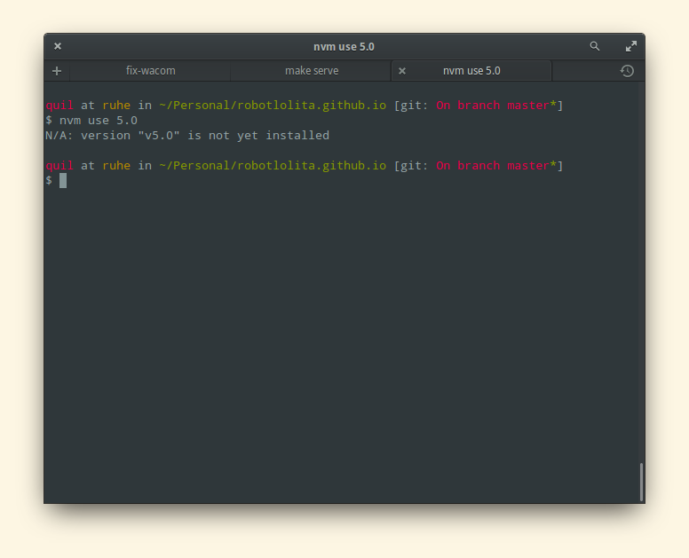

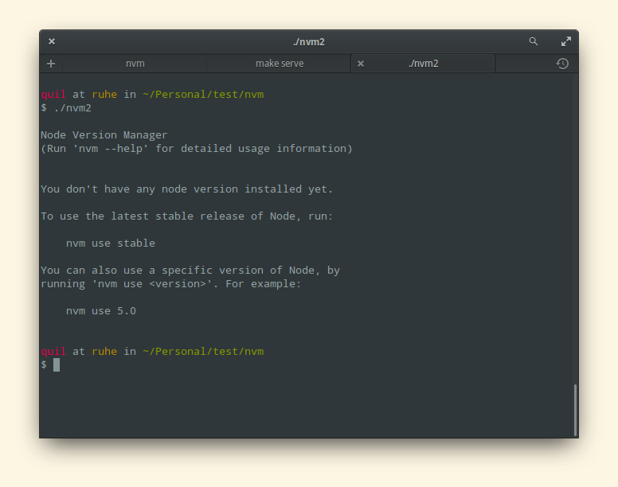

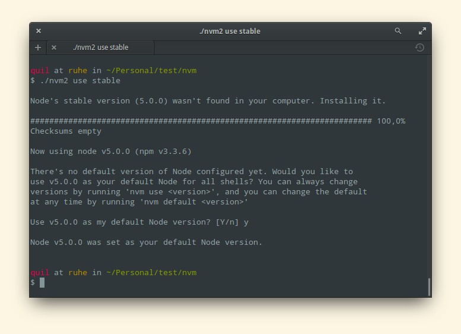

- When a tool can identify one safe and sensible repair, it should perform or offer that repair in the same flow instead of only reporting the failed prerequisite.
- Errors should locate the fault, describe the violated expectation, and give a repair path; interactive teaching can likewise make the next action executable in place.

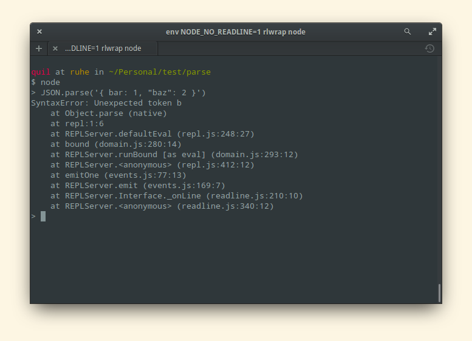

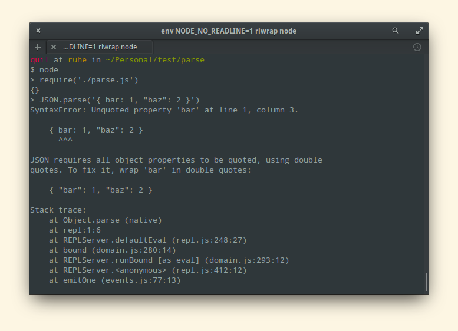

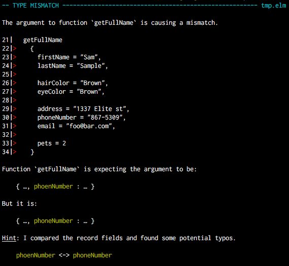

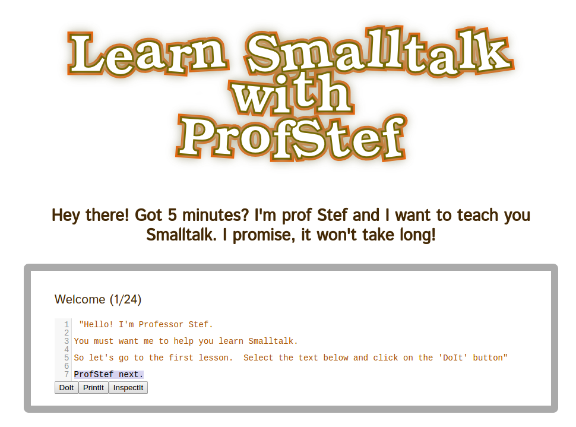

- Babel 5 versus Babel 6 is presented as a historical example of a default path becoming an opt-in assembly task: installing the CLI no longer installed an active transformation preset.

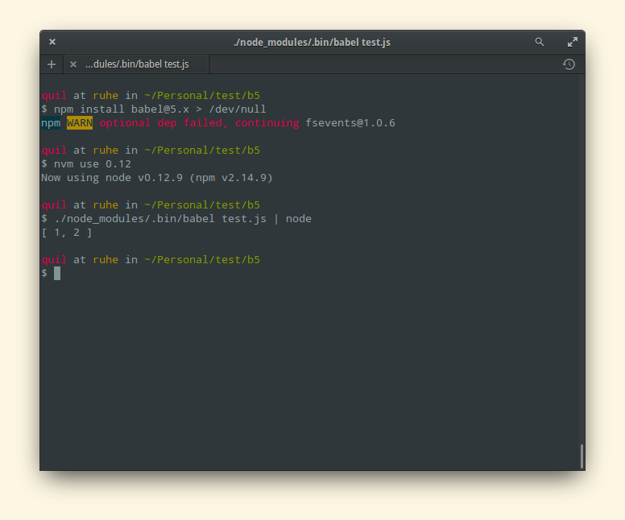

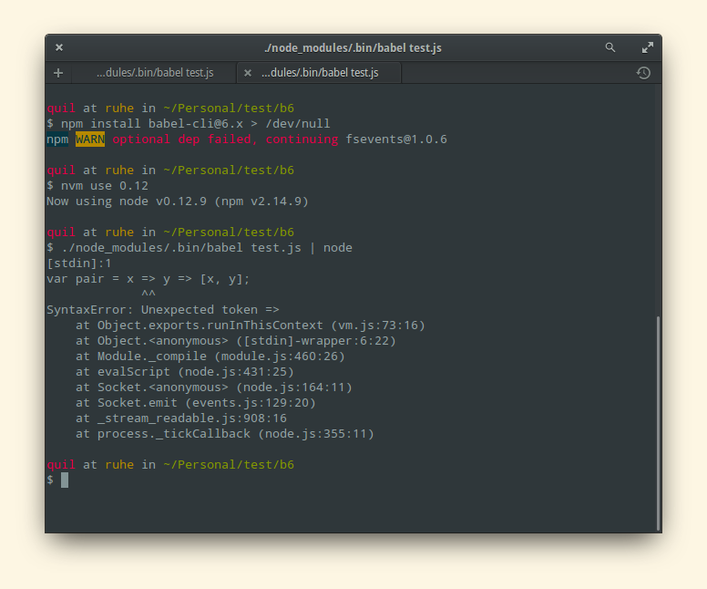

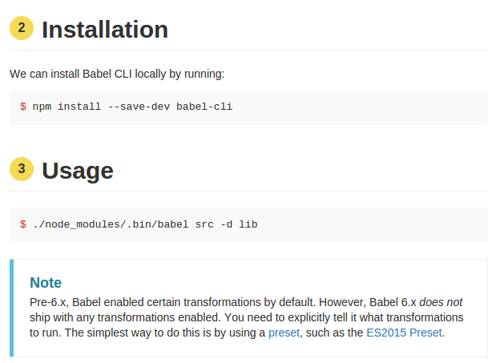

## Key Quotes
> "If I need to configure your application, you're doing it wrong." - the essay's intentionally absolute first rule.

> "When your application sees an error, and there's only one way to fix it, fix it." - the preferred recovery behavior.

## Connections
- [[Quil]] - author of the opinionated application-usability argument and the proposed interaction mockups.
- [[ApplicationConfigurationDesign]] - central distinction between packaged task completion and user-supplied assembly.
- [[CLIApplicationDesign]] - Babel, nvm, V8, and Elm show help, defaults, errors, and recovery as terminal interface design.
- [[SmartDefaults]] - common low-risk choices should be selected automatically while exceptional needs retain an override path.
- [[DeveloperExperience]] - technical users are still users whose time, comprehension, and recovery paths are product concerns.
- [[FirstMileProductExperience]] - an application should guide a newcomer from launch to the first useful result.

## Contradictions
- The essay's categorical claim that applications cannot be configured is a polemical design boundary, not a workable universal taxonomy. Accessibility, security, compliance, integration, localization, expert workflows, and genuinely different user goals can require configuration.
- Automatic repair is appropriate only when the diagnosis is reliable, the action is safe, and consequences are visible and reversible; otherwise a confident repair can corrupt state, consume resources, or violate user intent.
- The examples are author-operated historical snapshots from 2016, not controlled usability comparisons. They do not establish how representative the workflows were or how the named tools behave now.
- The claim that documentation is bad for applications overreaches: self-explanatory first use reduces mandatory reading, but reference, accessibility, troubleshooting, automation, audit, and advanced-use documentation can remain necessary.
- Eleven evidence-bearing screenshots were recovered from the publisher's 2019 archived copies and retained. Ten other effective images were opened and omitted as decorative or redundant: four coffee-machine and reaction drawings, four repetitive nvm command steps, one completed Babel setup screen, and one XKCD illustration.
