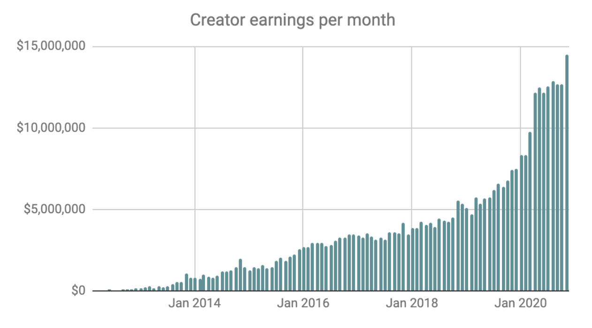
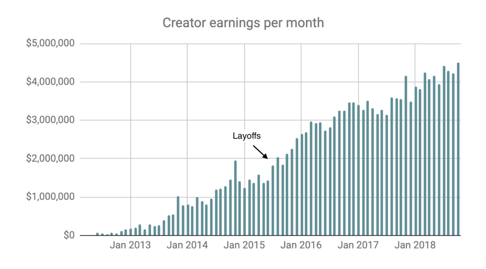
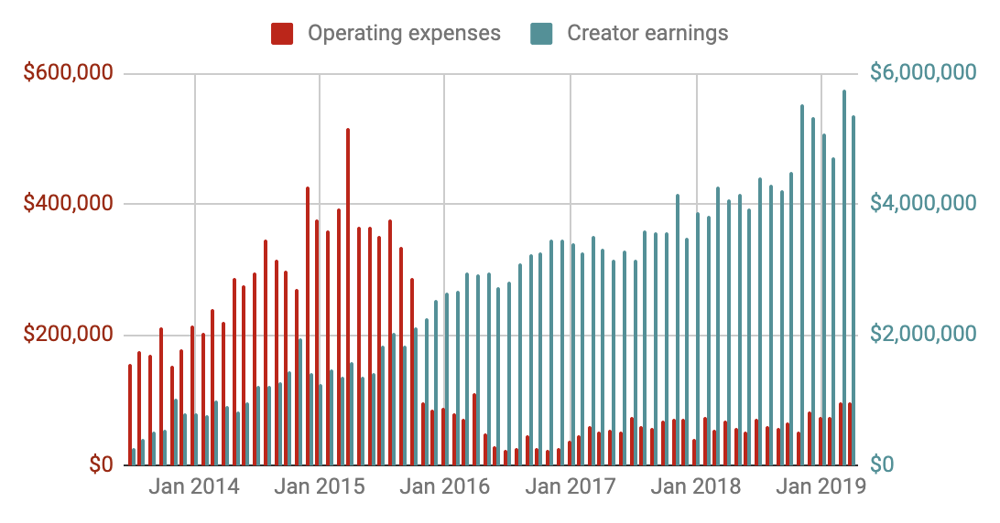
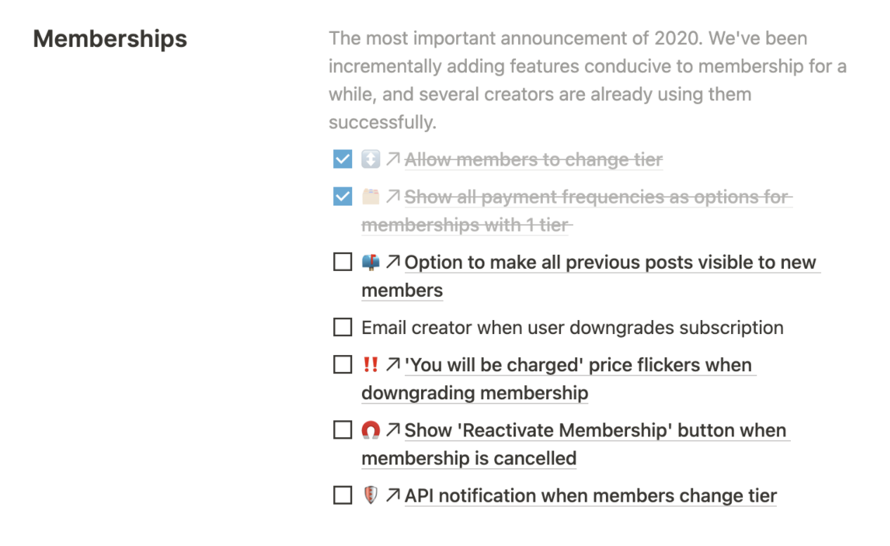
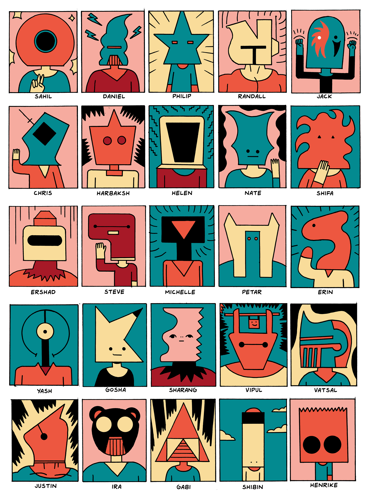

## Summary
[[SahilLavingia]] describes how [[Gumroad]] became a profitable remote company of roughly 25 hourly contractors with no full-time employees, routine meetings, deadlines, quarterly goals, or OKRs. Work is coordinated through writing, a shared task queue, a 24-hour response expectation, incremental releases, one creator-earnings north star, and substantial individual choice over tasks and hours. The account presents flexibility and low operating expense as benefits while explicitly conceding limited advancement, no employer benefits, time tracking, and weak transferability beyond Gumroad's circumstances.

## Key Claims
- After Gumroad's 2015-2016 contraction from 23 full-time employees to a one-person company, contractors maintained the product while Lavingia handled support, design, and feature work; creator earnings continued to rise after the layoffs.

- Gumroad's operating expenses fell sharply after the contraction while creator earnings kept increasing, but the chart is descriptive and does not isolate the staffing model as the cause.

- [[AsynchronousWorkplaceCommunication]] replaces routine meetings: people use GitHub, Notion, and occasional Slack, write extensively, and normally expect responses within 24 hours rather than immediately.
- Instead of deadlines and quarterly goals, contributors select work from a shared queue, ship when a change improves production, and use creator earnings as a simple measurable north star; external tax dates are an acknowledged exception.
- Gumroad says its incremental model can still deliver large projects: Memberships took about a year, was released without meetings or video calls, and was assembled through a visible list of completed and pending features.

- Hourly worldwide rates reportedly ranged from $50 for support to $250 for product leadership, with standardized location-independent pay, an internal pay-and-hours document, an unpaid screening challenge, and a paid multi-week trial.
- The contractor model offers flexible hours and room for family, creative work, or another venture, but supplies no healthcare, equipment, or other benefits, requires hour tracking, and offers few leadership or promotion paths.
- Lavingia reports that no contributor accepted an offer to move full-time, interpreting this as preference for freedom over growth, sustainability over speed, and life over work.

## Key Quotes
> "We got here on accident, not some grand plan." - Lavingia on the model's contingent origin.

> "freedom over growth, sustainability over speed, life over work." - the priorities Lavingia attributes to Gumroad's contributors.

## Connections
- [[SahilLavingia]] - Gumroad founder and author presenting the model from his perspective.
- [[Gumroad]] - company whose contractor-only, asynchronous operating design is described.
- [[AsynchronousWorkplaceCommunication]] - writing, shared tools, and bounded response expectations replace most synchronized coordination.
- [[ContingentWorkforce]] - Gumroad uses contractors for enduring product, support, content, risk, design, and leadership work rather than temporary overflow alone.
- [[RemoteWork]] - location-independent pay and schedule flexibility support geographically distributed contribution.
- [[Incrementalism]] - work ships when it improves production, including a year-long membership product decomposed into smaller features.
- [[OrganizationalTransparency]] - contributors can see one another's pay and average hours.
- [[WorkLifeBalance]] - reduced hours and schedule autonomy are framed as means to protect family, creative work, and other ventures.

## Contradictions
- The source complicates accounts in which contingent work mainly creates low-status exclusion: Gumroad's contractors reportedly include product and functional leaders, receive globally standardized hourly rates, and sometimes prefer the arrangement to full-time work. It does not negate unequal contractor outcomes elsewhere because workers still carry benefits, equipment, income-continuity, and time-tracking costs.
- The source challenges claims that regular meetings, deadlines, OKRs, or ruthless prioritization are necessary for every substantial software launch, but supplies one founder-authored case rather than a controlled comparison.
- Revenue, growth, creator earnings, expense, and Memberships figures are historical company-reported snapshots. They do not establish that the operating model caused the outcomes or that the same model would work under different scale, regulation, interdependence, or customer demands.
