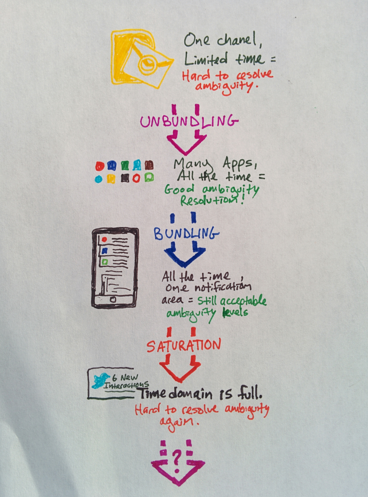

## Summary
[[AlexDanco]] argues that an effective notification reduces uncertainty about whether incoming information needs attention or triage; relevance alone is insufficient when a vague alert still forces the user to inspect an app. He interprets mobile notification history as a cycle from Outlook's single channel, through app unbundling, to notification-tray rebundling and saturation, then proposes spatial, glanceable interfaces as a speculative way to expand ambiguity-resolution bandwidth. The retained hand-drawn diagram makes that unbundle-rebundle-saturate sequence explicit.

## Key Claims
- A notification is effective when it resolves enough ambiguity for the recipient to dismiss, defer, triage, or act without unnecessary inspection.
- An unread count or undifferentiated buzz can be more disruptive than a clearly irrelevant message because uncertainty persists until the user opens the device or app.
- Glanceable subject-level information can reduce interaction cost even when the display is not suitable for consuming content or doing sustained work.
- Incoming information exceeds immediate attention, making ambiguity resolution a limiting step whose rate depends on both signal clarity and available human bandwidth.
- Smartphones expanded intake capacity by unbundling Outlook into persistent app-specific channels, while the notification tray later rebundled those channels into one place and eventually became saturated.

- The essay proposes distributing alerts across spatial interfaces, using Facebook Chat Heads as an early example of persistent, movable, groupable objects that may recruit visuospatial memory instead of relying only on serial reading and short-term recall.
- Better relevance and actionability may improve an overloaded notification stream, but the article's stronger proposal is to expand interface bandwidth rather than only optimize the existing tray.

## Key Quotes
> "Effective notifications are ones that resolve ambiguity." - the essay's design criterion.

> "There's room in space." - the proposed move from a saturated time domain to spatial interfaces.

## Connections
- [[AlexDanco]] - author applying scarcity, saturation, and bundling cycles to notification interfaces.
- [[NotificationDesign]] - central design problem of giving enough information for confident triage without unnecessary interruption.
- [[AmbiguityReduction]] - extends ambiguity reduction from project framing to the intake and triage of incoming information.
- [[AttentionManagement]] - notifications compete for limited immediate attention and can impose inspection and refocusing costs.
- [[MobileRuntime]] - the source calls notifications a third phone runtime alongside apps and the web.
- [[VisualAttention]] - spatial placement and glanceability are proposed as additional perceptual bandwidth for notification triage.
- [[FacebookMessenger]] - Facebook Chat Heads provide the essay's main example of notifications represented as movable spatial objects.

## Contradictions
- The essay is a speculative 2015 product argument, not controlled evidence that ambiguity resolution is the unique bottleneck in information intake or that spatial notification layouts increase capacity, comprehension, wellbeing, or task performance.
- Moving alerts into more screen locations may increase clutter, visual competition, distraction, accessibility burden, and platform capture rather than create usable bandwidth; spatial memory does not make total attention unlimited.
- The Apple Watch, Outlook, notification-tray, Facebook Chat Heads, Slack, and neuroanatomy examples are historical or simplified. The article does not measure users, tasks, error rates, habituation, privacy effects, or differences in visual, motor, and cognitive access.
- The final stock-heat-map paragraph in the captured Markdown shifts to first person without identifying its author. It is treated as an unattributed appended note, not as evidence of Danco's position.
