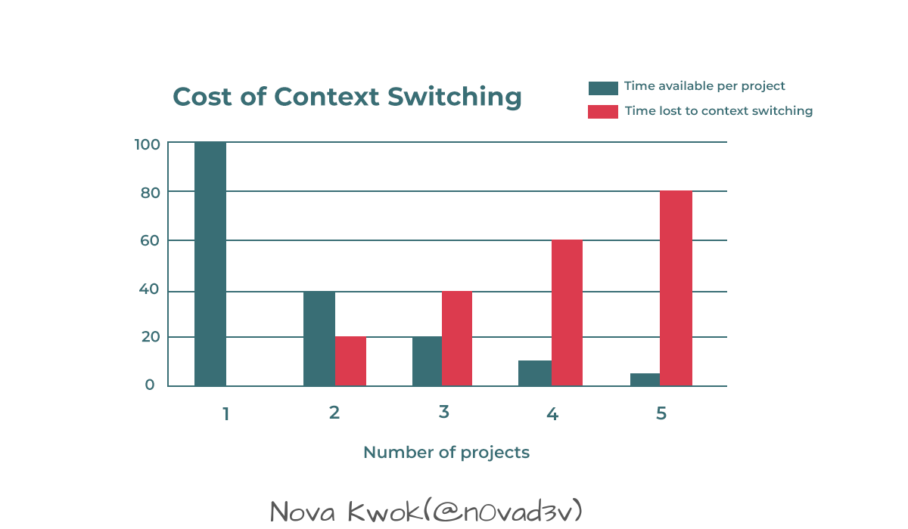
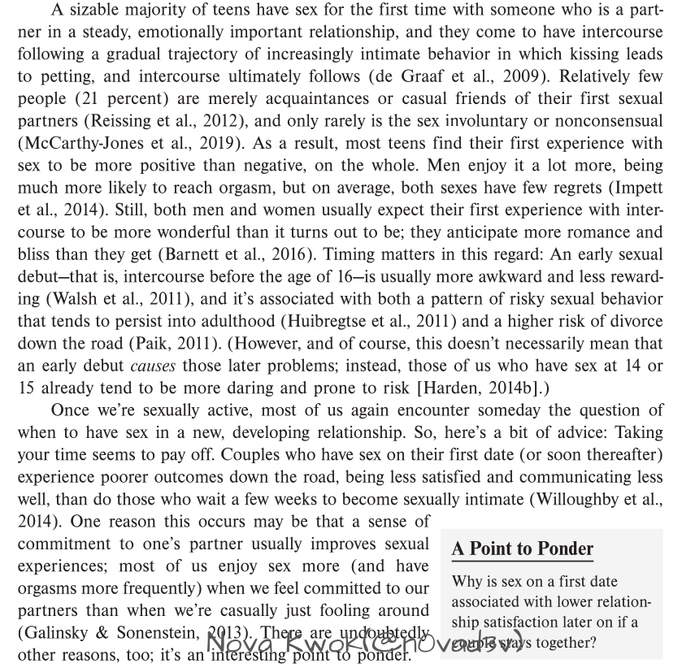
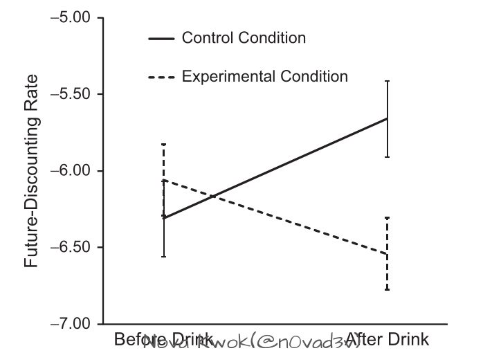
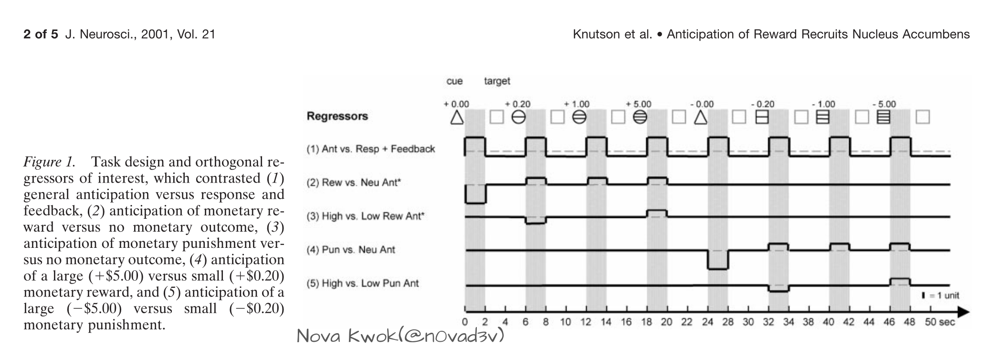

## Summary
[[NovaKwok]] combines workplace observations about interruption with a critical reading of Kelly McGonigal's 《自控力》. The essay argues that repeated [[AttentionManagement|attention]] shifts, reward-seeking, stress, and self-punishment can reinforce one another, while physiological state, restorative activity, self-compassion, and a meaningful long-term aim can support [[SelfControlPsychology|self-control]]. It also checks two book claims against named studies and repeatedly distinguishes suggestive evidence from stronger conclusions. Four retained images provide the article's switching-cost illustration, its example of citation-dense writing, and the two study figures it discusses.

## Key Claims
- Human work is serial enough that concurrent requests, chat messages, phone checking, and unfinished commitments impose context-reconstruction costs rather than creating free parallelism.

- The essay treats a blog chart's steep project-count penalty as an illustration, not a measured law: it depicts per-project time falling from 100% for one project toward roughly 5% for five while switching loss rises toward 80%.
- The author finds 《自控力》 useful but less thoroughly evidenced than books that expose dense academic support, and recommends checking its arguments rather than accepting them on authority.

- A reported 65-person glucose-drink experiment linked rising blood glucose with lower future discounting, but the essay explicitly rejects turning that result into advice for continuously consuming sugar.

- Dopamine is framed as incentive salience and pursuit rather than pleasure itself; the inspected monetary-incentive-delay figure separates anticipation from response and feedback, although the author notes that the paper does not directly establish the book's stronger contrast between expectation and happiness.

- Stress can prompt people to choose stimulating activities they predict will help, while exercise, reading, music, relationships, walking, massage, and creative activity are presented as more restorative alternatives.
- Harsh self-criticism after a lapse can worsen mood and trigger another short-term reward loop; accepting conflicting impulses and reconnecting behavior to a long-term goal is presented as more durable than punishment or perfectionism.

## Key Quotes
> “每次上下文切换都会带来大量的性能开销让工作变慢” — on the author's serial-processing analogy.

> “不过论文中似乎没有提到期待的部分，请读者阅读时注意。” — on checking a book's interpretation against the cited study.

> “自控力最强的人不是与自我的较量中获得自控” — on integrating rather than punishing conflicting motives.

## Connections
- [[NovaKwok]] - author combining personal work experience with a critical book reflection.
- [[AttentionManagement]] - repeated external and self-initiated switches consume focus and recovery time.
- [[ProgrammerInterruptionRecovery]] - build waits, design work, chat requests, and unfinished infrastructure tasks illustrate state loss in software work.
- [[SelfControlPsychology]] - integrates physiological state, reward anticipation, stress, guilt, self-compassion, and long-term aims.
- [[SelfDiscipline]] - the essay qualifies refusal-centered discipline by emphasizing acceptance and goal alignment over punishment.
- [[BurnoutPrevention]] - accumulated switching, pressure, fatigue, and ineffective recovery can make sustained focus harder.

## Contradictions
- The source does not directly contradict the wiki's discipline material, but it rejects a purely moral or punitive account: self-control is presented as state- and environment-dependent, and self-criticism may make another lapse more likely.
- The context-switching chart is a secondary illustration without methods, units, or an empirical sample; its exact percentages should not be treated as universal measurements.
- The article is a personal, secondary synthesis of a popular book, two studies, a survey, and the author's observations. It explicitly notes sparse primary evidence in places and says the 2001 reward paper does not directly support every experiential claim attributed to it.
