## Summary
This code-oriented secondary analysis presents [[OpenClaw]] as a local-first personal-agent platform whose single WebSocket Gateway separates messaging and control interfaces from session routing, context assembly, model invocation, tool execution, and persistent state. It describes extensibility, multi-agent routing, Canvas/A2UI interaction, memory, security controls, and deployment topologies, while showing that self-hosted orchestration does not make model calls local or eliminate prompt-injection and capability risks. The article also attributes OpenClaw's early productization and rapid adoption to creator [[PeterSteinberger]], but its implementation details and growth claims are point-in-time assertions rather than an independently reproduced audit.

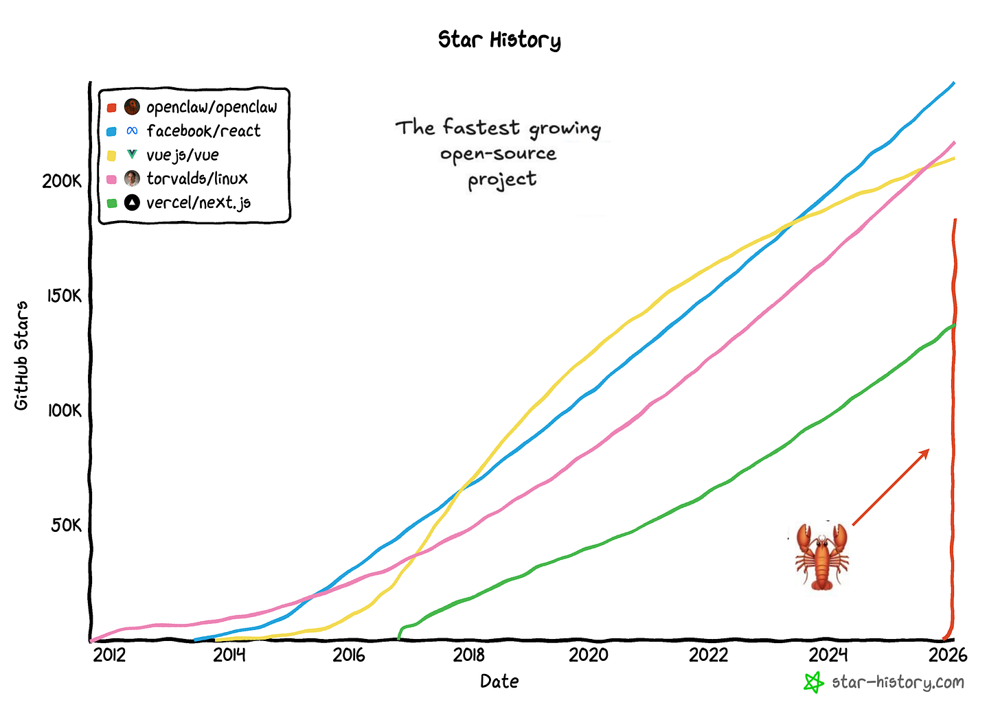

## Key Claims
- OpenClaw uses a hub-and-spoke architecture: messaging channels and control clients converge on one Gateway, which applies access control and session resolution before dispatching work to the agent runtime.

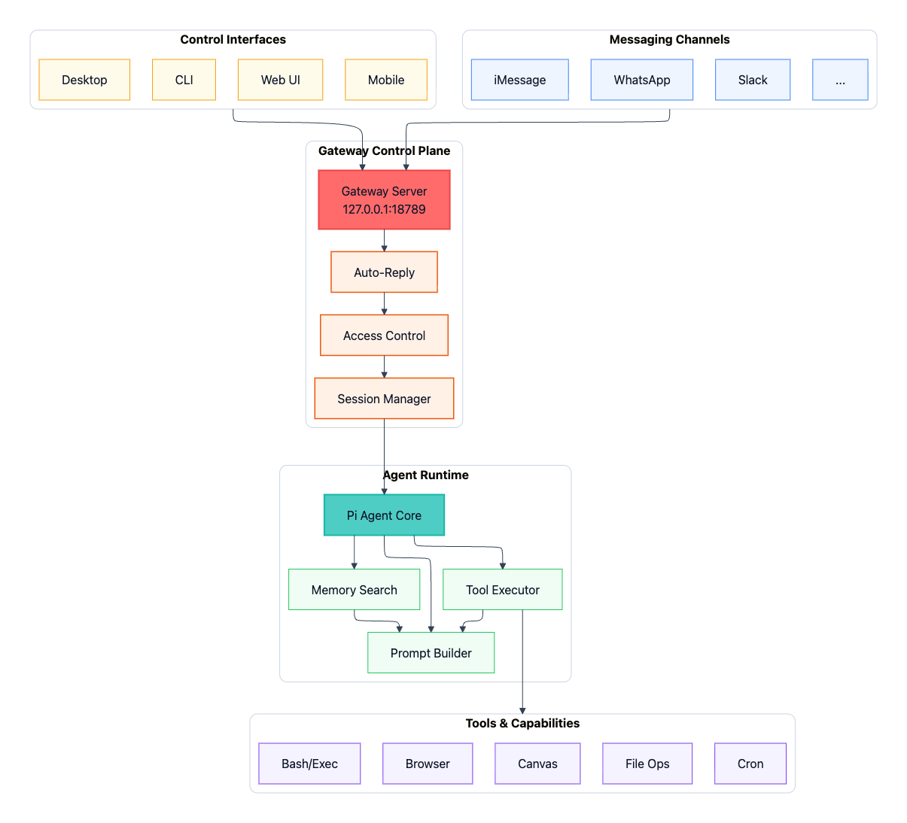

- Channel adapters normalize authentication, inbound text and media, sender and group policy, platform formatting, chunking, and outbound delivery, keeping channel-specific behavior outside the runtime.
- The runtime resolves a session, assembles history, workspace instructions, selected Skills, memory, and tool definitions, then streams model output through an iterative tool-call loop and persists the resulting state.

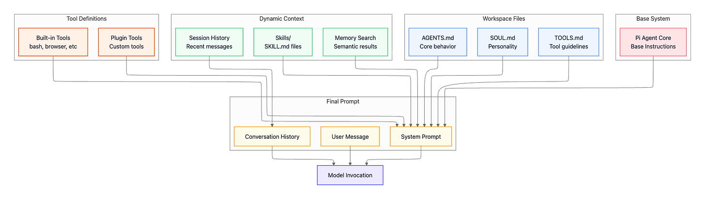

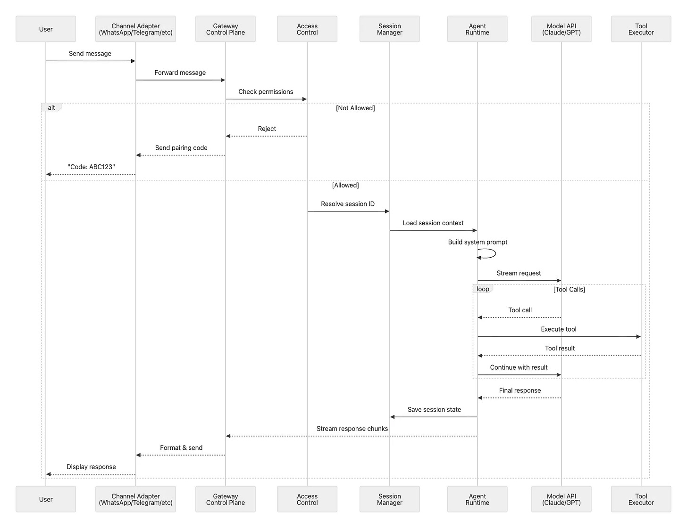

- Plugins are discovered from package metadata and extend four surfaces—channels, tools, memory, and model providers—through validated registration into the relevant core subsystem.

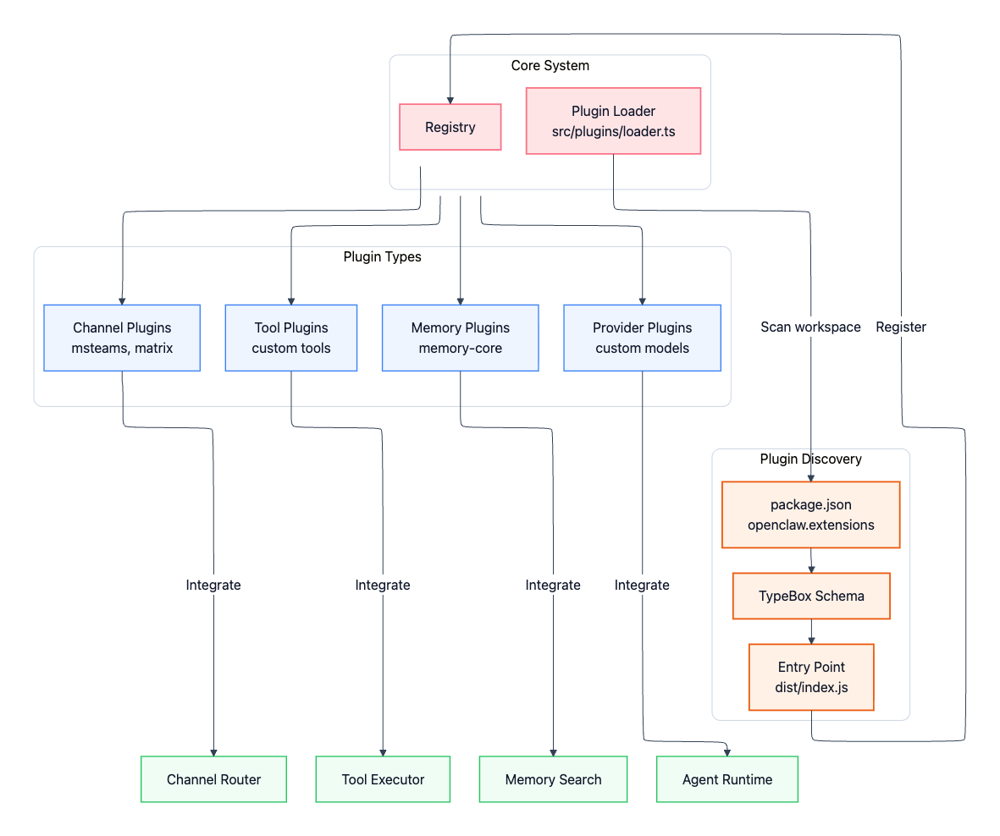

- Session keys also express trust boundaries: operator, DM, and group contexts can receive different workspaces, models, tool policies, and sandbox rules; routing can map channels to fully separate agent instances.

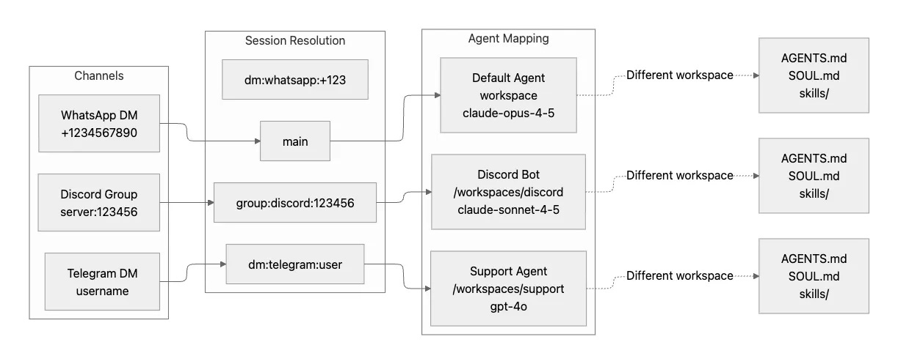

- Canvas runs separately from the Gateway and uses a bidirectional A2UI sequence: the agent pushes declarative HTML, the user action returns as an event and tool call, and updated state is pushed back to the client.

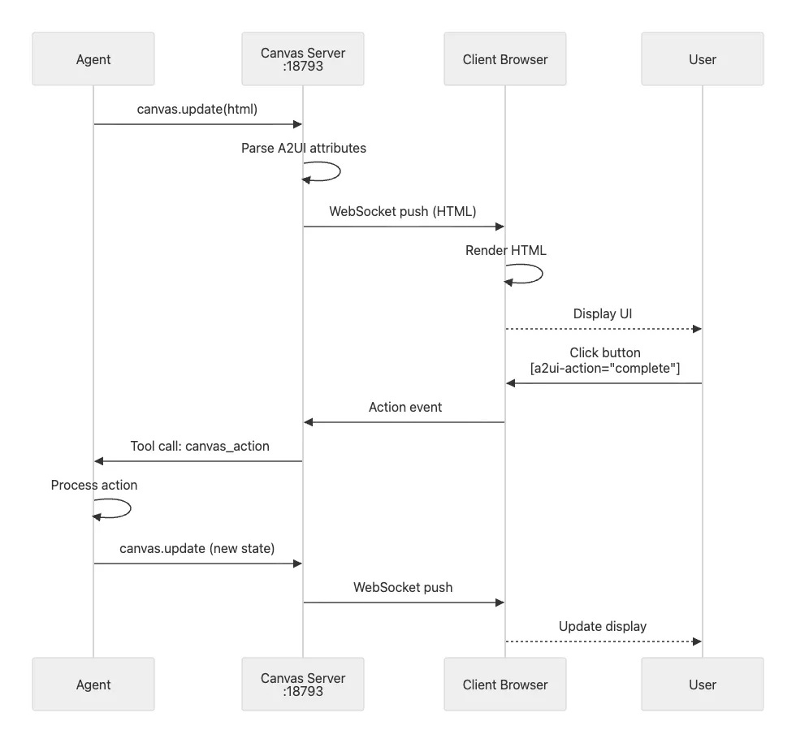

- Configuration, workspace instructions, credentials, sessions, and searchable memory are separate state domains; the article describes append-only session events, compaction with a pre-compaction memory flush, and hybrid vector plus BM25 retrieval.

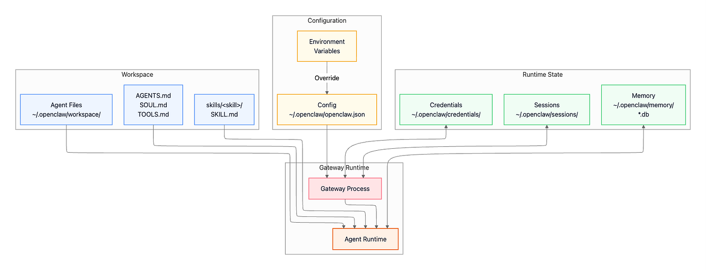

- Security is layered across loopback binding, authentication, device and DM pairing, allowlists, group mention policies, tool-policy precedence, session-specific sandboxing, and constrained filesystem and network exposure; prompt text is guidance, while these runtime controls provide enforcement.
- The same Gateway architecture can run locally, as a macOS background service, on a loopback-bound VPS reached by SSH or Tailscale, or in a public Fly.io container backed by persistent storage.

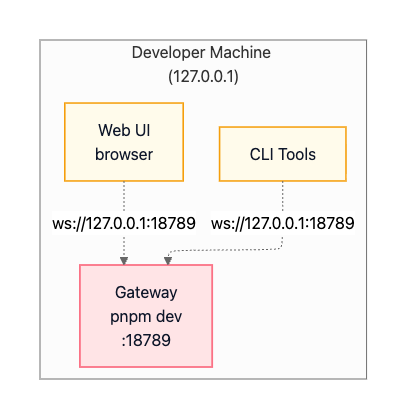

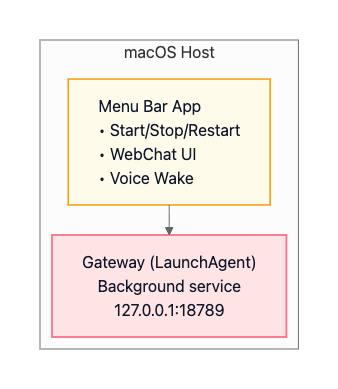

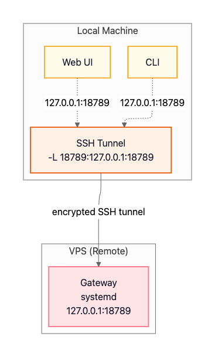

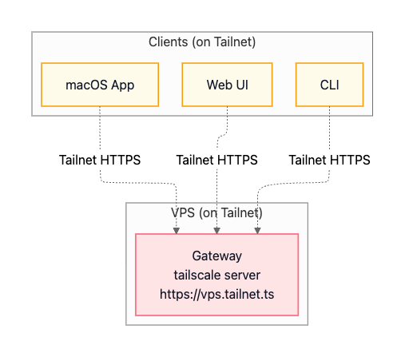

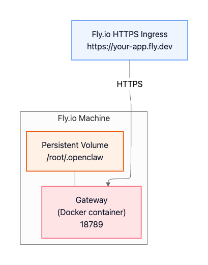

## Key Quotes
> "The LLM provides intelligence; OpenClaw provides the operating system." - on the distinction between the model and its execution environment.

## Connections
- [[OpenClaw]] - project whose control plane, runtime, state, extension, security, and deployment layers are analyzed.
- [[PeterSteinberger]] - identified as OpenClaw's creator and the focal builder at the early ClawCon event.
- [[HeadlessAgentArchitecture]] - the interface/runtime separation and persistent Gateway exemplify an IM-first agent control plane.
- [[LLMToolingSkills]] - relevant Skills are selectively injected into the per-turn context rather than all being loaded blindly.
- [[AgentMemory]] - sessions, memory files, compaction, vector search, and BM25 support continuity beyond the active prompt.
- [[AgentPermissionModel]] - channel checks, pairing, allowlists, policy precedence, and sandbox rules assign authority by trust context.
- [[ProductionAgentInfrastructure]] - the source supplies a concrete execution stack while leaving durable external-effect recovery less developed.
- [[ConversationalUI]] - Canvas and A2UI add generated interactive surfaces beside messaging conversation.

## Contradictions
- The article says DM and group sessions are sandboxed by default, later says sandboxing is opt-in, and elsewhere uses the softer formulation that those sessions "can default" to Docker isolation. This unresolved configuration/default distinction should not be treated as a verified guarantee.
- The star-history graphic supports the direction of rapid growth but does not provide its extraction date, counting method, or reproducible data, so the roughly 180,000-star figure remains a point-in-time source claim.
- The source's self-hosted and private framing is qualified by its own account: configured model and voice providers still receive requests, and host-side credentials and tools remain exposed to whatever boundaries the operator actually configures.
