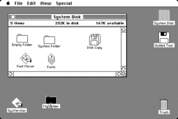
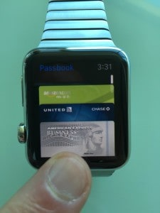

## Summary
[[NirEyal]] proposes the [[CaliforniaRollRule]]: unfamiliar products gain a practical route to adoption when they present meaningful novelty through ingredients, metaphors, or controls people already understand. He connects the California roll’s role in popularizing sushi with the Macintosh desktop, Apple Wallet, and Apple Watch, arguing that familiar mental models reduce learning effort without requiring the underlying capability to remain conventional. The essay is a practitioner analogy rather than adoption research, and its historical and sales examples do not isolate familiarity from distribution, product quality, timing, or brand power.

## Key Claims
- The California roll combined mostly familiar ingredients in a new arrangement, providing many American diners with a lower-friction introduction to sushi.

- [[CaliforniaRollRule|The California Roll Rule]] says products can make novelty approachable by preserving a recognizable frame of reference.
- Early graphical interfaces used familiar desktop objects such as folders, disks, windows, and trash cans to make personal computing more legible to people unfamiliar with command lines.

- [[Apple]] can later remove skeuomorphic detail after users learn the underlying interaction, but it reuses familiar forms when introducing another behavior.
- Apple’s Passbook and Wallet represented digital payment options as card-shaped objects even though the technical system did not require that physical form.

- [[BJFogg]]’s simplicity account treats a non-routine behavior as harder because learning and training require effort; familiar routines can therefore increase practical ability.
- Teams introducing a new product should identify a recognizable gateway into the new behavior rather than assume technical benefit will overcome learning cost by itself.

## Key Quotes
> “People don’t want something truly new, they want the familiar done differently.” — Eyal’s statement of the rule.

> “What’s my California Roll?” — the design question proposed for products that are not gaining traction.

## Connections
- [[NirEyal]] - author who names and applies the California Roll Rule.
- [[CaliforniaRollRule]] - central product-adoption heuristic developed through the food and interface examples.
- [[BJFogg]] - researcher cited for treating non-routine behavior as an ability and simplicity cost.
- [[JonyIve]] - Apple designer quoted on creating the “strangely familiar” and using the Digital Crown as a bridge to smartwatch interaction.
- [[Apple]] - supplies the Macintosh, Wallet, and Apple Watch examples.
- [[MentalModels]] - familiar representations give users a starting model for predicting a novel system.
- [[CognitiveOverheadInProductDesign]] - the rule attempts to reduce the connections and training required before a product makes sense.
- [[FoggBehaviorModel]] - explains familiarity as one input to whether a prompted behavior feels simple enough to perform.
- [[BehaviorDesign]] - uses routine and recognizable interaction to make a target behavior easier.

## Contradictions
- The essay offers analogy, selected examples, quotations, and contemporary forecasts rather than controlled evidence that familiarity caused sushi, Macintosh, mobile-payment, or smartwatch adoption.
- Familiarity is not universally beneficial: inherited metaphors can misrepresent a genuinely new system, constrain better interaction models, preserve exclusionary conventions, or delay learning that the new capability requires.
- The cited $2.25 billion sushi-consumption figure and 19 million Apple Watch sales forecast are historical claims from linked secondary sources; the article does not supply methods or later outcome checks.
- The opening diner photograph, Nir Eyal headshot, and two Nir and Far logos were inspected and omitted as decorative, avatar, or branding images. The three retained product and interface examples are recorded in the asset manifest.
