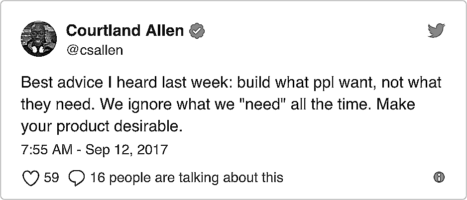
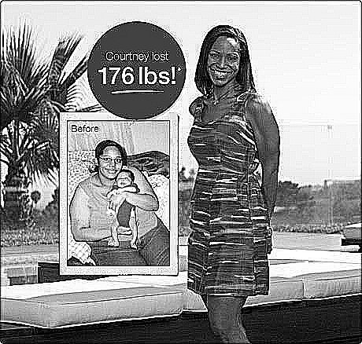

## Summary
[[JustinJackson]] argues that identifying a beneficial need is not enough to create demand: a product must give customers something they already want or make the desired progress rewarding now. Examples from weight loss, [[Tesla]], and [[DatingRing]] support [[ProductDemandAlignment]], while [[JamesClear]] supplies the short-term-reward mechanism and [[RobWalling]] translates it into onboarding through a “Minimum Path to Awesome.” The essay is a practitioner argument illustrated by selected cases, not comparative evidence that emotional appeal, immediate reward, or any specific onboarding milestone causes adoption.

## Key Claims
- A socially or personally beneficial need does not establish willingness to buy, adopt, or persist; builders should look for demonstrated demand and a desired outcome.
- Products can connect delayed benefits to immediate rewards. The LA Weight Loss example markets a desired appearance rather than distant health, and the advertisement makes that promise concrete through a reported 170-pound before-and-after transformation.

- [[JamesClear]]’s attributed theory says beneficial habits often impose short-term pain for long-term reward, while harmful alternatives can reverse that timing; motivation improves when the long-term benefit is paired with a near-term reward.
- [[Tesla]] is presented as selling status, speed, and luxury alongside lower-emission transportation. The Roadster photograph places a visibly aspirational sports car against a wind farm, illustrating the pairing of immediate desirability with an environmental benefit.

- [[DatingRing]] initially removed profile photos in pursuit of more substantive matching, but the source says weak signups led it to restore photos and user-controlled preferences. Its relaunched homepage foregrounded “real people,” matches, dates, and a free trial rather than the earlier rational premise.

- [[RobWalling]]’s “Minimum Path to Awesome” applies the same principle to onboarding: move a new user quickly to a product-specific success such as sending an invoice, receiving payment, sending a proposal, gaining a subscriber, or sending an email.
- Customers may resist the progress a product promises and may make emotionally driven purchases that they later explain rationally, so a logically beneficial feature set is not sufficient evidence of demand.

## Key Quotes
> “People might not want the progress our product provides.” — Jackson’s warning against treating beneficial change as automatically desirable.

> “Build something that gives users a quick win, and then continues to provide value over time.” — the essay’s onboarding principle.

## Connections
- [[JustinJackson]] - author distinguishing beneficial need from customer demand.
- [[ProductDemandAlignment]] - central concept connecting long-term value to immediate desirability and reward.
- [[JamesClear]] - supplies the attributed short-term-pain and long-term-reward theory.
- [[RobWalling]] - contributes the “Minimum Path to Awesome” onboarding application.
- [[DatingRing]] - case in which a rational no-photo premise reportedly lost to users’ preference for photos and control.
- [[Tesla]] - example of pairing environmental progress with performance, luxury, and status.
- [[ProductMarketFit]] - demand must be observed through behavior rather than inferred from the importance of a need.
- [[ConversionRateOptimization]] - onboarding quick wins are hypotheses about activation that require measurement.

## Contradictions
- No direct contradiction was found. The essay reinforces the wiki’s demand-evidence account of [[ProductMarketFit]] while qualifying problem importance as insufficient evidence of pull.
- The argument relies on selected marketing and company stories without signup data, experiments, retention cohorts, price comparisons, or controls; the Dating Ring relaunch is reported without before-and-after metrics.
- Immediate reward can attract initial use without producing durable value, retention, ethical behavior, or beneficial outcomes. Marketing appearance, status, or emotion can also exploit insecurity or obscure material tradeoffs.
- The broad claim that customers buy emotionally and rationalize with logic is asserted rather than established by evidence in the captured article.
