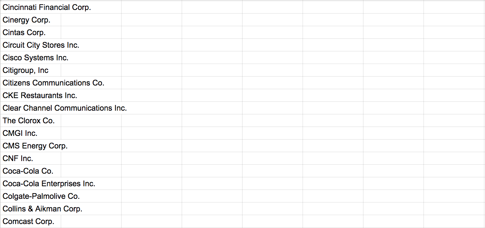

## Summary
[[PerHaraldBorgen]] describes a [[Xeneta]] experiment that turns company descriptions into a rough first-pass ranking of sales prospects. The workflow obtains descriptions through search and the FullContact API, cleans and stems their text, removes stop words, represents it with [[BagOfWordsModel]] and [[TFIDFRanking]] features, and trains a supervised [[TextClassification]] model from 1,000 qualified and 1,000 manually disqualified companies. A Random Forest reportedly reached 86.4% test accuracy, but the source offers no confusion matrix, class-specific error costs, deployment results, or evidence that its historical labels and descriptions represent future prospects.

## Key Claims
- Company descriptions can contain enough domain language to support an automated first-pass estimate of whether a company is a plausible customer.
- The described pipeline depends on data acquisition before modeling: it searches for a likely company URL, then requests a description from FullContact, with possible loss or error at each step.
- The training set balances 1,000 existing Xeneta customers against 1,000 companies manually labeled as disqualified prospects.
- Text preprocessing removes nonalphabetic characters and stop words and applies stemming before count vectorization and tf-idf transformation.
- On one 70/30 train-test split, Random Forest reportedly exceeded 80% accuracy while K-nearest neighbors remained near 60%; tuning vocabulary, n-gram range, and estimator count produced a reported 86.4% test accuracy.
- The intended use is decision support that roughly sorts large lead lists before human review, not autonomous outreach or a demonstrated replacement for sales judgment.

## Key Quotes
> "Given a company description, can we train an algorithm to predict whether or not it's a potential Xeneta customer?" - the experiment's central hypothesis.

> "There's of course a loss at each step here" - on errors introduced while resolving company names to URLs and descriptions.

## Connections
- [[PerHaraldBorgen]] - author and practitioner who built the experimental pipeline.
- [[Xeneta]] - sea-freight market-intelligence company whose customer profile defines the positive class.
- [[TextClassification]] - supervised binary classification task applied to company descriptions.
- [[NaturalLanguageProcessing]] - preprocessing and vectorization turn descriptions into model inputs.
- [[BagOfWordsModel]] - count-vector representation capped at 5,000 vocabulary features in the example.
- [[TFIDFRanking]] - term-weighting mechanism reused here for classification features rather than search-result ranking.

## Contradictions
- Qualifies any inference that the reported 86.4% accuracy proves production value: the source uses one small balanced dataset and one train-test split, acknowledges likely training-description bias, and reports neither precision and recall nor real-world sales outcomes.

## Image Notes
Both local images were opened. The port photograph was omitted as illustrative and fully represented by the prose; the text-bearing spreadsheet screenshot was retained because it shows the sparse company-name input that sales staff had to research and qualify manually.
