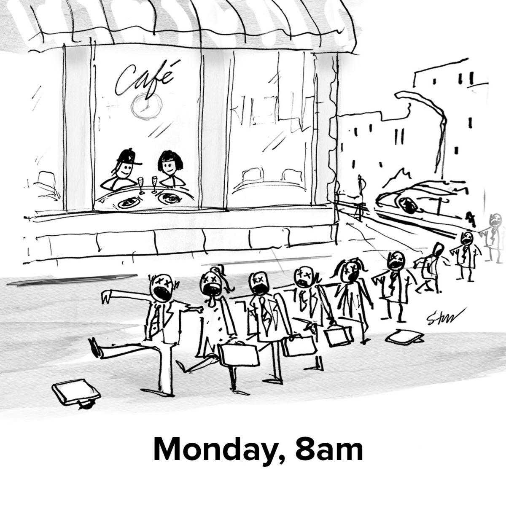

## Summary
[[PiaSilva]] describes replacing long entrepreneur workdays with a five-hour weekday window after a two-month European experiment showed that her business could continue while she worked only in the late afternoon. She attributes the schedule to concentrated work, explicit weekly and daily objectives, delegation with training, and strict control of habitual distraction, while treating greater leisure as an input to creativity rather than evidence of laziness. The result is a seven-month first-person account, not comparative evidence that a 1-6 schedule improves output generally.

## Key Claims
- A two-month Europe trip led Silva and Steve to work only a few late-afternoon hours while keeping their business operating on U.S. Eastern Time.
- Silva invokes [[ParkinsonsLaw]] to explain why a smaller work window appeared to produce more output than an open-ended day.
- Her 1-6 schedule depends on delegating work others can do, investing in handoff and training, and reserving the limited window for work only she can perform.
- Weekly planning, explicit short- and long-term objectives, and a tight daily list reduce the ambiguity that previously enabled procrastination.
- Silva says an eight-hour-plus day had contained roughly five hours of work and three hours of avoidable delay, social media, news reading, or work that could have been outsourced.
- More free time is presented as supporting reading, reflection, unrelated learning, and new ideas that later improve the business.
- The illustrated split between a relaxed cafe and exhausted 8 a.m. commuters reinforces the essay's challenge to visible early-morning busyness as a proxy for useful work.

## Key Quotes
> "What if you could only work five hours a day?" - on using a hard time constraint to force task selection and system redesign.

> "my eight-hour-plus workdays were really just five-hour workdays dragged out over eight hours" - Silva's retrospective judgment about procrastination and undelegated work.

## Connections
- [[PiaSilva]] - author describing her own seven-month adoption of the 1-6 schedule.
- [[PersonalProductivity]] - the schedule combines task filtering, planning, delegation, and distraction control.
- [[WorkLifeBalance]] - the source adds an entrepreneur-controlled daily schedule centered on leisure and a bounded work window.
- [[ParkinsonsLaw]] - named explanation for work expanding to occupy the time made available.
- [[Forbes]] - publication venue for the contributor essay.

## Contradictions
- The source complements [[i-am-a-9-to-5-developer-and-so-can-you-exception-not-found]] on legitimate work boundaries, but proposes a five-hour entrepreneurial schedule rather than a conventional eight-hour employee day.
- The account is self-reported and supplies no output definition, baseline, revenue, customer-service result, employee perspective, comparison period, or independent evidence that fewer hours caused better work.
- Silva and Steve had unusual control over schedule, delegation, travel, and time-zone alignment. The model may not transfer to shift work, care work, tightly coupled teams, low-autonomy roles, or jobs whose value depends on coverage and responsiveness.
- [[ParkinsonsLaw]] is invoked as an interpretation, not tested as the cause; novelty, travel, pre-existing systems, demand, staffing, or selective memory could also explain the reported result.
- The author portrait was inspected and omitted as a decorative avatar; only the evidence-bearing Monday-morning illustration was retained.
