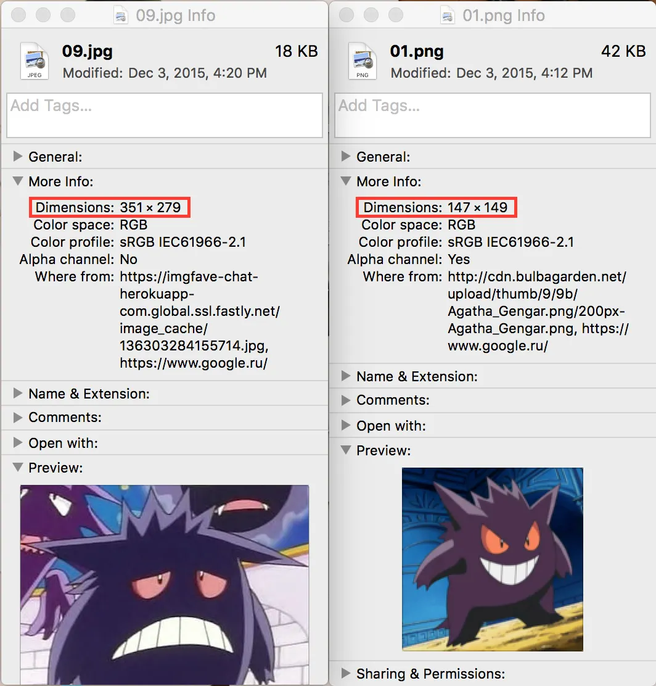
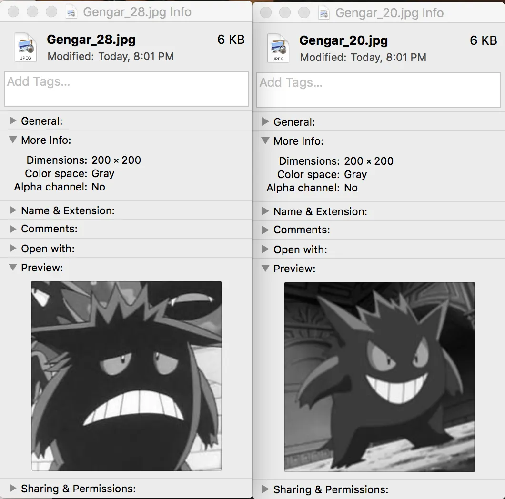
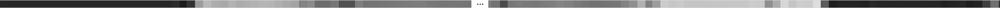
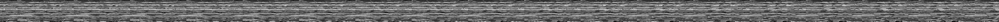
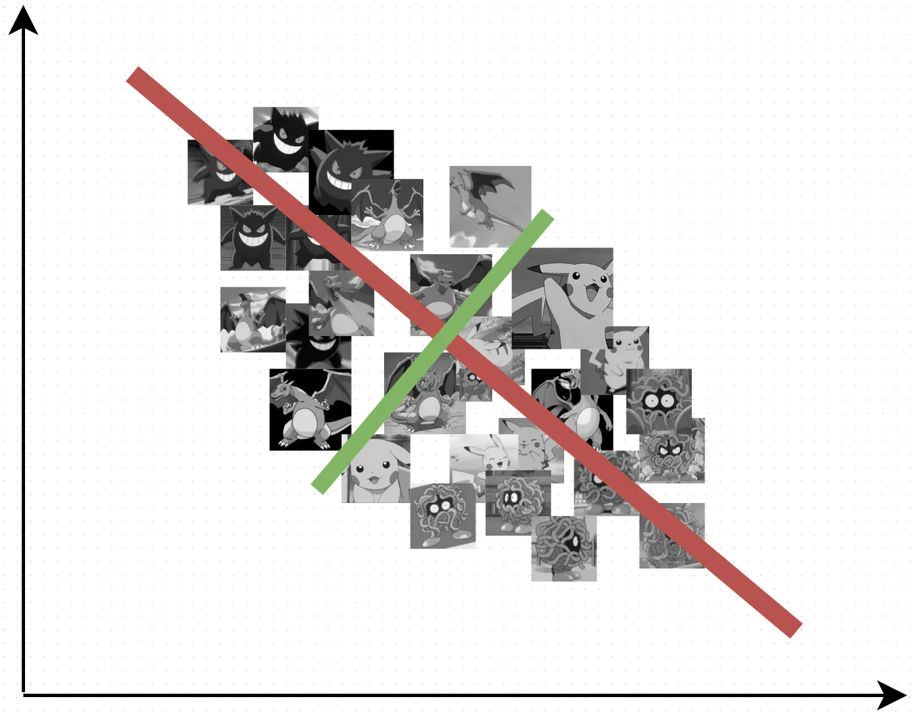
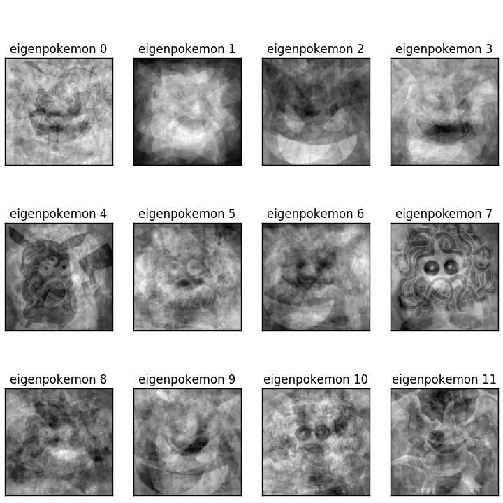
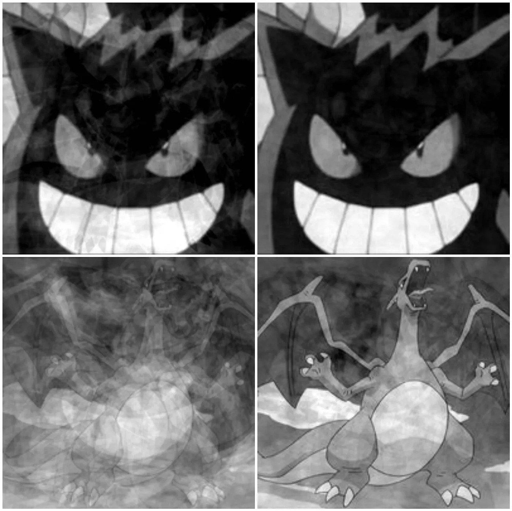

## Summary
[[DmitriiPetukhov]] presents a small four-class [[ImageClassification]] tutorial built from 80 Pokémon images, grayscale 200×200 preprocessing, cross-validated SVM and k-nearest-neighbor baselines, and [[PrincipalComponentAnalysis]] before classification. The reported experiment reduces each image from 40,000 pixel features to 18 principal-component coordinates while keeping SVM precision and recall close to the unreduced baseline and reducing the stated runtime from two minutes to five seconds. The example is pedagogically useful for [[DimensionalityReduction]], but its tiny curated dataset, validation procedure, old library APIs, and unsupported extrapolations do not establish general image-recognition performance.

## Key Claims
- The tutorial constructs a balanced dataset of 20 images for each of Pikachu, Tangela, Charizard, and Gengar, producing 80 labeled examples.
- Images of different sizes are fitted to 200×200 pixels and converted to grayscale, then flattened so the dataset becomes an 80×40,000 feature matrix.
- A grid-searched SVM with four-fold cross-validation reportedly takes about two minutes and reaches average precision 0.95 and recall 0.9375; k-nearest neighbors reportedly takes about ten seconds but reaches only 0.8725 precision and 0.825 recall.
- PCA is fitted only on each training fold, with enough whitened components to preserve more than 80% of variance; the reported representation shrinks from 40,000 features to 18.
- Applying the same SVM search after PCA reportedly takes about five seconds and reaches average precision 0.935 and recall 0.925, a modest measured accuracy reduction for a large stated runtime reduction.
- Reshaped principal components produce “eigenpokemon,” while progressively larger component sets reconstruct recognizable source images with increasing fidelity.
- The author explicitly warns that high accuracy on 80 points in 40,000 dimensions is not evidence that the raw-pixel classifier would generalize to a larger image collection.

## Key Quotes
> “We had 40000 features for each pokemon, but after doing PCA we have just 18!” — on the reported reduction in representation size.

> “Better time, worse accuracy than SVM.” — on the k-nearest-neighbor comparison.

## Connections
- [[DmitriiPetukhov]] — author of the tutorial and reported experiment.
- [[ImageClassification]] — task of assigning each input image to one of four Pokémon classes.
- [[PrincipalComponentAnalysis]] — training-fold transformation used to retain more than 80% of variance in 18 components.
- [[DimensionalityReduction]] — broader strategy used to trade a small reported metric decline for much faster model fitting.
- [[SupportVectorMachine]] — strongest reported classifier before and after PCA in this experiment.
- [[KNearestNeighbors]] — faster but less accurate reported raw-pixel baseline.

## Contradictions
- The result is a tiny, curated 80-image demonstration with no independent test set, repeated-run uncertainty, duplicate detection, class-wise results, or comparison against stronger image features; its reported scores should not be generalized to open-world recognition.
- The nested evaluation is underspecified: the article shows `GridSearchCV` inside outer folds but does not report whether aggregate precision and recall are macro, weighted, or computed from pooled predictions, and gives no fold variability.
- Runtime comparisons are hardware-, implementation-, and search-space-dependent. PCA fitting cost is not reported, so “two minutes to five seconds” is not a complete end-to-end speed comparison.
- Variance preservation is not the same as preservation of class-discriminative information, and the article's prediction that a larger, better dataset would make PCA-SVM more accurate than raw-pixel SVM is not tested here.
- The code uses 2015-era scikit-learn and Pillow APIs and should be read as historical tutorial code, not current copy-and-run guidance.
- One final local result-image reference could not be opened because the asset is absent from the source vault; the surrounding prose supplies the reported PCA-SVM runtime, precision, and recall, but any additional visual detail is unavailable.
