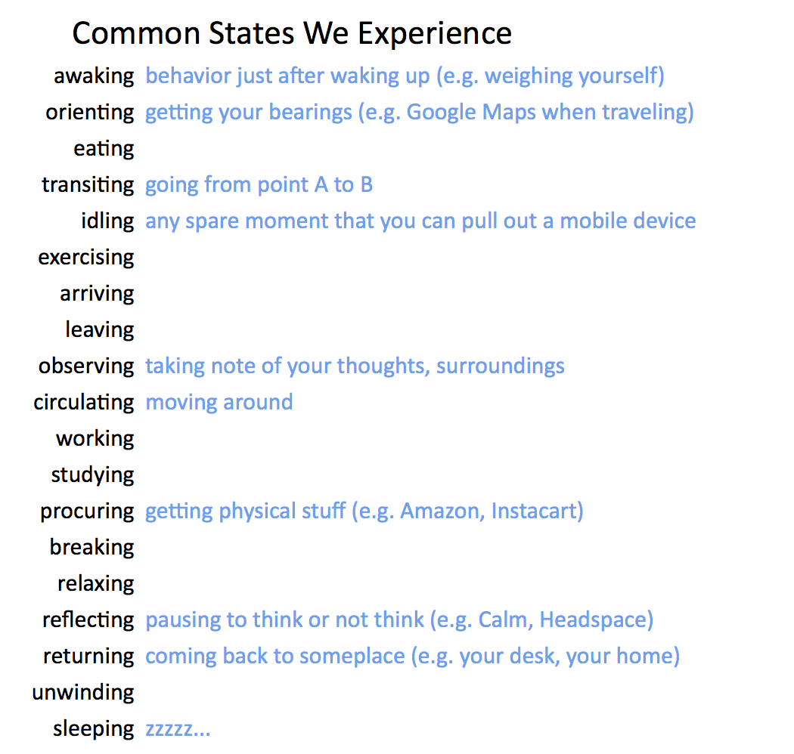

## Summary
This 2016 practitioner essay argues that a useful consumer product still needs a recurring moment in daily life when it becomes salient and easy to choose. It frames waking hours as a sequence of states and uses [[PokemonGo]], [[Uber]], exercise apps, social feeds, and [[ESPN]] to show how products can attach to movement, transportation, exercise, idling, or interruption. The resulting [[UsageMomentFit]] lens complements problem and audience selection with a concrete question: what existing routine will trigger use, and what already competes for that moment?

## Key Claims
- Mainstream consumer products must fit a recognizable state or routine within users' limited waking hours, not merely solve an abstract problem.
- Products tied to existing states can become top of mind without manufacturing every prompt: exercise can cue Strava or MapMyRun, movement can cue [[PokemonGo]], and point-to-point travel can cue [[Uber]].
- A narrow initial pain point can understate the eventual market when the product maps to a broad recurring state, as the source argues for Uber and everyday transportation.
- Mobile devices created an always-available “idling” state, but that opportunity is unusually competitive because many social and media products contest the same unpredictable spare moments.
- Notifications compete for interruption itself; the source presents [[ESPN]]'s live-sports alerts as an attempt to make being interrupted a product-owned state.
- Product planning should identify the exact moment of compelled choice before relying on beauty, problem severity, personas, notifications, or growth tactics.

## Key Quotes
> “there are only 24 hours a day!” - the essay's scarcity premise.

> “think about that specific moment in someone's routine” - the closing product-design question.

## Connections
- [[UsageMomentFit]] - captures the source's state, trigger, routine, competition, and moment-of-choice framework.
- [[AttentionEconomy]] - finite time makes product adoption a competition for recurring attention states.
- [[ProductContextAlignment]] - routine fit is a temporal counterpart to alignment among interface, logic, norms, graph, and strategy.
- [[PokemonGo]] - used as a movement-state example whose familiar franchise also supported adoption.
- [[Uber]] - used as the broad “getting from A to B” case hidden behind an initially narrow premium use case.
- [[ESPN]] - used as an attempt to own interruption through live-sports notifications.

## Contradictions
- The essay is a practitioner framework supported by selected examples, not user research or a comparative adoption study; it does not establish that owning a routine state caused the reported success of any example.
- “Owning” a state is rhetorical and can obscure multi-homing, substitution, different routines, accessibility constraints, regional variation, seasonality, and products used episodically rather than habitually.
- Pokémon's franchise strength, Uber's subsidies and marketplace execution, and ESPN's live-content rights are alternative explanations that routine fit alone does not resolve.
- The source frontmatter dates the article 2016-08-16 while the captured body displays 2016-08-10; the source page preserves the frontmatter date and records the mismatch.
- All five effective local images were opened. The state taxonomy was retained because it adds definitions and examples; two duplicate Pokémon illustrations, a small duplicate of the taxonomy, and the final reaction-bar GIF were omitted as decorative, duplicate, or interface chrome.
