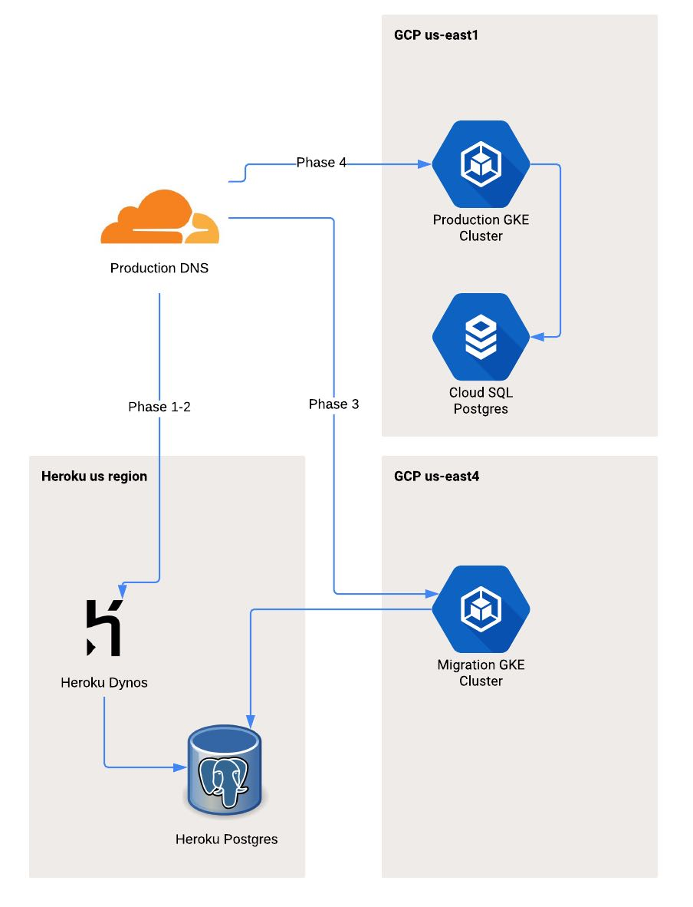
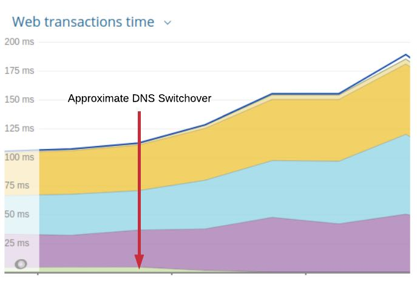

## Summary
[[RainforestQA]] describes a roughly six-month migration from [[Heroku]] to Google Cloud, with most applications moving to [[GoogleKubernetesEngine]] and PostgreSQL data moving to Cloud SQL. The first-party 2019 retrospective ties the move to database and batch-compute scale, private-network security, and workload cost, then emphasizes scope control, managed services, staged rollback, rehearsed irreversible cutovers, and simpler recovery plans over fashionable cloud-native additions.

## Key Claims
- Heroku remained operationally economical while a lean team benefited from its developer experience, but Rainforest QA outgrew its then-current database ceiling, security controls, and economics for large numbers of short-lived batch jobs.
- Kubernetes fit a heterogeneous estate of Rails, Go, Elixir, Python, and Crystal services because it preserved a container-like operating model, supplied availability and autoscaling primitives, and supported custom metrics without language-specific deployment systems.
- The 2018 evaluation favored [[GoogleKubernetesEngine]] over EKS because GKE managed both control-plane and worker-node concerns and had stronger cluster and custom-metric autoscaling at that time; these are historical comparisons, not current product guidance.
- The retained migration diagram shows a deliberate rollback boundary: production DNS first moved from Heroku dynos to a temporary us-east4 GKE cluster still using Heroku Postgres, then moved to the us-east1 production cluster only after data reached Cloud SQL.

- Close adherence to twelve-factor practices reduced application porting mostly to Dockerfiles, Helm charts, CI/CD changes, readiness endpoints, and custom queue-depth autoscaling.
- CPU limits unexpectedly throttled Rails startup and normal request handling; slow initial requests then failed liveness probes and drove pod availability to zero until the team rolled back and removed the limits.

- Heroku's lack of PostgreSQL superuser access ruled out native streaming replication. After trigger-based Teleport replication caused production locks, parallel directory-format `pg_dump` and `pg_restore`, local SSD scratch space, target tuning, scripted runbooks, and a full rehearsal reduced transfer time from days to about four hours inside a six-hour maintenance window.
- Migration safety depended on limiting simultaneous architectural change, keeping rollback available through the application phases, and using business-approved downtime plus rehearsal where the database cutover was difficult to reverse.

## Key Quotes
> "Have a Rollback Plan If You Can" - on preserving a safe return path during application migration.

> "Prepare Like Crazy If You Can't Roll Back" - on rehearsing the database cutover.

> "Simple Usually Beats Complicated" - on replacing trigger-based replication with tuned dump and restore.

## Connections
- [[RainforestQA]] - company reporting the migration and its operational lessons.
- [[Heroku]] - source platform whose constraints and twelve-factor discipline both shaped the move.
- [[Kubernetes]] - target orchestration model selected for heterogeneous services and custom autoscaling.
- [[GoogleKubernetesEngine]] - managed Kubernetes target used in temporary and final regions.
- [[PostgreSQL]] - critical state layer whose migration determined downtime and rollback risk.
- [[Terraform]] - versioned provisioning tool used for clusters, projects, permissions, and supporting infrastructure.
- [[InfrastructureAsCode]] - code review and repeatability principle applied across the new environment.
- [[ServiceHealthChecks]] - readiness and liveness behavior became central during the CPU-throttling incident.
- [[ChangeSafety]] - staged DNS cutovers, rollback boundaries, runbooks, scripts, and rehearsal bounded migration risk.
- [[CloudCostOptimization]] - cost mattered through security-tier requirements and compute-intensive workloads, not as a simple Heroku-versus-cloud price comparison.
- [[ForwardOnlyDatabaseMigration]] - related through an effectively irreversible data cutover, though this case moved entire databases rather than evolving schemas in place.

## Contradictions
- The source qualifies both pro- and anti-Kubernetes generalizations: managed GKE fit Rainforest QA's 2018 workload and staffing constraints, while the six-month project, custom autoscaling work, and CPU-limit incident show that managed orchestration did not remove configuration or migration risk.
- Product maturity, features, regional availability, limits, and prices are reported from a 2018 evaluation published in 2019 and should not be treated as current comparisons among Heroku, GKE, EKS, Azure, or Cloud SQL.
- The CPU-limit conclusion comes from one Rails-heavy environment and predates later Kubernetes and Linux CPU-throttling changes; it is useful incident evidence, not a universal rule to omit limits.
- The article is a successful first-party retrospective without independent cost, reliability, security, or performance comparison. The chart shows a material latency rise after DNS switchover but does not expose dates, traffic, series labels, or experimental controls.
