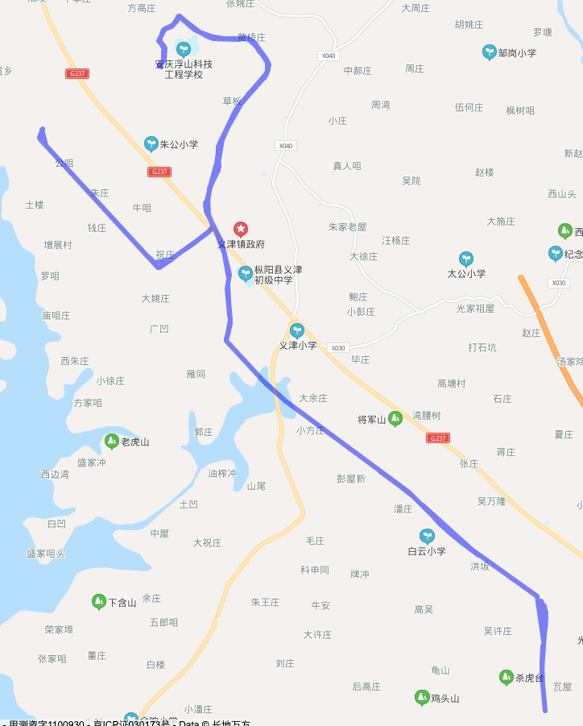
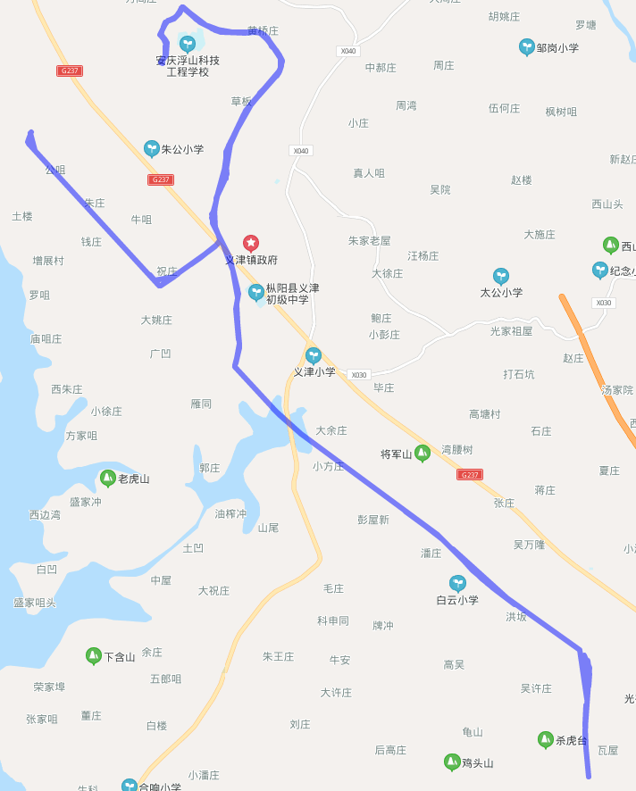
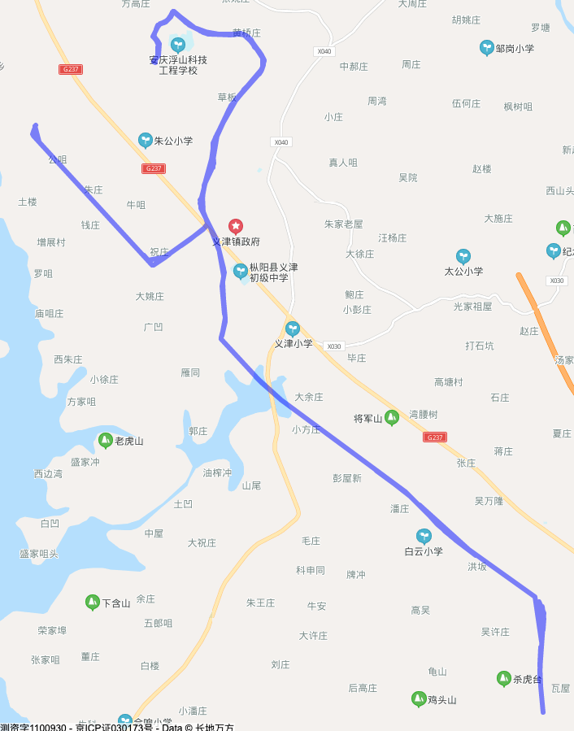

The article explains trajectory simplification as a way to reduce dense vehicle GPS traces before returning them through an API or drawing them in the browser. In the motivating example, a vehicle reporting one location every five seconds can produce around ten thousand points per day, which creates avoidable transfer, storage, and rendering cost.

Its core claim is that many trajectory points are redundant: stopped vehicles can report repeated or nearly repeated coordinates, and points that fall along the same straight segment do not all need to be retained. Simplification should preserve the route's visible shape while dropping points that do not materially change that shape.

## Ramer-Douglas-Peucker

The article presents the Ramer-Douglas-Peucker algorithm as a recursive line simplification method controlled by a tolerance value, `epsilon`.

The process is:

1. Connect the first and last points of a trajectory segment with a straight chord.
2. Find the intermediate point with the greatest distance from that chord.
3. If that distance is below `epsilon`, approximate the whole segment with the chord and discard the intermediate points.
4. If the distance is at least `epsilon`, keep that farthest point and recursively simplify the two subsegments it creates.
5. Connect the retained points to form the simplified path.

## Test Results

The test starts with 812 trajectory points and increases `epsilon` across several runs. The retained point counts fall from 676 at `0.000001`, to 569 at `0.00001`, to 250 at `0.0001`, and to 35 at `0.001`.

At the largest tested tolerance, the simplified route keeps about four percent of the original points. The article notes that some corners begin to diverge slightly, but the overall path remains smooth and close enough for the display use case, with substantial savings in transfer and storage.

