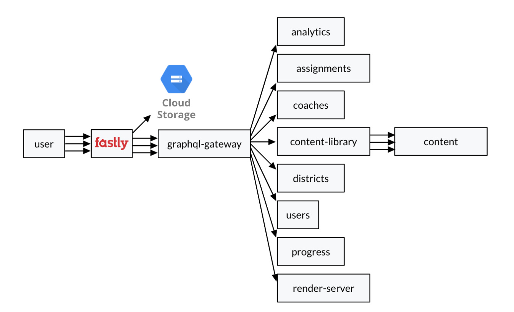
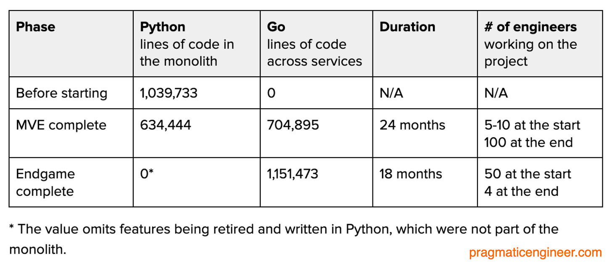
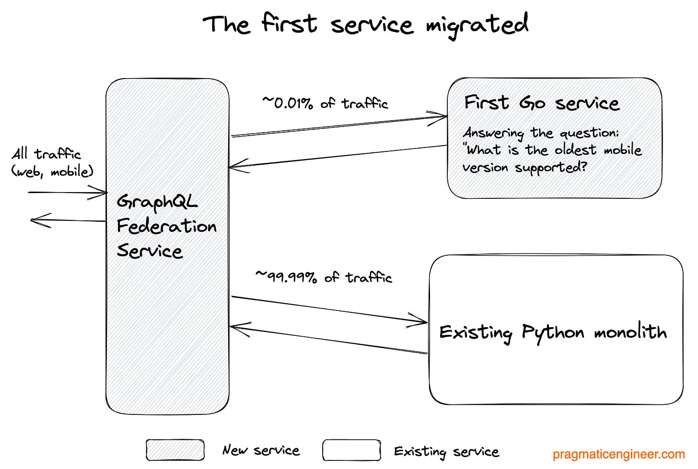
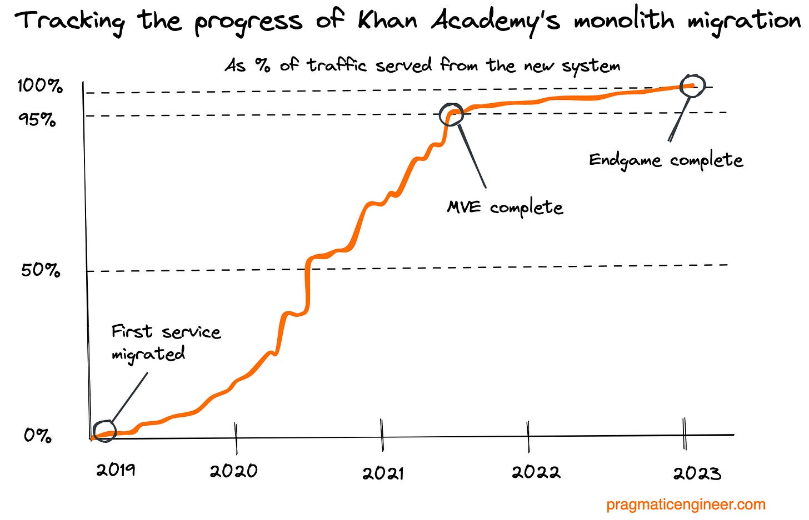

## Summary
[[GergelyOrosz]] reconstructs [[KhanAcademy]]'s 3.5-year migration of roughly one million lines of Python 2 into more than 40 mostly Go services, drawing on company posts and interviews with [[BrianGenisio]] and [[KevinDangoor]]. The case combines a hard end-of-life trigger, [[MinimumViableExperience]] scoping, federated [[GraphQL]], field-level [[IncrementalMonolithMigration]], behavioral parity testing, explicit data ownership, and a fixed deadline. It presents the migration as technically successful but organizationally exhausting, and leaves the language-switch economics unresolved.

## Key Claims
- Python 2's end of life made delay unacceptable, while performance pressure and the existing move from REST to GraphQL expanded the program into a full monolith-to-services rewrite.
- The June 2019-to-January 2023 program moved about one million Python lines into more than 40 mostly Go services with participation from roughly 100 engineers at peak.
- The target architecture placed a federated GraphQL gateway between edge routing and domain services, allowing one query plan to compose results from several backends.

- [[MinimumViableExperience]] defined the identity-preserving behavior required for the first phase. After 24 months, 32 services handled about 95% of traffic; the lower-staffed endgame took another 18 months and brought the total above 40 services.

- Migration occurred field by field rather than service by service. The first Go service answered one mobile-version field and received only about 0.01% of traffic while the Python monolith continued serving nearly everything else.

- The rollout sequence progressed from optional shadowing, to side-by-side response comparison, to canary responses where dual execution was unsafe, to Go-only routing with Python retained for fallback, and finally Python removal.
- Behavioral parity was the main safety contract: the team usually ported existing behavior, including bugs, and used production request comparisons to reveal differences that unit-test translation could not cover.
- Exactly one service could write each piece of data; other services had to call the owner, making change provenance and boundary responsibility explicit.
- Incremental shipping made progress observable as the new system's traffic share climbed from near zero to 95% at MVE completion and then to 100% at endgame.

- Fixed scope, a fixed deadline, a visible burndown, borderless movement of engineers, and dependency-aware mini-deadlines matched a known migration problem better than open-ended product discovery.
- Go delivered much faster execution and, for some request types, reportedly up to tenfold lower service-hour cost than Python, but the source does not calculate whether that saving repaid the learning and migration cost of changing languages.
- Services did not remove system-wide coupling: shared Redis load, cache-expiry thundering herds, cross-service workflows, and the prolonged opportunity cost to product and design still required ecosystem-level management.

## Key Quotes
> "We knew a 'big bang' rewrite would be fraught with pain" - Brian Genisio on choosing field-level migration.

> "only one service would 'own' a piece of data" - the article's description of the write-ownership rule.

## Connections
- [[KhanAcademy]] - organization and production system that completed the migration.
- [[GergelyOrosz]] - author who assembled the case from engineering posts and interviews.
- [[BrianGenisio]] - engineer and manager who led the endgame and explained rollout and planning choices.
- [[KevinDangoor]] - former principal software architect who helped shape and document the migration.
- [[IncrementalMonolithMigration]] - field-level shadow, compare, canary, cutover, fallback, and removal sequence used by the program.
- [[MinimumViableExperience]] - first-phase scope based on the behavior essential to Khan Academy's identity.
- [[GraphQL]] - federation layer that composed monolith and service fields during coexistence.
- [[MicroserviceDataBoundaries]] - one-writer ownership rule used to control distributed data changes.
- [[MicroserviceOperationalOverhead]] - the shared-resource, workflow, and coordination costs that remained after decomposition.

## Contradictions
- No direct contradiction was found. The case qualifies both pro- and anti-microservice material by showing that service decomposition can succeed with extensive migration infrastructure, staffing, and discipline while still creating distributed-system and organizational costs.
- The article reports strong runtime and cloud-cost gains from Go but explicitly leaves the total payback period unknown after training roughly 100 engineers and absorbing language-learning mistakes.
- The phase table shows 634,444 Python lines remaining at MVE completion despite about 95% of traffic having moved, demonstrating that traffic share is not a reliable proxy for remaining code or tooling work.
- The traffic chart is described as a rough reconstruction from interviews, not an instrumented time series; its curve should be read directionally.
- The account is a second-party practitioner case study based largely on interviews and Khan Academy's own engineering posts, with no independent reliability, delivery-rate, attrition, or total-cost comparison.

## Image Notes
All five effective local images were opened. Four evidence-bearing diagrams and charts were retained under descriptive canonical filenames with matching manifest entries. A recruiting-marketplace screenshot was omitted as unrelated promotional material.
