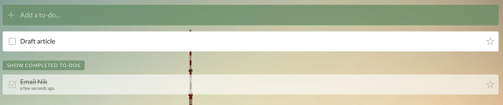

## Summary
[[TonyStubblebine]] proposes [[InterstitialJournaling]] as a transition ritual for knowledge work: whenever one project ends and another begins, record the time, reflect in full sentences on the work just completed, and identify how to begin and approach the next project. The method combines journaling, action decomposition, and attention management to externalize residue from the previous task, make the next move easier to start, and expose mood, scope, or skill problems that might otherwise become procrastination. It is presented as a practitioner-developed workflow rather than a measured intervention, and it replaces only the day's active working list, not a long-term backlog.

## Key Claims
- A minimum interstitial entry records the time, what was just completed and remains mentally active, the literal first action for the next project, and a strategy suited to the available time and context.
- Writing at project boundaries can provide a stable pivot ritual when the projects themselves are too varied to make switching habitual.
- Reflecting on the previous task is intended to externalize unfinished thoughts and reduce the attention residue carried into the next task.
- Reframing David Allen's “Next Action” as “First Action” can make a vague project easier to start by shrinking it to a literal move such as opening a program, although some people find such tiny actions demotivatingly trivial.
- Brief strategy reflection can surface scope limits, delegation opportunities, and easier routes before habitual action consumes the available time.
- Journaling during the work itself can make distraction visible, turn noticing procrastination into a recovery cue, and reveal mood or skill barriers that need a conscious response.
- The journal can replace a daily working to-do list while coexisting with a long-term backlog or a small capture list for tasks that arise during the day.

## Key Quotes
> “During your day, journal every time you transition from one work project to another.” — the core operating cadence.

> “What is the first action of the project I’m about to start?” — the prompt used to lower starting friction.

## Connections
- [[TonyStubblebine]] — author and productivity coach who describes and tested the method with his coaching group.
- [[InterstitialJournaling]] — the source's central transition-based work practice.
- [[JournalingPractice]] — extends reflective writing into project switching, action selection, and in-the-moment recovery from distraction.
- [[AttentionManagement]] — uses written closure and deliberate reorientation to protect focus across task boundaries.
- [[PersonalProductivity]] — proposes a journal as the day's execution surface rather than a checkbox list alone.
- [[WorkBreaks]] — adapts the Pomodoro interval by using the gap for reflection instead of treating it only as leisure or recovery.

## Contradictions
- The article cites a 40% or greater cognitive-performance cost for partial attention without preserving the underlying study details in the saved source, so that number should not be treated as independently verified here.
- The author reports coaching-group reactions and personal examples rather than comparative outcome data; claims that the method “kills” procrastination or optimizes strategy are stronger than the evidence supplied.
- The “First Action” wording is not universally helpful: some testers preferred a more meaningful next action because extremely small steps felt boring.
