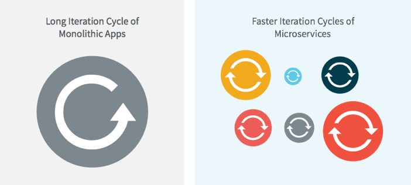

## Summary
[[RichardLi]] presents microservices as an architecture for distributing cloud-application development across teams that can release independently, rather than merely splitting a monolith into smaller programs. The article links that autonomy to faster iteration, organizational scaling, technology and compliance choices, targeted compute scaling, and onboarding, while making team autonomy, automated delivery, resilient communication, and cross-service tracing prerequisites rather than optional add-ons. It also gives a clear adoption gate: small engineering organizations that cannot iterate on multiple features independently should generally begin with a monolith.

## Key Claims
- The useful microservice boundary is an independently shippable unit owned by a team; separate code alone does not supply the delivery benefit.
- Independent release cycles can shorten response time to customer and market feedback by removing a shared monolithic release train.
- Smaller service boundaries can isolate code changes, let teams choose fit-for-purpose technology and process, narrow compliance scope, scale bottlenecks selectively, and reduce onboarding surface area.
- Microservices redistribute decisions about ship dates, quality assurance, and technology toward teams, which requires skills, mentoring, revised responsibilities, and delivery and recovery metrics.
- Hundreds of independently changing service instances make automated build, packaging, deployment, and elastic scaling core infrastructure requirements.
- Networked service calls require common protocols, loose coupling, tracing, load balancing, circuit breaking, and recovery mechanisms so one unavailable service does not collapse the whole application.
- Small teams should prefer a monolith-first path when they lack the capacity to develop and operate several features independently.

## Key Quotes
> “each microservice can be released independently” — on the claimed source of delivery agility.

> “microservices is not a fit for everyone” — on the article's adoption boundary.

## Connections
- [[RichardLi]] — author framing microservices for engineering executives.
- [[Datawire]] — company Li led while writing about open-source microservice infrastructure and tools.
- [[ServiceAutonomy]] — independent ownership and shipping are the central boundary and benefit in the article.
- [[MicroservicePlatformEngineering]] — automated delivery, elastic scaling, protocols, tracing, isolation, and recovery make a service network operable.
- [[ContinuousDelivery]] — the code-to-customer automation described is the release mechanism behind independent iteration.
- [[SystemReliability]] — service-level failure containment and recovery become application-level responsibilities.
- [[DistributedSystemRestraint]] — the monolith-first recommendation makes organizational capacity an adoption gate.

## Contradictions
- The article qualifies universal microservice advocacy by recommending monolith-first development for small teams without parallel delivery capacity.
- Its executive benefits are a 2016 practitioner argument supported by named examples and diagrams, not comparative measurements of deployment speed, cost, incidents, onboarding, retention, or hiring.
- The forecast that adoption effort would continue to fall is time-bound, and the synchronous-HTTP analogy compresses important differences among dependency structure, timeouts, retries, fallbacks, and graceful degradation.
