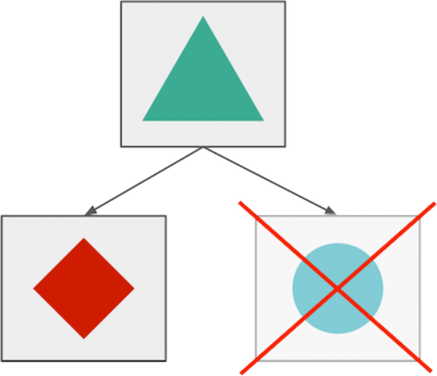

## Summary
[[RisingStack]] presents microservice reliability as deliberate containment of partial failure rather than prevention of every outage. Because network calls, independent deployment, and cross-team dependencies increase failure modes, the article combines staged and reversible change, health-aware routing, cautious self-healing, stale-on-error caching, bounded idempotent retries, priority-aware load shedding, resource bulkheads, circuit breakers, and recurring failure tests into [[MicroserviceFailureContainment]].

The article is a broad 2017 practitioner catalogue rather than measured comparative evidence. Its strongest durable contribution is the interaction among controls: each mechanism should bound blast radius and preserve critical work without producing a new retry storm, restart loop, stale-data error, or shared-resource collapse.

## Key Claims
- Microservice boundaries can support graceful degradation only when dependencies and resources are explicitly isolated; separate deployment alone does not prevent cascading failure.

- Change risk should be constrained through gradual rollout, metric-based monitoring, automatic or prompt rollback, blue-green activation, and routing away from unhealthy instances.
- Health checks and self-healing must distinguish an instance that should restart from one that is overloaded or blocked by a dependency, or automation can deepen an incident.
- Failover caches can preserve read service with stale data when stale is preferable to unavailable, using a normal freshness period and a longer failure-serving period such as HTTP `stale-if-error`.
- Retries need hard limits, exponential backoff, and idempotency keys because layered retries can amplify load and duplicate side effects.
- Rate limits, concurrent-request limits, and fleet-wide load shedding reserve capacity for critical transactions and help an overloaded system recover.
- Bulkheads isolate finite resource pools, while circuit breakers stop repeated calls after qualifying failures and cautiously probe recovery through a half-open state.
- Repeated failure injection, from terminating instances to simulating regional loss, tests whether resilience mechanisms and teams work before an uncontrolled incident.

## Key Quotes
> “Reverting code is not a bad thing.” — on restoring service before diagnosing a bad production change in place.

> “outdated data [is] better than nothing” — the condition under which the article recommends failover caching.

## Connections
- [[RisingStack]] - authoring company presenting a Node.js-informed practitioner reliability guide.
- [[MicroserviceFailureContainment]] - joins degradation, isolation, overload control, bounded retries, and recovery testing into one service-level reliability strategy.
- [[SystemReliability]] - broader discipline encompassing safe change, capacity protection, failure recovery, and operational learning.
- [[ServiceHealthChecks]] - routing and restart decisions depend on correctly interpreted instance health.
- [[DependencyDegradation]] - unavailable dependencies should remove only the capabilities that require them where possible.
- [[DatabaseOverloadProtection]] - retry amplification, admission control, workload priority, and load shedding also apply at database boundaries.
- [[ChaosEngineering]] - controlled instance and region failures are used to verify survival and incident readiness.
- [[ChangeSafety]] - rolling and blue-green deployments, monitoring, and rollback constrain change-induced outages.

## Contradictions
- The article first says services should fail fast and warns that waiting for timeouts is harmful, but later calls fine-grained static timeouts an anti-pattern while acknowledging that timeouts prevent hanging operations. The durable reading is not “no timeouts”: use bounded deadlines as a backstop, and do not treat one finely tuned static threshold as a substitute for adaptive failure controls.
- The cited claim that roughly 70% of outages arise from live-system changes is attributed to Google without a linked primary study or defined sample, so it should not be generalized as a current universal rate.
- The recommendations are a 2017 RisingStack practitioner synthesis with no before-and-after availability, latency, recovery-time, or cost measurements. Thresholds, error classifications, cache staleness, retry safety, restart policy, and traffic priority remain workload-specific.
