## Summary
[[RobinMarx]] distinguishes application-, transport-, stream-, and record-level [[HeadOfLineBlocking]] across [[HTTP11]], [[HTTP2]], [[HTTP3]], TCP, [[QUIC]], and TLS. The article and its inspected diagrams show how HTTP/2 framing enables HTTP-layer multiplexing while TCP still imposes one ordered byte stream, and how QUIC moves stream identity into transport so loss blocks only affected streams. Its main qualification is that this narrower blocking domain does not automatically improve page loads: useful gains require concurrent streams, favorable packet scheduling and loss patterns, and resources whose early partial delivery is valuable.

## Key Claims
- [[HTTP11]] serializes complete responses on a connection because its headers and payloads do not carry chunk-level resource identity; browsers compensate with several parallel TCP connections.

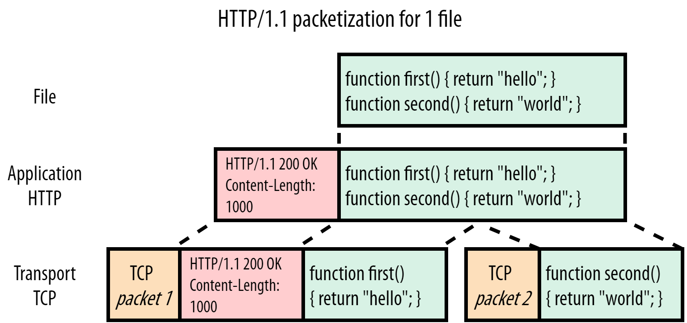

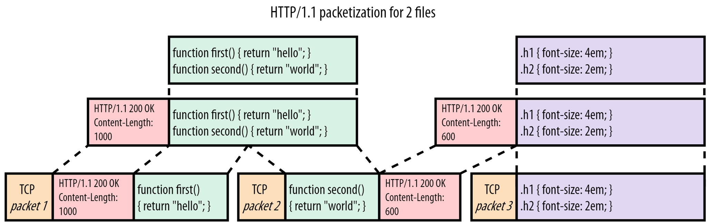

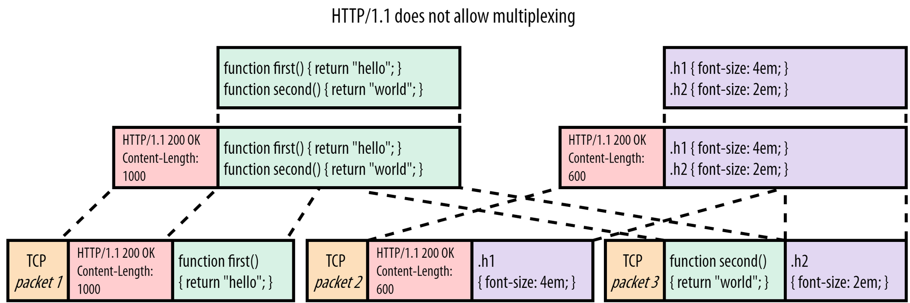

- [[HTTP2]] DATA frames add stream IDs and lengths so resource chunks can be multiplexed, but all frames still occupy TCP's single ordered byte stream.

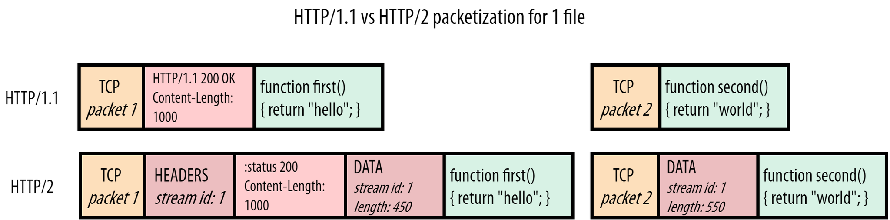

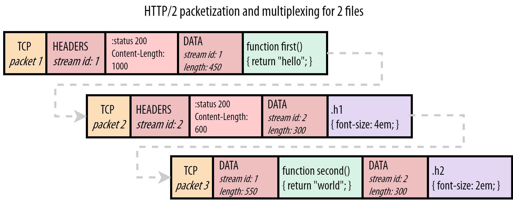

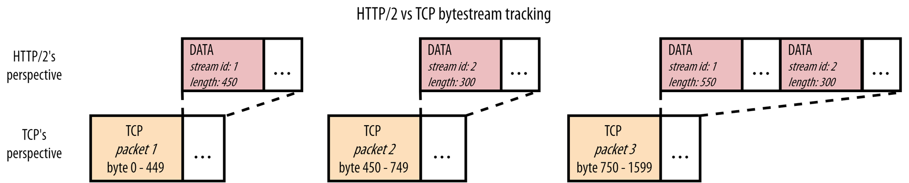

- [[HTTP3]] uses QUIC over UDP, integrating TLS and moving stream identity into transport rather than duplicating HTTP/2's stream layer.

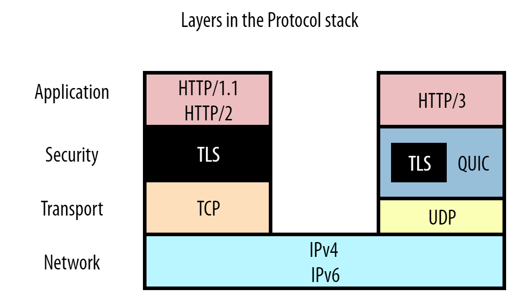

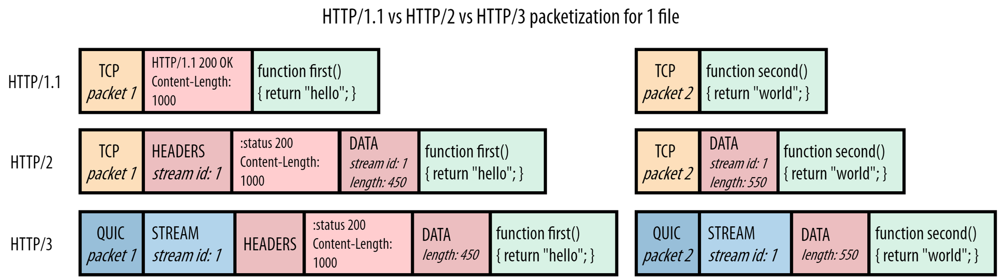

- QUIC tracks byte ranges per stream, so a lost packet blocks only streams with a byte gap; ordered delivery and [[HeadOfLineBlocking]] remain inside each affected stream.

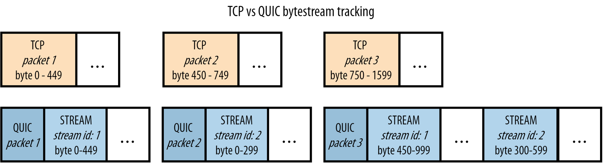

- QUIC's cross-stream benefit depends on how resources are scheduled and where burst loss lands; loss can still block every active stream when packets from those streams are affected.

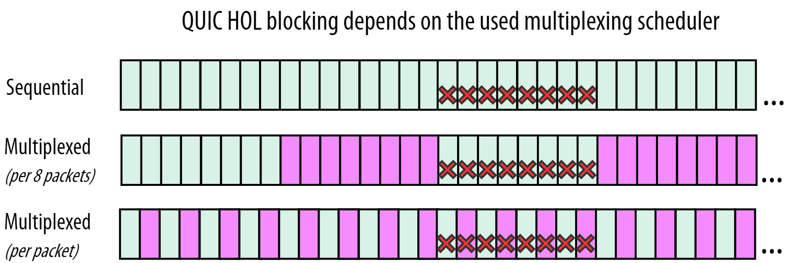

- HTTP/1.1 pipelining saves request round trips but cannot reorder or interleave responses, so a slow earlier response still blocks later ones.

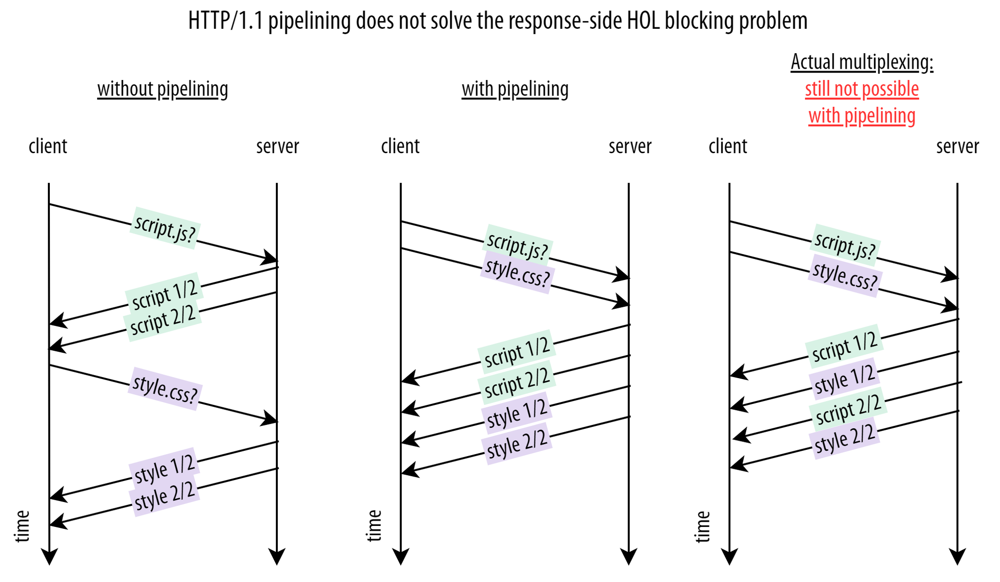

- Sequential delivery is often preferable for render-blocking JavaScript, CSS, and fonts, while multiplexing remains useful for progressive resources, small files beside large ones, cache-miss overlap, server push, and early hints.
- QUIC retains connection-wide congestion control and uses per-packet encryption; these shared-control and CPU costs limit the claim that removing TCP-level blocking alone makes it faster.

## Key Quotes
> "When a single (slow) object prevents other/following objects from making progress" - the article's general definition of head-of-line blocking.

> "QUIC retains ordering within a single resource stream but no longer across individual streams." - the boundary of QUIC's transport-layer improvement.

## Connections
- [[RobinMarx]] - protocol researcher and author of the article.
- [[HeadOfLineBlocking]] - the article distinguishes response serialization, TCP byte-stream blocking, QUIC intra-stream blocking, and TLS record blocking.
- [[HTTP11]] - cannot multiplex response chunks and uses parallel connections as a workaround.
- [[HTTP2]] - adds stream-aware framing but inherits TCP's cross-stream ordering constraint.
- [[HTTP3]] - reuses QUIC streams and replaces HTTP/2 mechanisms that depended on total cross-stream order.
- [[QUIC]] - provides reliable independent streams, integrated TLS, per-packet encryption, and connection-wide congestion control above UDP.

## Contradictions
- The article qualifies broad claims that QUIC or HTTP/3 simply “solves” head-of-line blocking: ordering remains within each stream, and cross-stream benefit requires useful concurrency plus favorable scheduling and loss placement.
- It also qualifies blanket recommendations for multiplexing. Round-robin interleaving can delay completion of render-blocking resources even while it protects unrelated streams from some packet loss.
- The source is a 2020 protocol-researcher explanation, not a controlled browser benchmark. Its loss-rate examples and implementation observations are contextual rather than current representative measurements.
- All 12 local images were opened. Eleven evidence-bearing packet, stack, scheduling, and sequence diagrams were retained at their semantic positions; the author portrait was omitted as decorative.
