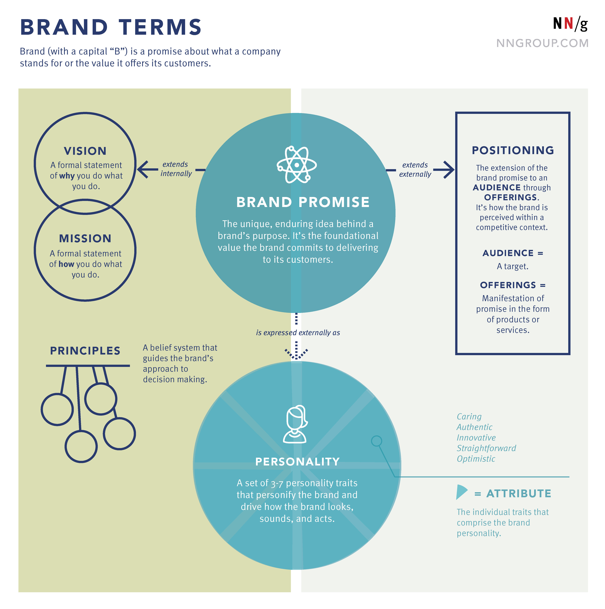
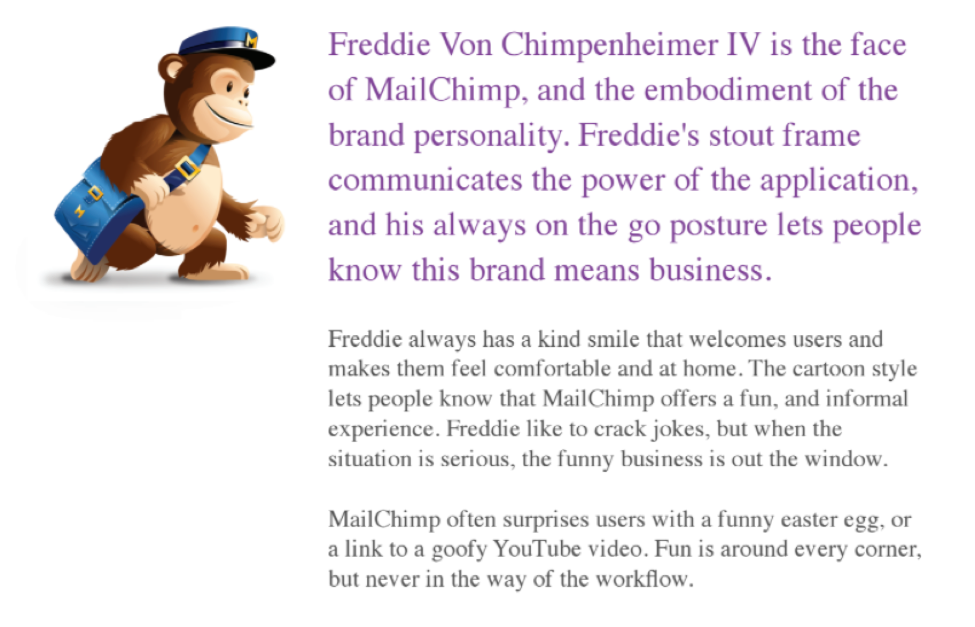
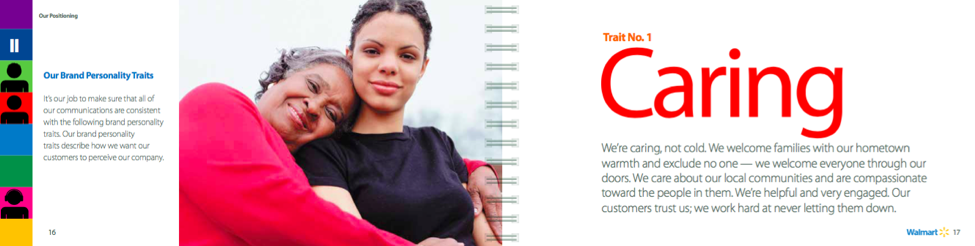
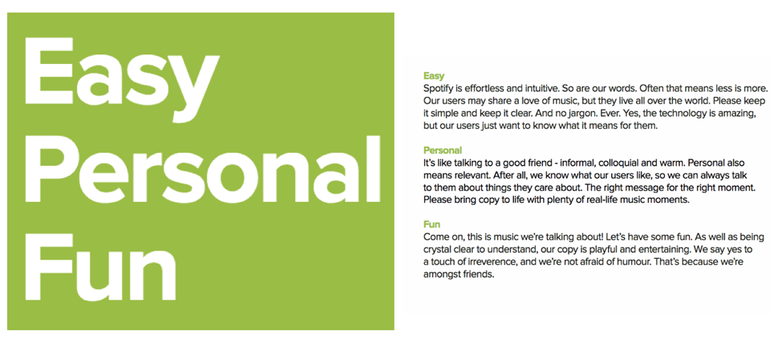
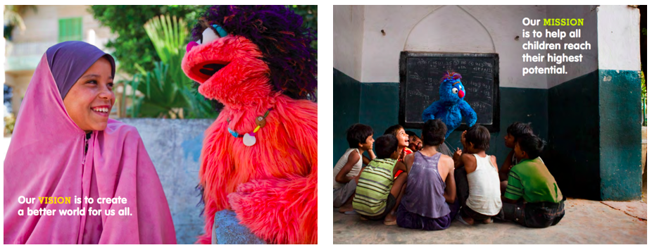
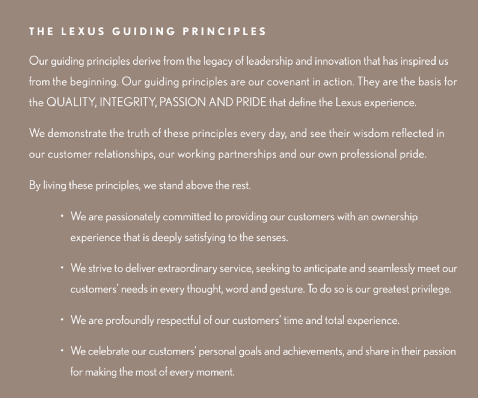

## Summary
[[SarahGibbons]] and [[KateKaplan]] define a six-part [[BrandFramework]] for translating an organization's intended meaning into consistent user experience: promise, personality, attributes, vision, mission, and principles. The framework distinguishes brand—the enduring customer promise—from branding—the controlled visual and communicative manifestation—and assigns each component a decision role from strategic direction through interaction details. The article is a [[NielsenNormanGroup]] practitioner taxonomy illustrated by selected companies rather than comparative evidence that adopting the vocabulary improves customer outcomes.

## Key Claims
- A Brand is the promise of what a company stands for or offers customers; branding is the controlled manifestation of that identity through logos, communications, packaging, and other expressions.
- The brand promise is the unique, enduring purpose and customer value that should drive internal vision, mission, and principles as well as external personality, positioning, offerings, and audience choices.
- Brand personality personifies the organization through a coherent set of traits; brand attributes are the three to seven individually defined traits that make that personality usable as an interaction-design test.
- Vision describes the ideal world the company seeks and answers why it acts, while mission describes how it intends to advance that vision.
- Brand principles turn mission and vision into decision criteria and cultural expectations, especially when teams must choose among plausible tradeoffs.
- UX teams can use the framework at different scales: promise checks the total omnichannel experience, personality and attributes guide interactions, visuals, and copy, mission and vision guide roadmaps, and principles arbitrate everyday choices.
- Shared definitions matter because ambiguous or incompatible brand terms allow compartmentalized teams to produce a fractured customer experience.

## Key Quotes
> "Brand is a promise about what a company stands for" - the article's distinction between enduring meaning and its controlled expression.

> "Think about principles as metaphorical bumpers" - on using principles to keep routine decisions aligned with the brand promise.

## Connections
- [[SarahGibbons]] - coauthor defining the framework in a UX context.
- [[KateKaplan]] - coauthor defining the framework in a UX context.
- [[NielsenNormanGroup]] - publisher and practitioner-research context for the article.
- [[BrandFramework]] - the six-component vocabulary and relationship model synthesized from the source.
- [[BrandPositioning]] - shown as an external extension of the brand promise to an audience through offerings in a competitive context.
- [[StartupBrandStrategy]] - gains a decision hierarchy connecting durable promise to tactical product and communication choices.
- [[Mailchimp]] - personality example in which Freddie embodies friendliness, confidence, humor, and situational restraint.
- [[Walmart]] - attribute example defining “caring” as concrete interaction behavior.
- [[Spotify]] - attribute example defining product and communication behavior as easy, personal, and fun.

## Contradictions
- No direct contradiction found. The framework complements the wiki's operating view of brand, but its terminology does not map perfectly onto [[BrandPyramid]]: this article treats attributes as personality traits, while the pyramid source uses attributes for product capabilities at its base.
- The distinction between vision as why and mission as how is a chosen convention rather than a universal standard; organizations and other frameworks may reverse or blend those labels.
- The examples are curated excerpts from successful brands and do not show that the stated traits caused coherent UX, customer preference, or business performance.
- A shared vocabulary can improve internal consistency, but rigid application can suppress context, accessibility, local market needs, or evidence that the underlying promise should change.
