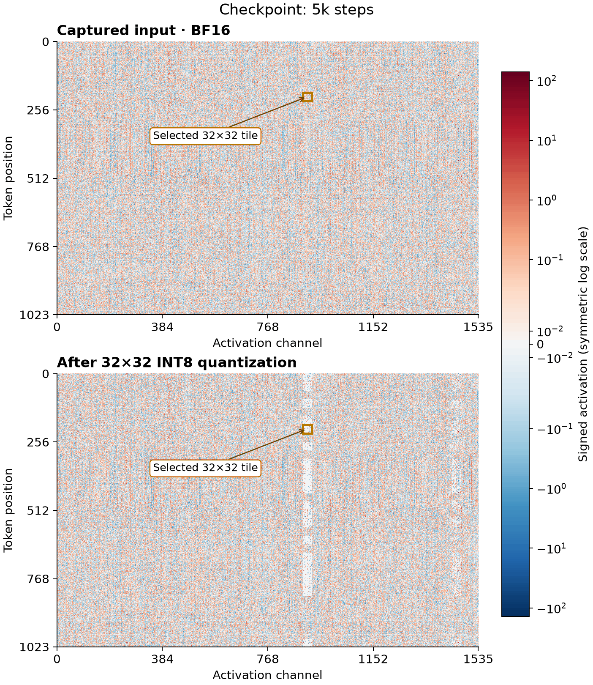
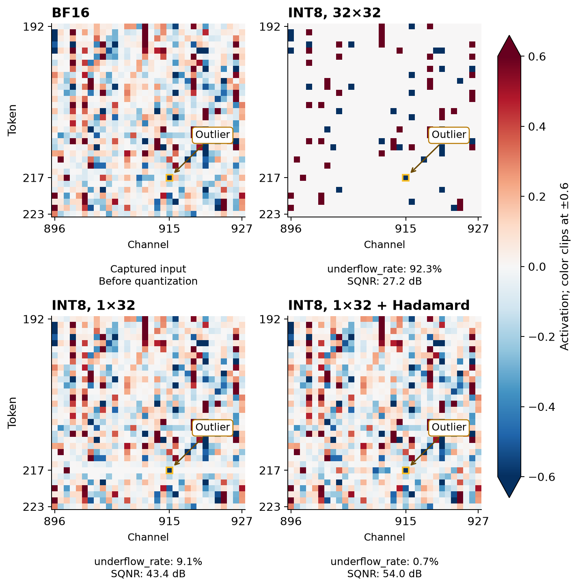
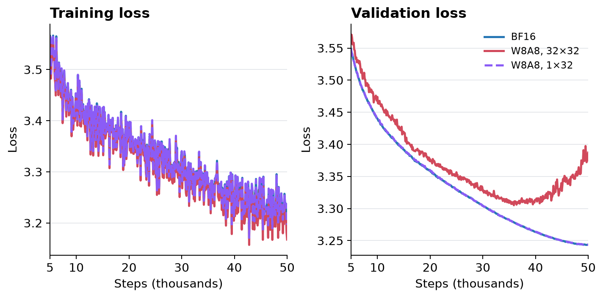

## Summary
This practitioner report diagnoses an INT8 [[QuantizationAwareTraining]] run in which training loss continued falling while BF16 validation loss stopped converging. A large activation outlier set the shared scale for each 32-token by 32-channel [[BlockQuantization|quantization block]], rounding many smaller nonzero activations to zero and leaving structured pale bands or “scars”; changing activation scaling to 1 by 32 made the reported rerun track the BF16 validation curve. An offline Hadamard rotation further improved one selected tile's measured signal quality, but the author did not train a model with that intervention.

## Key Claims
- Shared-scale granularity controls how far one outlier's quantization damage spreads: a 32 by 32 scale couples 1,024 values across tokens and channels, whereas a 1 by 32 scale limits the affected neighborhood.
- Structured activation underflow can remain visible across training checkpoints even while aggregate training loss falls, so training loss alone can hide quantization-induced generalization failure.
- In the selected 10,000-step tile, 32 by 32 INT8 produced 92.3% underflow and 27.2 dB SQNR, 1 by 32 produced 9.1% and 43.4 dB, and offline Hadamard rotation plus 1 by 32 produced 0.7% and 54.0 dB.
- Retraining with 1 by 32 activation scales while leaving weight quantization unchanged made the reported validation loss converge nearly on top of BF16 through 50,000 steps.
- Larger models may still contain channel outliers that damage neighboring features under vector-wise scaling, making transforms or other outlier-aware methods possible next steps rather than demonstrated training results here.
- Scale sharing across tokens in quantized attention can create a causal information leak even when the attention operation itself is masked; the article cites this external result but does not reproduce it.

The fixed-scale animation compares the same `mlp.down_proj` activation for one sequence from 5,000 through 50,000 steps. Some pale vertical bands in the dequantized panel fade or shift, while a band near the high-numbered channels remains visible at the final checkpoint, showing that the distortion is structured and evolves with the model rather than appearing as uniform noise.

The selected tile isolates the mechanism: one marked outlier leaves most of the 32 by 32 result white, while narrower scaling recovers much of the signed activation pattern. The displayed underflow rate counts nonzero inputs rounded to zero before any inverse Hadamard rotation, and the color range clips at ±0.6, so the panels illustrate local behavior rather than the full tensor distribution.

The three training-loss curves decline together, but the 32 by 32 run's BF16 validation loss bottoms near step 37,000 and then rises, while 1 by 32 remains nearly coincident with BF16. Because validation disables quantization, this comparison indicates a learned-model quality gap rather than only inference-time rounding error.

## Key Quotes
> “Outliers were causing smaller activations sharing their scale to round to zero.” — the proposed mechanism behind the activation scars.

## Connections
- [[QuantizationAwareTraining]] — the failure occurs while the model is trained under simulated low-precision activation and weight behavior.
- [[BlockQuantization]] — the 32 by 32 versus 1 by 32 comparison shows how shared-scale boundaries determine outlier blast radius.
- [[NeuralNetworkTraining]] — falling training loss did not imply validation convergence under the distorted activation distribution.
- [[NeuralNetwork]] — transient activations, rather than only stored weights, are the quantities whose low-precision representation caused the reported failure.
- [[AttentionMechanism]] — token-shared scales create a separate causal-leakage risk in attention, according to the external MatX result cited by the article.
- [[DeepLearningScaling]] — the author warns that feature outliers may make 1D scaling insufficient as model size increases, but does not test that forecast here.

## Contradictions
- The article demonstrates one run and one selected activation tile without giving model size, dataset, seeds, error bars, a full activation distribution, or an ablation that isolates every training difference; its numerical results should not be generalized into universal thresholds.
- Hadamard rotation is evaluated offline on one tile after inverse rotation, not in an end-to-end training run, so its measured SQNR and underflow improvement do not establish convergence, accuracy, throughput, or stability benefits.
- The attention-leakage and larger-model observations come from cited external work rather than this experiment and are recorded as transfer hypotheses, not reproduced findings.
