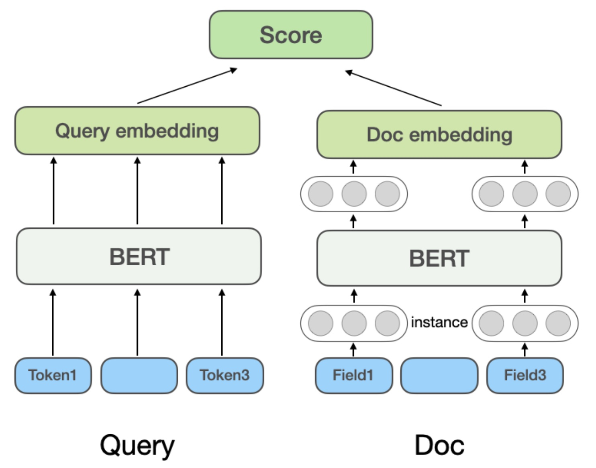
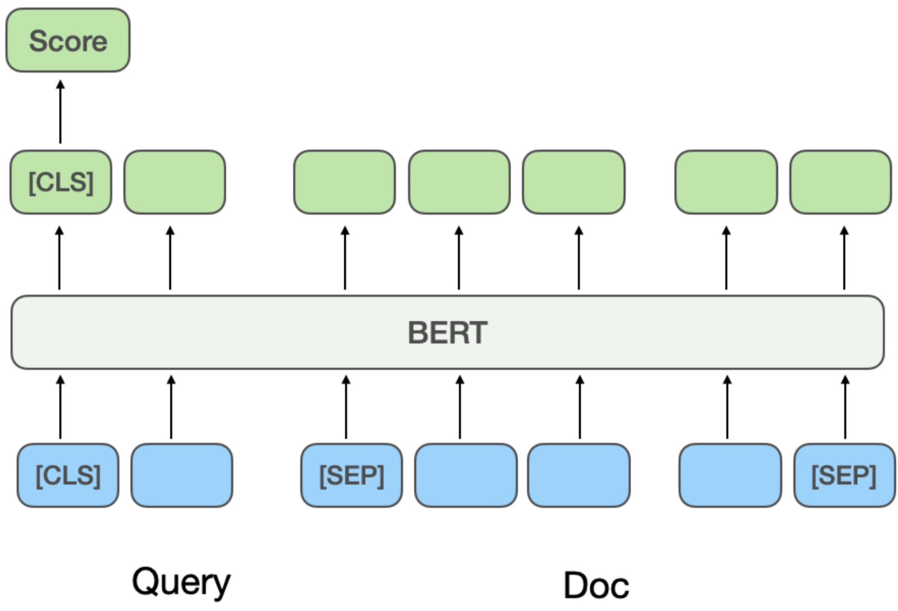
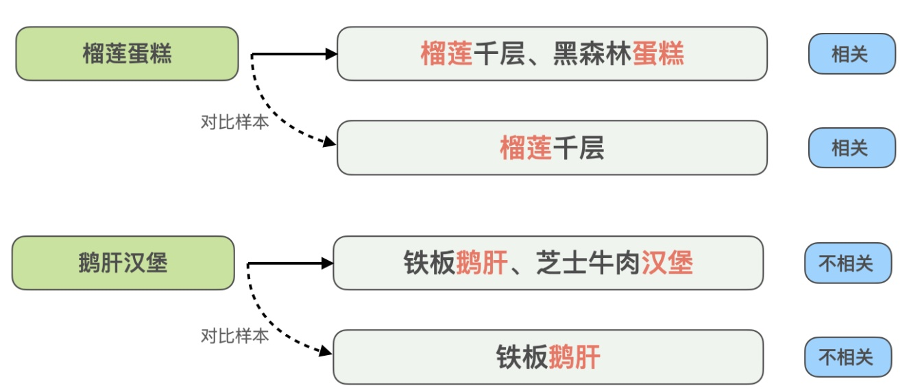
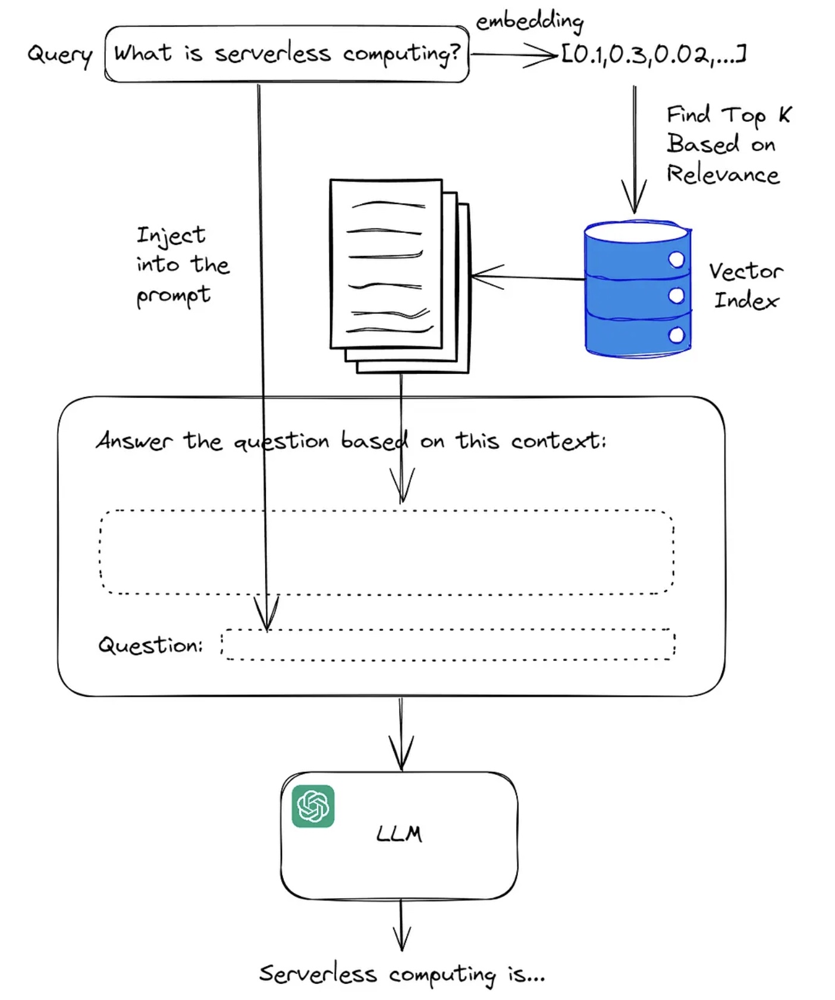
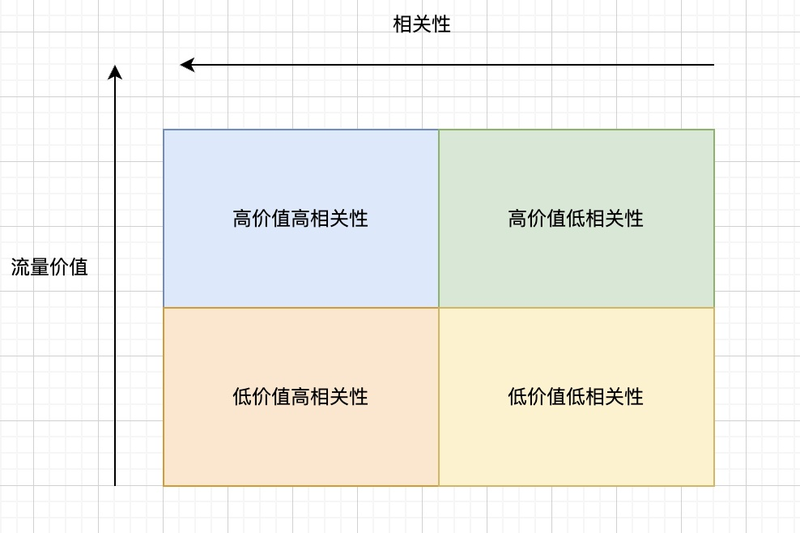

## Summary
The article separates [[SearchRelevance]] into estimating query-document fit and using that estimate inside an online ranking mechanism. It traces modeling from lexical matching through [[NeuralSemanticMatching]], describes a two-stage training strategy that combines noisy behavioral data with selectively annotated hard examples, and uses [[RetrievalAugmentedGeneration]] as one way to enrich query features. For advertising, it formulates [[RelevanceConstrainedRanking]] as value maximization under a mean-relevance target, then compares an ideal global shadow price with PID-like control and value-aware traffic segmentation.

## Key Claims
- Search differs from feed recommendation because a user-issued query creates a strong intent contract: irrelevant results can invalidate the session even if they would otherwise attract engagement.
- Relevance should be measured with both behavior signals such as clicks, query changes, and retention and human judgments based on an application-specific rubric; neither is a stable universal ground truth.
- Lexical methods such as TF-IDF and BM25 are efficient but weak on synonymy and polysemy, while neural models trade serving efficiency against fine-grained interaction.

- Representation-based models encode queries and documents separately, allowing document embeddings to be cached, but compress interaction into a final similarity score.

- Interaction-based models jointly encode query and document tokens, improving fine-grained matching at substantially greater online compute and latency cost.
- A practical training pipeline can pretrain on abundant but noisy click-derived pairs, then fine-tune on human labels concentrated through disagreement, uncertainty, and hard-example mining.

- Contrastive augmentation is useful when lexical overlap is misleading: carefully paired examples force the model to learn which matched terms actually determine relevance.
- LLM-generated query summaries can become extra relevance features, with RAG supplying retrieved context before generation.

- In search advertising, a relevance threshold can remove unacceptable candidates, while a relevance term in the ranking score can pace an aggregate target against eCPM.
- Lagrangian relaxation yields a per-request linear value-plus-relevance score whose relevance coefficient is the shadow price of the global constraint; replay and binary search can estimate it only under strong traffic-stability and counterfactual assumptions.
- A controller that observes only mean relevance may sacrifice valuable inventory at the wrong time, motivating value-aware adjustment across traffic quadrants.

- The proposed quadrant policy spends less relevance weight on high-value/high-relevance traffic and more on low-value/low-relevance traffic, but it works only if relevance lost in valuable traffic can be recovered elsewhere and if the marginal relevance cost differs by value tier.

## Key Quotes
> "directly using click samples for relevance judgment has significant noise" - the article's warning that behavioral labels confound relevance with position and other exposure effects.

> "actual control needs to ensure overall target is achievable" - the operating boundary on value-aware coefficient perturbations.

## Connections
- [[SearchRelevance]] - central distinction between estimating query-document fit and protecting the search intent contract.
- [[NeuralSemanticMatching]] - representation-based and interaction-based architectures for learned relevance scoring.
- [[RelevanceConstrainedRanking]] - mechanism for balancing aggregate relevance with advertising value.
- [[TFIDFRanking]] - lexical baseline in the source's relevance-model evolution.
- [[SemanticSearch]] - embedding similarity is the core signal in the representation-based model family.
- [[RetrievalAugmentedGeneration]] - retrieved context can enrich an LLM-generated query representation or summary.
- [[MixedRankingGovernance]] - adjacent problem of coordinating local ranking choices under platform-wide constraints and controller coupling.
- [[ScoreShading]] - related use of adaptive score coefficients to satisfy aggregate objectives.

## Contradictions
- The source first treats relevance as largely independent of position and context, but later anticipates personalized relevance based on history and real-time preferences. The latter would make relevance conditional on user context even if it remains independent of result position.
- The theoretical derivation calls for one global shadow price under full-information assumptions, while the operational proposal deliberately varies the exchange ratio by value/relevance tier. The article presents this as an approximation forced by partial observability, not as the same optimum.
- Click-derived labels are described as scalable relevance evidence and simultaneously as position-biased and noisy; the proposed filters reduce that problem but do not identify or measure the remaining bias.
- Several mathematical symbols and formulas are missing from the supplied Markdown conversion, so the optimization derivation is conceptually clear but not independently reproducible from this file alone.
